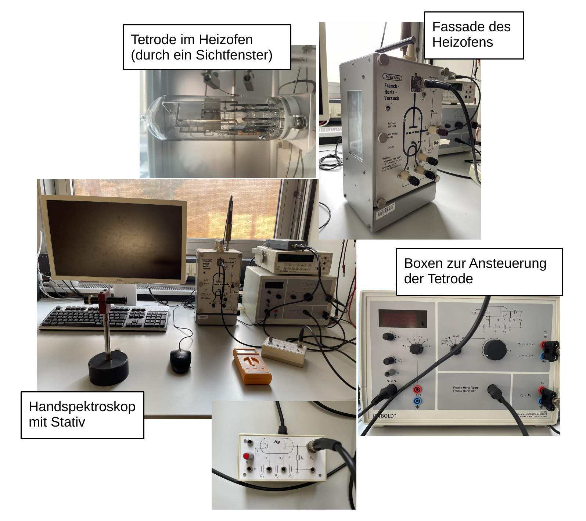

# Fakultät für Physik

## Physikalisches Praktikum P2 für Studierende der Physik

Versuch P2-53, 54, 55 (Stand: März 2024)

[Raum F1-13](https://labs.physik.kit.edu/img/Praktikum/Lageplan_P2.png)

# Franck-Hertz-Versuch

## Motivation

Zwischen 1912–14 führten [James Franck](https://de.wikipedia.org/wiki/James_Franck) und [Gustav Hertz](https://de.wikipedia.org/wiki/Gustav_Hertz) Versuche zur Untersuchung der Ionisationsenergie einatomiger Gase mit Hilfe von [Röhrendioden](https://de.wikipedia.org/wiki/R%C3%B6hrendiode) durch, die sie kontrolliert mit Quecksilbergas ($\mathrm{Hg}$) befüllten. Damals war über die diskreten Energieniveaus im Atom nichts bekannt. Es bestand die verbreitete Ansicht, dass Ionisation die einzige Form sei, in der Atome außer durch elastische Stöße Energie aufnehmen könnten. Die Energieaufnahme einatomiger Gase konnte jedoch durch die anerkannte Theorie der [Gasentladung](https://de.wikipedia.org/wiki/Gasentladung) nicht beschrieben werden, worin für Franck und Hertz die Motivation ihrer Versuche bestand. Der letzte in einer Reihe von Versuchen ging als [Franck-Hertz-Versuch](https://de.wikipedia.org/wiki/Franck-Hertz-Versuch) in die Geschichte der Quantenphysik ein und führte zur Verleihung des Physik-Nobelpreises 1925. Franck und Hertz führten diese Versuche nicht durch, um das 1913 durch Niels Bohr entwickelte [Bohrsche Atommodell](https://de.wikipedia.org/wiki/Bohrsches_Atommodell) zu bestätigen, das zu dieser Zeit noch wenig bekannt war. Tatsächlich, gingen beide bis 1917 noch davon aus, dass die von ihnen beobachteten Effekte auf die Rekombination ionisierter $\mathrm{Hg}$-Atome zurückzuführen seien. 

Damals war durch mehrere Experimente bekannt, dass Atome nur mit diskreten Lichtquanten in Wechselwirkung traten. Es war jedoch nicht klar, ob dieses Phänomen nicht eine Eigenschaft nur des Lichts sei. Mit dem Franck-Hertz-Versuch konnte die von Niels Bohr postulierte quantisierte Aufnahme von Energie im Atom auch in Stößen von Atomen mit Elektronen nachgewiesen und die anschließende Energieabgabe durch Lichtquanten gleicher Energie beobachtet werden. Der Franck-Herz-Versuch trug so entscheidend zum Durchbruch und zur Entwicklung der Quantenphysik und unserer heutigen Vorstellung des Atoms im Rahmen der Quantenmechanik bei. Im P2-Praktikum haben Sie die Möglichkeit diesen historischen Versuch selbst durchzuführen.

## Lehrziele

Wir listen im Folgenden die wichtigsten **Lehrziele** auf, die wir Ihnen mit dem **Franck-Hertz-Versuch** vermitteln möchten: 

- Sie führen einen historischen Versuch der Quantenphysik eigenhändig durch. Dieser Versuch verlangt die Kontrolle mehrerer experimenteller Parameter.
- Ein wichtiger Aspekt bei der Durchführung der Versuche besteht darin, die [mittlere freie Weglänge](https://de.wikipedia.org/wiki/Mittlere_freie_Wegl%C3%A4nge) der Elektronen zu kontrollieren, die ein Maß dafür ist, wie oft ein Elektron mit einem $\mathrm{Hg}$-Atom stößt.
- Sie beobachten den Effekt der quantisierten Anregung und untersuchen mehrere Anregungszustände von $\mathrm{Hg}$. 
- Sie schätzen die Ionisierungsenergie von $\mathrm{Hg}$ ab und beobachten mehrere diskrete Emissionslinien bei der Rekombination nach der Ionisation. 
- Zum Schluss wenden Sie, was sie gelernt haben auf eine mit Neon ($\mathrm{Ne}$) betriebene Röhre an. 

## Versuchsaufbau

Ein typischer Aufbau des im P2 verwendeten Franck-Hertz-Versuchs ist in **Abbildung 1** gezeigt:

**Abbildung 1**: (Ein typischer Aufbau des im P2 verwendeten Franck-Hertz-Versuchs)

---

Im Zentrum des Aufbaus steht ein rechteckiger Heizofen (siehe Bild oben rechts), mit Sichtfenstern hinten und an den Seiten. In diesem befindet sich eine mit einem [$\mathrm{Hg}$](https://de.wikipedia.org/wiki/Quecksilber)-Tropfen befüllte Frank-Hertz-[Tetrode](https://de.wikipedia.org/wiki/Elektronenr%C3%B6hre#Tetrode). Der Heizofen kann auf $\vartheta{\gtrsim}200^{\circ}\hspace{0.05cm}\mathrm{C}$ beheizt werden, wodurch sich der Dampfdruck und damit die Dichte der $\mathrm{Hg}$-Atome $\rho(\mathrm{Hg})$ in der Tetrode regulieren lassen. Diese bestimmt wiederum die [mittlere freie Weglänge](https://de.wikipedia.org/wiki/Mittlere_freie_Wegl%C3%A4nge) $\lambda$ der Elektronen, die ein Maß für die Wahrscheinlichkeit dafür ist, dass ein Elektron mit einem $\mathrm{Hg}$-Atom stößt.  

Elektronen werden aus der Glühkathode K der Tetrode ausgelöst. Sie werden zunächst durch eine Spannung $U_{1}$ von K in Richtung eines grobmaschigen Raumladungsgitters G1 abgesaugt und dann durch die Spannung $U_{2}$ auf eine feinmaschige Gitteranode G2 zu beschleunigt. Durchdringen sie die Schlaufen von G2 wirkt ihnen eine Gegenspannung $U_{3}$ zwischen G2 und einer Auffängerelektrode A entgegen. Elektronen, deren kinetische Energie kleiner als $e\,U_{3}$ ist werden zwischen G2 und A vollständig abgebremst und schließlich auf G2 zurück beschleunigt. Dabei steht $e$ für die Elementarladung. Elektronen, die A erreichen lösen dort einen geringen Auffängerstrom $I_{A}$ aus, der als eine, über einen hochohmigen Lastwiderstand $R_{A}$ abfallende Spannung $U_{A}$ gemessen werden kann. 

Erhöht man $U_{2}$ schrittweise beobachtet man eine zunehmende Spannung $U_{A}$, die jenseits charakteristischer Werte für $U_{2}$, in festen Abständen, immer wieder abfällt.  

## Wichtige Hinweise

- Die nominelle Betriebstemperatur der Franck-Hertz-$\mathrm{Hg}$-Röhre liegt bei $180^{\circ}\hspace{0.05cm}\mathrm{C}$. Im kalten Zustand kann kondensiertes $\mathrm{Hg}$ Kurzschlüsse zwischen den Elektroden verursachen. Liegen in diesem Fall bereits Gitterspannungen an kann dies die Röhre beschädigen. **Legen Sie die Gitterspannungen $U_{1}$, $U_{2}$ und $U_{3}$ daher erst nach Erreichen der Betriebstemperatur an.**
- Die Franck-Hertz-Röhre darf nicht bei $\vartheta{\gtrsim}220^{\circ}\hspace{0.05cm}\mathrm{C}$ betreiben werden. Zu starkes Aufheizen auf $\vartheta{\gtrsim}200^{\circ}\hspace{0.05cm}\mathrm{C}$ und zu langes Verweilen im aufgeheizten Zustand können die Röhre beschädigen. Dabei treten aus den Oberflächen im Röhreninneren Fremdgase aus, die die Versuchsdurchführung beeinträchtigen und mit der Zeit sogar unmöglich machen können. **Ein dauerhafter Betrieb unterhalb von $200^{\circ}\hspace{0.05cm}\mathrm{C}$ ist unbedenklich.**
- Die Kathode K ist zur Verbesserung ihrer Emissionsfähigkeit mit einem Oxyd beschichtet. **Das Aufheizen der Röhre ohne Kathodenspannung $U_{K}$ kann zur Kontamination der Kathodenoberfläche durch Fremdmoleküle und zum Verlust Emissionsfähigkeit von K führen.**

# Navigation

- [Hinweise-Franck-Hertz.md](https://gitlab.kit.edu/kit/etp-lehre/p2-praktikum/students/-/blob/main/Franck_Hertz_Versuch/doc/Hinweise-Franck-Hertz.md): Weitere Informationen zu den **Grundlagen des Franck-Hertz-Versuchs**.
- [Hinweise-mittlere-freie-Weglaenge.md](https://gitlab.kit.edu/kit/etp-lehre/p2-praktikum/students/-/blob/main/Franck_Hertz_Versuch/doc/Hinweise-mittlere-freie-Weglaenge.md): Weitere Informationen zur **mittleren freien Weglänge der Elektronen** und zum Energieverlust der Elektronen in der Franck-Hertz-$\mathrm{Hg}$-Röhre.
- [Hinweise-unelastischer-Stoss.md](https://gitlab.kit.edu/kit/etp-lehre/p2-praktikum/students/-/blob/main/Franck_Hertz_Versuch/doc/Hinweise-unelastischer-Stoss.md): Mehr Informationen zu den **diskreten Energieniveaus** von $\mathrm{Hg}$. 
- [Hinweise-Versuchsdurchfuehrung.md](https://gitlab.kit.edu/kit/etp-lehre/p2-praktikum/students/-/blob/main/Franck_Hertz_Versuch/doc/Hinweise-Versuchsdurchfuehrung.md): Wichtige Hinweise und **Tipps zur Versuchsdurchführung**.
- [Datenblatt.md](https://gitlab.kit.edu/kit/etp-lehre/p2-praktikum/students/-/blob/main/Franck_Hertz_Versuch/Datenblatt.md): Technische Details zu den Versuchsaufbauten.
