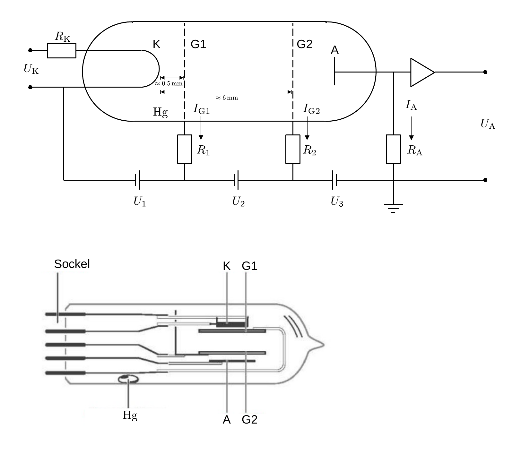
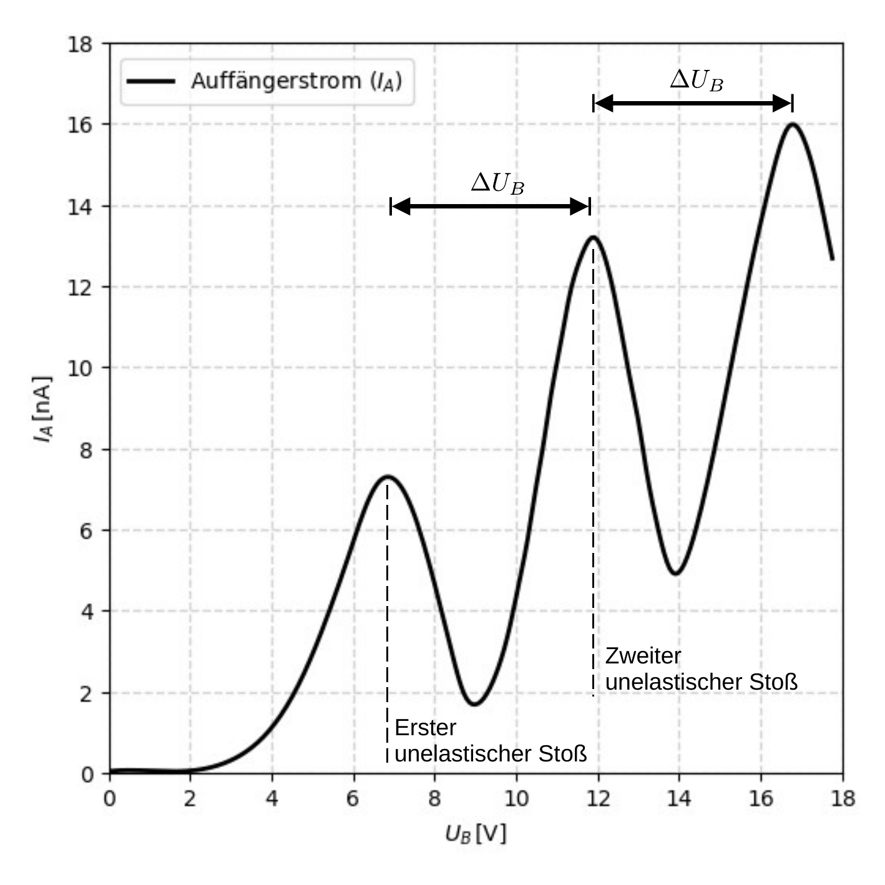

# Hinweise für den Franck-Hertz-Versuch

## Aufbau und Schaltung der Röhre

Eine Skizze der Tetrode, wie sie für den Franck-Hertz-Versuch im P2 verwendet wird in **Abbildung 1** gezeigt:

**Abbildung 1**: (Schematische Darstellung der Franck-Hertz-Röhre, wie sie im P2 verwendet wird (oben). Im unteren Teil der Abbildung ist der Aufbau der tatsächlichen Röhre zu sehen)

---

Auf der linken Seite der Zeichnung, im oberen Teil der Abbildung, befindet sich eine Glühkathode K mit dem Widerstand $R_{\mathrm{K}}$, die mit der Spannung $U_{\mathrm{K}}$ versorgt wird. Im Abstand von ${\approx}0.5\,\mathrm{mm}$ zu K befindet sich ein *grobmaschiges* **Raumladungsgitter G1** (auch [Steuergitter](https://de.wikipedia.org/wiki/Steuergitter) genannt), dessen Funktion es ist, die freien Elektronen aus der K umgebenden Raumladung auf das Beschleunigungsgitter G2 zu lenken. Zwischen K und G1 liegt die Spannung $U_{1}$ an. Das *feinmaschige* **Beschleunigungsgitter G2** (auch [Schirmgitter](https://de.wikipedia.org/wiki/Schirmgitter) genannt) befindet sich im Abstand von $d{\approx}6\,\mathrm{mm}$ von K und fungiert als Anode. Zwischen G1 und G2 liegt die Spannung $U_{2}$ an. Gemeinsam mit der zunächst unbekannten effektiven [Kontakt-](https://de.wikipedia.org/wiki/Volta-Spannung) und [Thermospannung](https://de.wikipedia.org/wiki/Thermoelektrizit%C3%A4t) $U_{\mathrm{th.}}$ zwischen K und G2 ergibt sich die wahre Beschleunigungsspannung zu
$$
\begin{equation}
U_{B} = U_{\mathrm{th.}}+U_{1}+U_{2}.
\end{equation}
$$
In wiederum geringem Abstand zu G2 befindet sich eine **Auffängerelektrode A.** Zwischen G2 und A befindet sich die Gegenspannung $U_{3}$. 

Zu $U_{\mathrm{th.}}$ zitieren wir aus dem Handblatt zur Apparatur: "Die eigentliche Kontaktspannung wird durch die unterschiedlichen Austrittsarbeiten des Kathoden- und des Gittermaterials hervorgerufen. Hier spielen die Emissionseigenschaften der Mischoxyd-Kathode und die Gasbeladung bzw. die $\mathrm{Hg}$-Bedeckung des Gitters eine Rolle. Die aus der Glühkathode austretenden Elektronen haben eine Anfangsgeschwindigkeit, die von der Temperatur der Kathode abhängt."

Um die Röhre auch im Fall der Gasentladung vor zu großen Strömen $I_{\mathrm{G1}}$ und $I_{\mathrm{G2}}$ zu schützen sind G1 und G2 jeweils über einen Widerstand $R_{1}=R_{2}=10\hspace{0.05cm}\mathrm{k\Omega}$ angeschlossen, die im Heizofengehäuse fest eingebaut sind.

## Bahn der ausgelösten Elektronen

Aus K treten Elektronen thermisch aus und werden auf G1 zu beschleunigt. Wegen des geringen Abstands zwischen K und G1 kommt es hier nur selten zu Stößen der Elektronen mit $\mathrm{Hg}$-Atomen. Während einige Elektronen auf G1 aufschlagen und so über den Strom $I_{\mathrm{G1}}$ zu K zurückgeführt werden, durchdringen die meisten Elektronen die *groben* Maschen von G1 und werden auf G2 zu beschleunigt. Auf diesem deutlich längeren Weg kommt es, abhängig von $U_{2}$ sowohl zu **elastischen** als auch zu **unelastischen** Stößen der Elektronen mit $\mathrm{Hg}$-Atomen. Die meisten Elektronen treffen daraufhin auf G2 auf und erzeugen dort einen messbaren **Anodenstrom** $I_{\mathrm{G2}}$. Einige Elektronen treten jedoch durch die feinen Maschen von G2 hindurch und werden durch das elektrische Feld zwischen G2 und A abgebremst. Je nach Konfiguration aus $U_{1}$, $U_{2}$ und $U_{3}$ werden die Elektronen wieder zu G2 zurück beschleunigt, oder sie erreichen A. Dort können sie mit Hilfe eines Operationsverstärkers über den Spannungsabfall ($U_{\mathrm{A}}$) an einem hochohmigen Widerstand $R_{A}$ als sehr geringer **Auffängerstrom** $I_{\mathrm{A}}$ nachgewiesen werden. Für die Übersetzung von $U_{\mathrm{A}}$ nach $I_{A}$ gilt $1\hspace{0.05cm}\mathrm{V} \approx1\hspace{0.05cm}\mathrm{nA}$.

Unter [diesem Link](https://www.kippenbergs.de/mint-franckhertz) können Sie eine Simulation des Wegs der Elektronen durch eine etwas einfachere Franck-Hertz-[Triode](https://de.wikipedia.org/wiki/Elektronenr%C3%B6hre#Triode) beobachten. 

## Anodenstrom $I_{\mathrm{G2}}$

Für eine aus einer Glühkathode (z.B. K) und einer Anode (z.B. G2) bestehende, evakuierte Diode, für die der Anodenstrom $I_{\mathrm{G2}}$ durch Raumladungseffekte bei K dominiert wird gilt die Strom-Spannung-Abhängigkeit des Schottky-Langmuirschen [Raumladungsgesetzes](https://de.wikipedia.org/wiki/Raumladungsgesetz)
$$
\begin{equation}
I_{\mathrm{G2}}(U_{2}) = \kappa\, U_{2}^{3/2},
\end{equation}
$$
wobei man $\kappa$ als Raumladungskonstante oder [Perveanz](https://de.wikipedia.org/wiki/Perveanz) bezeichnet. Dabei hängt $\kappa$ nur von der Geometrie der Anordnung und nicht von der Emissionsfähigkeit der Kathode ab. Den in Gleichung **(2)** dargestellten funktionalen Zusammenhang bezeichnet man auch als [Neilsche Parabel](https://de.wikipedia.org/wiki/Neilsche_Parabel).

Für die Anordnung der im Versuch verwendeten Tetrode kann der Zusammenhang aus Gleichung **(2)** durch die folgenden Besonderheiten beeinflusst werden: 

- Zusätzlich zu G2 liegt G1 auf einem relativ zu K nicht verschwindenden Potential und beeinflusst damit die Geometrie der elektrischen Feldlinien und der Röhre. 
- Die Tetrode ist nicht evakuiert, sondern mit $\mathrm{Hg}$-Dampf geringer Dichte befüllt, der die Bewegung der Elektronen hämt. 

## Auffängerstrom $I_{A}$

Nur wenige Elektronen treten durch die engen Maschen von G2. Zudem ist die Bewegung der durch die Maschen tretenden Elektronen aufgrund der Streuung an den Atomen des $\mathrm{Hg}$-Dampfs diffus, wobei nur der zum durch $U_{3}$ induzierten Gegenfeld anti-parallel ausgerichtete Teil der Geschwindigkeit dazu beiträgt $U_{3}$ zu überwinden. Daher gilt i.a. $I_{A}\ll I_{\mathrm{G2}}$. Der Verlauf von $I_{A}$ als Funktion von $U_{B}$ ist in **Abbildung 2** schematisch dargestellt:

**Abbildung 2**: (Schematischer Verlauf des Auffängerstroms $I_{A}$ als Funktion der Beschleunigungsspannung $U_{B}$)

---

$I_{A}$ steigt zunächst mit zunehmender Spannung $U_{B}$ an. In periodischen Abständen $\Delta U_{B}$ kommt es jedoch zu charakteristischen Einbrüchen, die auf **unelastische** Stöße der Elektronen im Hg-Dampf zurückzuführen sind, bei denen die Elektronen so viel ihrer kinetischen Energie $E_{\mathrm{kin}}^{(\mathrm{e})}$ verlieren, dass sie $U_{3}$ anschließend nicht mehr überwinden können. Dass $I_{A}$ in diesem Fall nicht auf 0 zurückfällt ist dadurch zu erklären, dass nicht alle Elektronen mit Atomen des Hg-Dampfs unelastisch stoßen. Der erste Einbruch in **Abbildung 2** zeigt den Wert von $U_{B}$ an, ab dem $E_{\mathrm{kin}}^{(\mathrm{e})}$ zum ersten mal ausreicht, um das Energieniveau mit dem niedrigsten Energieübertrag in einem Hg-Atom anzuregen. Beim zweiten Einbruch reicht die daraufhin auf dem Weg nach G2 wieder aufgenommene Energie aus, um erneut Hg-Atome anzuregen. 

# Navigation

[Main](https://gitlab.kit.edu/kit/etp-lehre/p2-praktikum/students/-/tree/main/Franck_Hertz_Versuch)
