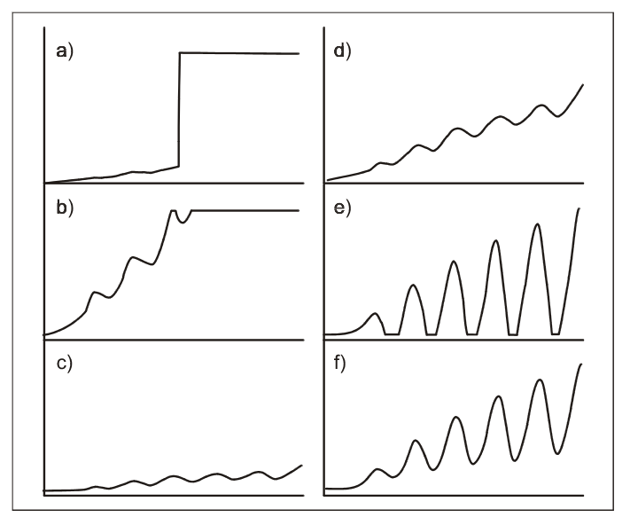

# Hinweise für den Franck-Hertz-Versuch

## Versuchsdurchführung [2/4]

### Aufgabe 1: Messanordnung

#### Aufgabe 1.2: Effekt der Steuerparameter an der Röhre

Steuerparameter an der Röhre sind $\vartheta$, $U_{1}$, $U_{2}$, $U_{3}$. In **Abbildung 5** ist gezeigt, welche Effekte die einzelnen Steuerparameter grundsätzlich haben sollten:

**Abbildung 5**: (Effekt der Steuerparameter $\vartheta$, $U_{1}$ und $U_{3}$)

---

Auf der $x$-Achse sind jeweils ansteigende Werte von $U_{2}$ gezeigt. Steigt $I_{A}$ mit zunehmenden Werten von $U_{2}$ sprunghaft an (siehe **Abbildung (a)**) kommt es zur Gasentladung. Dieser Vorgang ist i.a. von fahlblauem Leuchten der Röhre begleitet. Sie sollten eine unkontrollierte Gasentladung unbedingt vermeiden, um die Röhre nicht zu beschädigen. Schalten Sie in diesem Fall $U_{2}$ sofort ab und erhöhen Sie dann $\vartheta$, um $\lambda$ zu reduzieren. 

Das Raumladungsgitter G2 befindet sich dicht hinter K. Durch $U_{1}$ kommt es zwischen K und G1 daher zu hohen elektrischen Feldern, deren Funktion es ist die Raumladungswolke um K abzusaugen, so dass weitere Elektronen aus K nachrücken können. Die Spannung $U_{1}$ reguliert daher effektiv den Elektronenstrom durch die Röhre und somit die Steigung von $I_{A}$ als Funktion von $U_{2}$.  In **Abbildung 5 (b)** geht $I_{A}$ bereits weit vor Erreichen des Maximalwertes von $U_{2}$ (auf der $x$-Achse) in die Sättigung der Messanordnung, $U_{1}$ sollte nach unten geregelt werden. In **Abbildung 5 (c)** sollte $U_{1}$ nach oben geregelt werden. Bleibt der Verlauf von $I_{A}$ selbst bei maximaler Einstellung von $U_{1}\approx 5\hspace{0.05cm}\mathrm{V}$ flach regeln Sie $\vartheta$ nach unten, um die mittlere freie Weglänge der Elektronen auf dem Weg durch die Röhre zu erhöhen. 

Die Höhe von $U_{3}$ reguliert die Ausprägung der beobachteten Minima und Maxima. Gleichzeitig wird $I_{A}$ für steigende Werte von $U_{3}$ insgesamt reduziert. Ohne besondere Optimierung von $U_{3}$ könnte $I_{A}$, bei geeigneter Einstellung von $U_{1}$ so aussehen, wie in **Abbildung 5 (d)** gezeigt. Von **Abbildung 5 (d)** zu **(f)** gelangen Sie, indem Sie vorsichtig abwechselnd $U_{1}$ und $U_{3}$ erhöhen. Von **Abbildung 5 (e)** zu **(f)** gelangen Sie, indem Sie vorsichtig abwechselnd $U_{1}$ und $U_{3}$ reduzieren.  

**Nehmen Sie sich ausreichend Zeit das Wechselspiel der Steuerparameter zu studieren. Fügen Sie schließlich die Einstellungen, zu den entsprechenden Darstellungen Ihrem Protokoll zu.**

# Navigation

[Zurück](https://gitlab.kit.edu/kit/etp-lehre/p2-praktikum/students/-/tree/main/Franck_Hertz_Versuch/doc/Hinweise-Versuchsdurchfuehrung.md) | [Main](https://gitlab.kit.edu/kit/etp-lehre/p2-praktikum/students/-/tree/main/Franck_Hertz_Versuch) | [Weiter](https://gitlab.kit.edu/kit/etp-lehre/p2-praktikum/students/-/tree/main/Franck_Hertz_Versuch/doc/Hinweise-Versuchsdurchfuehrung-b.md)
