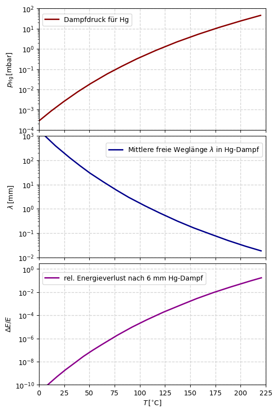

# Hinweise für den Franck-Hertz-Versuch

## Mittlere freie Weglänge der Elektronen

Ein entscheidender Faktor des Versuchs ist die Wahrscheinlichkeit mit der ein freies Elektron auf seinem Weg mit einem $\mathrm{Hg}$-Atom stößt. Diese wird durch die [mittlere freie Weglänge](https://de.wikipedia.org/wiki/Mittlere_freie_Wegl%C3%A4nge) charakterisiert, die wie folgt von der Dichte $n$ der $\mathrm{Hg}$-Atome in der Tetrode und vom Wirkungsquerschnitt $\sigma$ für die Streuung eines Elektrons mit einem $\mathrm{Hg}$-Atom abhängt
$$
\begin{equation*}
\lambda = \frac{1}{n\,\sigma}
\end{equation*}
$$

### Wirkungsquerschnitt

Der Wirkungsquerschnitt $\sigma$ kann durch die geometrische Ausdehnung des $\mathrm{Hg}$-Atoms abgeschätzt werden: 
$$
\begin{equation*}
\sigma= \pi\,R^{2};\qquad R=\sqrt[3]{\frac{3}{4\pi}V};
\qquad V= \frac{M_{m}(\mathrm{Hg})\,f}{N_{A}\,\rho_{\mathrm{fl}}},
\end{equation*}
$$
wobei $N_{A}$ der [Avogradro-Konstanten](https://de.wikipedia.org/wiki/Avogadro-Konstante),  $M_{m}(\mathrm{Hg})$ der [molaren Masse](https://de.wikipedia.org/wiki/Molare_Masse), $\rho_{\mathrm{fl}}$ der Dichte von flüssigem $\mathrm{Hg}$ und $f\approx0.74$ dem Füllfaktor der [dichtesten Kugelpackung](https://de.wikipedia.org/wiki/Dichteste_Kugelpackung) entsprechen. Daraus ergibt sich ein Wert von 
$$
\begin{equation*}
\sigma\approx 8\times10^{-16}\,\mathrm{cm}
^{-2}\end{equation*}
$$

### Teilchendichte

Die Teilchendichte $n$ kann, unter der Annahme, dass sich das System im thermischen Gleichgewicht befindet, mit Hilfe der [idealen Gasgleichung](https://de.wikipedia.org/wiki/Thermische_Zustandsgleichung_idealer_Gase) abgeschätzt werden: 
$$
\begin{equation*}
N\,k\,T = p_{\mathrm{Hg}}\,V;\qquad n=\frac{N}{V} = \frac{p_{\mathrm{Hg}}}{k\,T},
\end{equation*}
$$
wobei $k$ der [Boltzmann-Konstanten](https://de.wikipedia.org/wiki/Boltzmann-Konstante), $N$ der Teilchenzahl, $p_{\mathrm{Hg}}$ dem [Sättigungsdampfdruck](https://de.wikipedia.org/wiki/S%C3%A4ttigungsdampfdruck) von $\mathrm{Hg}$, $V$ dem Volumen und $T$ der Temperatur entsprechen. Die Annahme eines thermischen Gleichgewichts impliziert, dass der $\mathrm{Hg}$-Dampf homogen in der Röhre verteilt ist. Die Sidetemperatur von $\mathrm{Hg}$ liegt bei $357^{\circ}\hspace{0.05cm}\mathrm{C}$, es verbleibt also immer ein Teil des $\mathrm{Hg}$ in flüssigem Zustand. Eine Parametrisierung von $p_{\mathrm{Hg}}$ ist in **Abbildung 3** oben gezeigt. 

**Abbildung 3**: (Verlauf (oben) des Sättigungsdampfdrucks $p_{\mathrm{Hg}}$ für $\mathrm{Hg}$, (Mitte) der daraus abgeschätzten mittleren freien Weglänge $\lambda$ der Elektronen in $\mathrm{Hg}$-Dampf, sowie (unten) des mittleren Energieverlusts von Elektronen nach Durchlaufen einer Strecke von $d=6\,\mathrm{mm}$ in $\mathrm{Hg}$-Dampf, jeweils als Funktion der Temperatur)

---

Sie folgt in sehr guter Näherung der Form 
$$
\begin{equation*}
p(T)[\mathrm{mbar}] = 1.324\times 10^{8}\,\exp\left(-\frac{7345.25}{T[\mathrm{K}]}\right),
\end{equation*}
$$
wobei $T$ in $\mathrm{K}$ in die Formel einzusetzen ist, um den Druck in $\mathrm{mbar}$ zu erhalten. Der sich daraus ergebende Verlauf von $\lambda$ ist in **Abbildung 3** (Mitte) gezeigt. Er kann durch die Temperatur $T$ verhältnismäßig leicht kontrolliert werden. Beim Betrieb der Röhre zwischen 120 und $200^{\circ}\,\mathrm{C}$ gilt $\lambda\lesssim0.2\ldots 0.02\,\mathrm{mm}$.  

## Energieverlust beim elastischen Stoß

Beim elastischen Stoß sind die kinetische Energie, sowie die Summe aller Impulse im Anfangs- und Endzustand erhalten. Es handelt sich um einen Zwei-Körper-Stoß, der sich im Rahmen der klassischen Mechanik leicht berechnen lässt.  

Die Geschwindigkeit eines Elektrons nach Durchlaufen einer Beschleunigungsspannung von $U=1\,\mathrm{V}$ beträgt 
$$
\begin{equation*}
E_{\mathrm{kin}}^{\mathrm{(e)}} = \frac{1}{2}m_{\mathrm{e}}v^{2} = e\,U;\qquad v=\sqrt{\frac{2\,e\,U}{m_{\mathrm{e}}}}\approx600000\,\mathrm{m/s}.
\end{equation*}
$$
Im Vergleich dazu kann das $\mathrm{Hg}$-Atom mit einer, bei $T\approx500\,\mathrm{K}$, abgeschätzten mittleren Geschwindigkeit von 
$$
\begin{equation*}
E_{\mathrm{kin}}^{(\mathrm{Hg})} = \frac{1}{2}m_{\mathrm{Hg}}\overline{v^{2}} = \frac{3}{2}k\,T;\qquad \overline{v}=\sqrt{\frac{3\,k\,T}{m_{\mathrm{Hg}}}}\approx 250\,\mathrm{m/s}
\end{equation*}
$$
in sehr guter Näherung als ruhend angenommen werden. Ebenso gilt  $m_{\mathrm{Hg}}\gg m_{\mathrm{e}}$, weshalb wir annehmen dürfen, dass das Ruhesystem des Stoßes dem Laborsystem entspricht. In diesem Fall beträgt der maximale Energieübertrag des Elektrons ans $\mathrm{Hg}$-Atom 
$$
\begin{equation*}
\Delta E_{\mathrm{kin}}^{(\mathrm{e})} = E_{\mathrm{kin}}^{(\mathrm{e})}\,\frac{2\,m_{\mathrm{e}}}{m_{\mathrm{Hg}}}\left(1-\cos\theta\right),
\end{equation*}
$$
wobei $m_{\mathrm{e}}$ der Masse des Elektrons und $\theta$ dem Streuwinkel entsprechen. Gemittelt über alle Streuwinkel ergibt sich also ein sehr geringer zu erwartender relativer Energieübertrag pro Stoß von
$$
\begin{equation*}
\frac{\Delta E_{\mathrm{kin}}^{(\mathrm{e})}}{E_{\mathrm{kin}}^{(\mathrm{e})}} = \frac{2\,m_{\mathrm{e}}}{m_{\mathrm{Hg}}}\approx 5.4\times10^{-6}.
\end{equation*}
$$
Andererseits kann das sehr viel leichtere Elektron bei jedem Stoß sehr stark abgelenkt werden, was einen im Vergleich zu einem geraden Weg deutlich längeren Diffusionsweg durch die Tetrode zur Folge hat, bei dem es, je nach $n$, sehr häufig zu Stößen kommen kann. Eine entsprechende Näherungsrechnung dieses Diffusionsprozesses für die dem Versuch zugrunde liegende Geometrie führt auf einen totalen mittleren Energieverlust von 
$$
\begin{equation*}
\Delta E_{\mathrm{kin}}^{(\mathrm{e})}(T, U_{B})\approx\frac{1}{3}\left(\frac{d}{\lambda(T)}\right)^{2}\frac{2\,m_{\mathrm{e}}}{m_{\mathrm{Hg}}}\, e\,U_{B}.
\end{equation*}
$$
Der Verlauf des relativen Energieverlusts des Elektrons in $\mathrm{Hg}$-Dampf, als Funktion der Temperatur, ist in **Abbildung 3** (unten) gezeigt. Er liegt für $T\lesssim175^{\circ}\,\mathrm{C}$ bei unter 1%, steigt jenseits davon jedoch deutlich an.

**Wir halten zusammenfassend fest, dass der Energieverlust der Elektronen durch elastische Stöße für Temperaturen von $T\lesssim175^{\circ}\,\mathrm{C}$ verhältnismäßig gering ist.** 

# Navigation

[Main](https://gitlab.kit.edu/kit/etp-lehre/p2-praktikum/students/-/tree/main/Franck_Hertz_Versuch)
