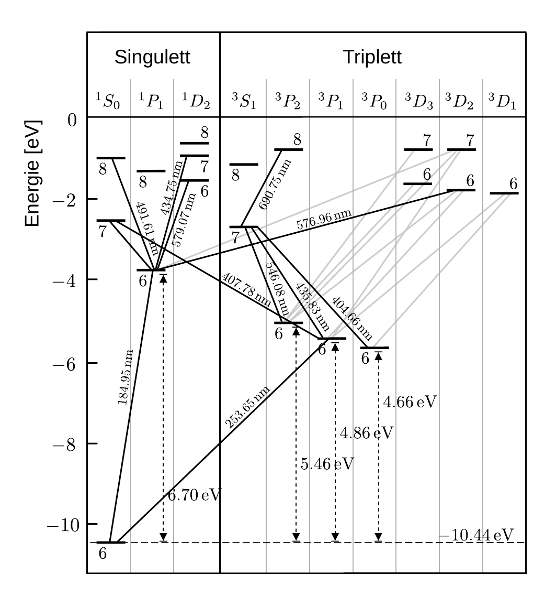

# Hinweise für den Franck-Hertz-Versuch

## Energieverlust beim unelastischen Stoß

Beim unelastischen Stoß entspricht die Summe der kinetischen Energien der Stoßpartner nach dem Stoß **nicht mehr** der Summe der kinetischen Energien im Anfangszustand. Die "fehlende" Energie wird in Form von inneren Anregungszuständen des $\mathrm{Hg}$-Atoms aufgenommen. Ein wesentlicher Ausgang des Franck-Hertz-Versuchs ist, dass diese Anregungszustände quantisiert vorliegen.

[Quecksilber](https://www.periodensystem.info/elemente/quecksilber/) hat die Ordnungszahl $Z=80$. In neutralem Zustand ist seine Hülle mit 80 Elektronen besetzt. Die Elektronenkonfiguration lautet: 
$$
\begin{equation*}
\mathrm{[Xe]\,4\,f^{14}\,5\,d^{10}\,6\,s^{2}},
\end{equation*}
$$
d.h. die N-Schale (für die Hauptquantenzahl $n=4$) ist mit 60 Elektronen voll besetzt (Edelgaskonfiguration von $\mathrm{Xe}$), die O-Schale (für $n=5$) hat die Konfiguration $\mathrm{5\hspace{0.05cm}s^{2}\hspace{0.05cm}5\hspace{0.05cm}p^{6}\hspace{0.05cm}5\hspace{0.05cm}d^{10}}$, das $\mathrm{5\,f^{0}}$-Orbital ist unbesetzt und das $\mathrm{6\hspace{0.05cm}s^{2}}$-Orbital mit zwei Elektronen besetzt. 

Im [$6^{1}\mathrm{S}_{0}$-Grundzustand](https://de.wikipedia.org/wiki/Termsymbol) des Atoms sind der Bahndrehimpuls ($L=0$), sowie der Gesamtdrehimpuls ($J=0$, Spinmultiplizität $2\hspace{0.05cm}S+1=1$) des Systems Null. Dies führt zur Bezeichnung $^{1}S_{0}$. In angeregten Zuständen befindet sich ein Elektron (in selten Fällen auch zwei oder mehr) in einem Zustand, der zu anderen anderen Quantenzahlen führt. Ein verkürztes Termschema der Energieniveaus in $\mathrm{Hg}$ ist in **Abbildung 4** gezeigt:

**Abbildung 4**: (Verkürztes Termschema von $\mathrm{Hg}$ (Werte aus [NIST Atomic Spectra Database](https://www.nist.gov/pml/atomic-spectra-database)))

---

Der $6^{1}\mathrm{S}_{0}$-Grundzustand befindet sich unten links im Bild, schräg verlaufende Linien entsprechen [erlaubten optische Übergängen](https://de.wikipedia.org/wiki/Auswahlregel) zwischen verschiedenen Anregungsniveaus. Für einige optisch erlaubte Übergänge sind auch die Wellenlängen des abgestrahlten Lichts angegeben. Optisch verbotene Übergänge ergeben sich, wenn die Erhaltung des Gesamtdrehimpulses $J$ beim Übergang nur durch Multipolstrahlung höherer Ordnung gewährleistet ist. Da es für Elektronstöße keine solchen Auswahlregeln gibt sind in diesem Fall prinzipiell alle Übergänge erlaubt. Tatsächlich sind aus dem gleichen Grund der Drehimpulserhaltung, aber auch in diesem Fall optisch verbotene Übergänge i.a. seltener. Die Wahrscheinlichkeit, mit der ein Übergang bei Anregung stattfindet wird durch den Wirkungsquerschnitt beschrieben, den man in diesem Fall auch als [Anregungsfunktion](https://de.wikipedia.org/wiki/Wirkungsquerschnitt) bezeichnet. Die Anregungsfunktion ist unterhalb der für die Anregung notwendigen Energie 0 und steigt darüber mehr oder weniger steil an. Im Praktikum beobachtbar sind die folgenden Übergänge: 

- $`6^{1}\mathrm{S}_{0} \to 6^{3}\mathrm{P}_{0}`$ mit einer Energiedifferenz von $4.66\,\mathrm{eV}$ (optisch verboten); die Anregungsfunktion steigt steil, jedoch auf einen kleinen Wert an.
- $`6^{1}\mathrm{S}_{0}\to 6^{3}\mathrm{P}_{1}`$ mit einer Energiedifferenz von $4.86\,\mathrm{eV}$ (optisch erlaubt); die Anregungsfunktion steigt steil, auf einen **großen Wert** an.
- $`6^{1}\mathrm{S}_{0}\to 6^{3}\mathrm{P}_{2}`$ mit einer Energiedifferenz von $5.46\,\mathrm{eV}$ (optisch verboten); die Anregungsfunktion steigt steil, jedoch auf einen kleinen Wert an.
- $`6^{1}\mathrm{S}_{0}\to 6^{1}\mathrm{P}_{1}`$ mit einer Energiedifferenz von $6.70\,\mathrm{eV}$ (optisch erlaubt); die Anregungsfunktion steigt flach, auf einen **großen Wert** an.

Nach einer Anregung durch Elektronenstoß kehrt das Atom spontan wieder in den Grundzustand zurück. Bei optisch erlaubten Übergängen erfolgt dieser Übergang in Bruchteilen von Mikrosekunden, unter Emission von Licht, bei optisch verbotenen Übergängen geschieht dies durch erneute Anregung durch  Elektronenstoß in ein höheres Energieniveau mit optisch erlaubtem Übergang oder durch Stöße mit der Gefäßwand. Der zuletzt genannte Vorgang läuft dabei deutlich langsamer ab. 

Beim Franck-Hertz-Versuch mit $\mathrm{Hg}$ liegen ohne Ionisierung alle Wellenlängen des emittierten Lichts im UV-Bereich. Sie sind im Praktikum also nicht zu beobachten.

## Ionisation 

Die [Ionisierungsenergie](https://de.wikipedia.org/wiki/Ionisierungsenergie) (für die einfache Ionisation) von $\mathrm{Hg}$ beträgt $10.44\,\mathrm{eV}$. Für das Auftreten von Ionisierung gibt es im Experiment typische Kennzeichen: 

- Im Gasraum treten positive $\mathrm{Hg}$-Ionen auf, die sich im Vergleich zu den beschleunigten Elektronen sehr viel langsamer bewegen. Die $\mathrm{Hg}$-Ionen setzen die Raumladung in der Nähe von K herab wodurch die Elektronen leichter aus K heraus gelöst werden. Dadurch kommt es zu einem steileren Anstieg von $I_{\mathrm{G2}}$. 

- Die $\mathrm{Hg}$-Ionen sammeln sich nicht nur um K, sondern auch im Raum zwischen G2 und A, wo sie einen Strom $I_{A}$ **mit gegenüber dem Elektronenstrom umgekehrtem Vorzeichen** bewirken. 

- Das Zünden einer Gasentladung ist von deutlichem Leuchten begleitet, das spektroskopisch beobachtet werden kann. Bei der Rekombination der $\mathrm{Hg}$-Ionen mit Elektronen kommen stufenweise alle möglichen Übergänge bis in den Grundzustand vor. Am deutlichsten sind die folgenden Emissionslinien sichtbar: 

  - $\lambda=404,66\,\mathrm{nm}$ (violett): $`7^{3}\mathrm{S}_{1}\to6^{3}\mathrm{P}_{0}`$; 
  - $\lambda=407,78\,\mathrm{nm}$ (violett): $`7^{1}\mathrm{S}_{0}\to6^{3}\mathrm{P}_{1}`$;
  - $\lambda=434,75\,\mathrm{nm}$ (violett): $`7^{1}\mathrm{D}_{1}\to6^{1}\mathrm{P}_{1}`$;  
  - $\lambda=491,61\,\mathrm{nm}$ (blau): $`6^{1}\mathrm{P}_{1}\to 8^{1}\mathrm{S}_{0}`$;
  - $\lambda=546,08\,\mathrm{nm}$ (grün): $`7^{3}\mathrm{S}_{1}\to6^{3}\mathrm{P}_{2}`$;
  - $\lambda=579,07\,\mathrm{nm}$ (gelb): $`6^{1}\mathrm{D}_{2}\to6^{1}\mathrm{P}_{1}`$.

  Die fahlblaue Farbe des ohne Spektroskop beobachteten Leuchtens ist das Ergebnis der additiven Mischung der einzelnen Linien.

# Navigation

[Main](https://gitlab.kit.edu/kit/etp-lehre/p2-praktikum/students/-/tree/main/Franck_Hertz_Versuch)
