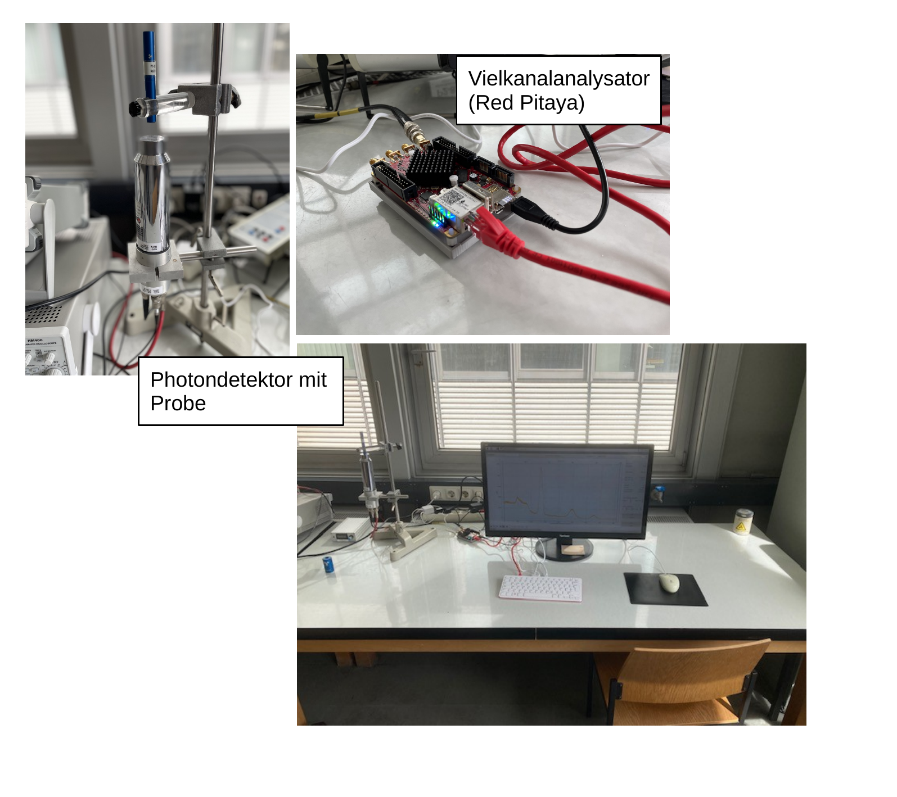

# Fakultät für Physik

## Physikalisches Praktikum P2 für Studierende der Physik

Versuch P2-72, 73, 83 (Stand: März 2024)

[Raum F2-19](https://labs.physik.kit.edu/img/Praktikum/Lageplan_P2.png)

# Gammaspektroskopie

## Motivation

Bei Experimenten der Kern- und Teilchenphysik ist neben den Fragen nach Art und Ort einer Wechselwirkung die Frage nach dem Impuls und der Energie der Reaktionsprodukte besonders wichtig. In der Teilchenphysik gibt es unterschiedliche Detektoren, die die Energie eines einlaufenden Teilchens messen. Ein prominentes Beispiel sind [Kalorimeter](https://de.wikipedia.org/wiki/Kalorimeter_(Teilchenphysik)), die die im Detektor deponierte Energie messen. Dazu wird das Teilchen im Detektor komplett abgebremst und die dort deponierte Energie gemessen. Bei der Energiemessung von niederenergetischen Teilchen wird beispielsweise die durch die Energiedeposition verursachte Erwärmung des Detektors gemessen. In diesem Versuch untersuchen Sie die Energie hoch-energetischer Photonen aus dem $\gamma$-Zerfall verschiedener radioaktiver Präparate. Der Nachweis erfolgt mit Hilfe eines [Szintillationszählers](https://de.wikipedia.org/wiki/Szintillationsz%C3%A4hler), bestehend aus einem Thallium-dotierten $\mathrm{NaJ}$-Einkristall, mit dem Sie die Energie $E_{\gamma}$ des einlaufenden Photons $\gamma$ bestimmen können. Bei $\mathrm{NaJ}$ handelt es sich um einen [Szintillator](https://de.wikipedia.org/wiki/Szintillator), der beim Durchgang geladener Teilchen selbst zur Emission von Photonen angeregt wird. Die vom Szintillator emittierten Photonen haben eine um mehrere Größenordnungen niedrigere Energie als $E_{\gamma}$, deren exakter Wert $\Delta E$ vom Material des Szintillators abhängt. Ein Photon kann durch drei verschiedene Prozesse mit Materie in Wechselwirkung treten: 

 - [Photoeffekt](https://de.wikipedia.org/wiki/Photoelektrischer_Effekt): das Photon schlägt ein Elektron aus der Hülle eines Atoms, dabei geht die gesamte Energie des Photons auf das Elektron über; 
 - [Compton-Effekt](https://de.wikipedia.org/wiki/Compton-Effekt): das Photon wird elastisch an einem Elektron in der Hülle eines Atoms gestreut, d.h. das gestreute Elektron nimmt einen Teil der Energie des einfallenden Photons ($\gamma$) auf, ein Photon ($\gamma^{\prime}$) niedrigerer Energie wird dabei emittiert; und 
 - [Paarbildung](https://de.wikipedia.org/wiki/Paarbildung_(Physik)): das Photon zerfällt, im elektromagnetischen Feld, z.B. eines Atomkerns, in ein Elektron-Positron-Paar, die Energie des Photons geht dabei zu gleichen Teilen auf das Elektron und das Positron über. 

Je nach dem Wert von $E_{\gamma}$ tragen diese Prozesse mit unterschiedlich hoher Wahrscheinlichkeit zur Wechselwirkung des Photons mit dem Detektor bei. In jedem Fall überträgt das Photon seine Energie auf elektrisch geladene Elektronen. Ein hoch-energetisches Elektron (oder Positron) kann selbst wieder mit einer gewissen Wahrscheinlichkeit (durch [Bremsstrahlung](https://de.wikipedia.org/wiki/Bremsstrahlung)) Photonen abstrahlen, die wiederum, wie oben beschrieben, mit Materie in Wechselwirkung treten. Auf diese Weise entsteht im Material ein sogenannter [elektromagnetischer Schauer](https://de.wikipedia.org/wiki/Elektromagnetischer_Schauer), der schließlich, solange er vollständig im Detektor zum erliegen kommt im statistischen Mittel zur Emission von 

$$
\begin{equation*}
\langle n_{\gamma}\rangle = \frac{E_{\gamma}}{\Delta E}
\end{equation*}
$$

Szintillationsphotonen führt. Gelingt es diese Photonen einzusammeln und (wiederum durch den Photoeffekt) nachzuweisen lässt sich aus dem so erzeugten Photostrom $E_{\gamma}$ bestimmen. Dies ist bis zum heutigen Tag das Prinzip jedes Szintillations-Kalorimeters in der Teilchenphysik. 

Am [CMS Experiment](https://cms.cern/detector/measuring-energy/energy-electrons-and-photons-ecal) des LHC verwendet man z.B. Bleiwolframat ($\mathrm{PbWO_{4}}$)-Einkistalle, um hoch-energetische Photonen und Elektronen im Kalorimeter auf die kurze Distanz von $\ell\approx30\,\mathrm{cm}$ möglichst zu stoppen und ihre Energie zu bestimmen. 

## Lehrziele

Wir listen im Folgenden die wichtigsten **Lehrziele** auf, die wir Ihnen mit dem Versuch **Gammaspektroskopie** vermitteln möchten: 

 - Sie lernen Funktionsweise, Aufbau und Verwendung eines Szintillationszählers kennen. 
 - Sie experimentieren mit radioaktiven Präparaten und untersuchen deren Eigenschaften. 
 - Sie studieren die Wechselwirkung von Licht mit Materie und identifizieren entsprechende Signaturen im Energiespektrum des Szintillators. 
 - Sie diskutieren den Zusammenhang der Energieauflösung des Detektors mit den statistischen Prozessen der Messung.

## Versuchsaufbau

Ein typischer Versuchsaufbau ist in **Abbildung 1** gezeigt:

**Abbildung 1** (Typischer Aufbau des Versuchs Gammaspektroskopie)

---

Der Photodetektor wird mit Hochspannung (bei etwa $600\,\mathrm{V}$) betrieben und ist auf ein Stativ montiert. Sie erhalten die radioaktiven Proben von Ihre:r Tutor:in. Diese sind in Aluminium-Zylinder eingeschlossen, die die $\beta$-Strahlung der Präparate hinreichend abschirmt. Zur Messung werden die Probenzylinder mit ihrer Stirnfläche in die Nähe der Stirnfläche des Photodetektors gebracht. Die im Detektor nachweisbare Intensität eintreffender $\gamma$-Strahlen hängt stark vom Abstand der Probe vom Detektor ab. Die Auslese des Signals erfolgt über einen [Vielkanalanalysators](https://de.wikipedia.org/wiki/Vielkanalanalysator) ([*Multichannel analyzer*](https://en.wikipedia.org/wiki/Multichannel_analyzer) MCA) vom Typ [Rep Pitaya](https://de.wikipedia.org/wiki/Red_Pitaya). Eine einfache graphische Benutzeroberfläche erlaubt die Beobachtung der aufgezeichneten Signale, während der Datennahme, unter Verwendung des MCA als [Oszilloskop](https://de.wikipedia.org/wiki/Oszilloskop) oder [Spektrumanalysator](https://de.wikipedia.org/wiki/Spektrumanalysator). Zur abschließenden Auswertung können Sie das aufgezeichnete Spektrum z.B. in [csv-Format](https://de.wikipedia.org/wiki/CSV_(Dateiformat)) ausgeben lassen. 

## Wichtige Hinweise

- Die Kernphysik-Räume stellen einen innerbetrieblichen Überwachungsbereich dar. Dies bedeutet, u.a. dass wir zu Ihrer Sicherheit permanent die auftretende Strahlendosis in diesen Räumen aufzeichnen. In einem innerbetrieblichen Überwachungsbereich gelten nach der **Strahlenschutzverordnung** des Bundes besondere Regeln, die Sie unbedingt beachten und einhalten müssen. Mehr Information finden Sie auf den entsprechenden [Webseiten des P1- und P2-Praktikums](https://labs.physik.kit.edu/163.php?tab=%5B315%5D#tabpanel-315).
- Die Versuche der Kernphysik dürfen erst nach Teilnahme an der **Strahlenschutzbelehrung** durchgeführt werden, die in der Regel während der Vorbesprechung zum Praktikum stattfindet.
- Der Zugang zum Bunker für radioaktive Präparate ist nur den Betreuern gestattet.

# Navigation

-  [Hinweise-Praeparate.md](https://gitlab.kit.edu/kit/etp-lehre/p2-praktikum/students/-/blob/main/Gammaspektroskopie/doc/Hinweise-Praeparate.md): Mehr Informationen zu den in diesem Versuch verwendeten **radioaktiven Präparaten**.
- [Hinweise-Wechselwirkungen.md](https://gitlab.kit.edu/kit/etp-lehre/p2-praktikum/students/-/blob/main/Gammaspektroskopie/doc/Hinweise-Wechselwirkungen.md): Mehr Informationen zu den **Wechselwirkungen von Photonen mit Materie**.
- [Hinweise-Gammaspektroskopie.md](https://gitlab.kit.edu/kit/etp-lehre/p2-praktikum/students/-/blob/main/Gammaspektroskopie/doc/Hinweise-Gammaspektroskopie.md): Grundlegende Informationen zum Versuch und rund ums Thema **Gammaspektroskopie. 
- [Hinweise-Versuchsdurchfuehrung.md](https://gitlab.kit.edu/kit/etp-lehre/p2-praktikum/students/-/blob/main/Gammaspektroskopie/doc/Hinweise-Versuchsdurchfuehrung.md): Wichtige Hinweise und **Tipps zur Versuchsdurchführung**.

