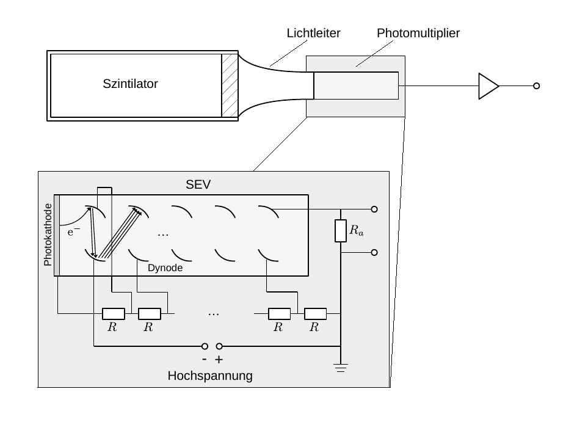

# Hinweise für den Versuch Gammaspektroskopie

## Gammaspektroskopie [2/4]

#### Auslesekette

Nach Erzeugung des Szintillationslichts besteht die primäre Aufgabe darin, dieses  Licht möglichst verlustfrei aus dem aktiven Detektormaterial heraus zur weiteren Auslese zu leiten. Um zu vermeiden, dass es den Szintillator ohne Nachweis verlässt ist dieser i.a. von einem diffus reflektierenden Material umgeben. Zusätzlich kann sich an das (beliebig geformte) aktive Detektormaterial ein sog. [Lichtleiter](https://de.wikipedia.org/wiki/Lichtleiter) anschließen, um den Weg des Szintillationslichts durch den Detektor an die geometrischen Vorgaben der weiteren Auslesekette anzupassen. Grenzflächen müssen möglichst dicht anschließen, um Verluste durch Rückstreuung beim Übergang von einem ins andere Material zu vermeiden.

Die weitere Auslese erfolgt erneut durch die Rückübersetzung der einzelnen Szintillationsphotonen in Ladungsträger (d.h. Elektronen), in unserem Fall an der Photokathode (PK) eines [Photomultipliers](https://de.wikipedia.org/wiki/Photomultiplier) (PM). Diese Rückübersetzung erfolgt, bei den nun sehr viel geringeren Energien des Szintillationslichts von wenigen $\mathrm{eV}$, wiederum durch Photoeffekt. Das Verhältnis der Anzahl ausgeschlagener Elektronen über der Anzahl auftreffender Photonen bezeichnet man als [Quantenausbeute](https://de.wikipedia.org/wiki/Quantenausbeute) $q$. Sie ist ein wichtiges Qualitätsmerkmal eines PM. Typische Werte für $q$ liegen bei 25–50%.   

Die effektive Anzahl resultierender Elektronen an der Photokathode $N_{\mathrm{e}}$ einer solchen Anordnung, für ein einlaufendes Photon $\gamma$ mit $E_{\gamma}$, ist von der Größenordnung 100, was einer Ladung von $10^{-17}\,\mathrm{C}$ entspricht. Neben weiteren Aufgaben werden Sie diese Zahl für die Messanordnung Ihres Versuchsaufbaus selbst abschätzen. An der kleinsten plausiblen Kapazität von ${\approx}10\,\mathrm{pF}$, führt eine Ladung von $10^{-17}\,\mathrm{C}$ zu einer praktisch nicht messbaren Spannungsänderung von ${\approx}1\,\mathrm{\mu V}$. Um ein messbares elektrisches Signal zu erhalten ist es daher notwendig $N_{\mathrm{e}}$ zu vervielfachen. Dies erfolgt über eine Folge von 10–14 Prallelektroden (Dynoden) im sogenannten Sekundärelektronenvervielfacher-Abschnitt (SEV) des PM. Jede Dynode liegt dabei gegenüber der vorangehenden Dynode auf einem typischerweise $100\,\mathrm{V}$ höheren Potential. Die Dynoden weisen eine spezielle Beschichtung auf, um ein möglichst hohes Verhältnis von ausgeschlagenen Sekundärelektronen pro einfallendem Elektron (Sekundäremissionsverhältnis, $\delta$) zu erreichen. Typische Werte von $\delta$ liegen zwischen 3 und 10. Die Anzahl ausgeschlagener Elektronen, wächst dadurch exponentiell an. Für eine mittlere Anzahl von $\langle\delta\rangle=4$ und 10 Dynoden ergibt sich eine erwartete Verstärkung des Signals von $\mu_{V}\approx10^{6}$, was zu einem leicht messbaren Signal führt.

Der SEV wird mit einer regelbaren, stabilisierten Hochspannung betrieben. Die Notwendigkeit der Stabilisierung ergibt sich aus der starken Abhängigkeit von $\mu_{V}$ von der Beschleunigungsspannung. Das Spannungssignal wird an einem Ausgangswiderstand $R_{a}$ in der Leitung zur letzten Elektrode (d.h. der Anode) des SEV abgegriffen. Dabei ist $R_{a}$ so bemessen, dass zusammen mit einer immer vorhandenen Streukapazität $C$ eine Integrations-Zeitkonstante 
$$
\begin{equation*}
\tau=R_{a}\,C
\end{equation*}
$$
resultiert, die nach Möglichkeit groß gegen die Relaxationszeit des Szintillators (siehe oben), aber klein gegen den zu erwartenden mittleren zeitlichen Abstand zweier einlaufender Photonen $\gamma$ ist. 

Die erste Forderung stellt sicher, dass ein Spannungssignal erzeugt wird, das proportional zur $E_{\gamma}$ ist. Die letzte Forderung berücksichtigt, dass sich aus zwei dicht aufeinander folgenden einlaufenden Photonen $\gamma$ und $\gamma'$ nicht ein gemeinsamer Spannungsimpuls aufbauen sollte, eine Situation, die man auch als [pile-up](https://de.wikipedia.org/wiki/Pile-up) bezeichnet. Dass sich dies, je nach Messanordnung jedoch nicht immer vermeiden lässt werden Sie im Verlauf des Experiments u.U. beobachten können. 

Die Skizze eines typischen Photondetektors einschließlich Auslesekette und PM ist in **Abbildung 6** gezeigt: 

**Abbildung 6:** (Skizze eine Photodetektors, wie er für diesen Versuch verwendet wird)

---

Das analoge Spannungssignal des PM wird mit Hilfe eines 12-Bit [Vielkanalanalysators](https://de.wikipedia.org/wiki/Vielkanalanalysator) ([*Multichannel analyzer*](https://en.wikipedia.org/wiki/Multichannel_analyzer) MCA) vom Typ [Rep Pitaya](https://de.wikipedia.org/wiki/Red_Pitaya) in bis zu 4096 Kanälen ausgelesen. Die Auslesekanäle des MCA entsprechen den Histogramm-Bins auf der $x$-Achse. Eine einfache graphische Benutzeroberfläche erlaubt die Beobachtung der aufgezeichneten Signale, während der Datennahme, unter Verwendung des MCA als [Oszilloskop](https://de.wikipedia.org/wiki/Oszilloskop) oder [Spektrumanalysator](https://de.wikipedia.org/wiki/Spektrumanalysator). Die Datennahme erfolgt in zuvor festgelegten Zeitfenstern. Zur abschließenden Auswertung können Sie das aufgezeichnete Spektrum z.B. in [csv-Format](https://de.wikipedia.org/wiki/CSV_(Dateiformat)) ausgeben lassen und auf dem Jupyter-server weiter verarbeiten. 

# Navigation

[Zurück](https://gitlab.kit.edu/kit/etp-lehre/p2-praktikum/students/-/tree/main/Gammaspektroskopie/doc/Hinweise-Gammaspektroskopie.md) | [Main](https://gitlab.kit.edu/kit/etp-lehre/p2-praktikum/students/-/tree/main/Gammaspektroskopie) | [Weiter](https://gitlab.kit.edu/kit/etp-lehre/p2-praktikum/students/-/tree/main/Gammaspektroskopie/doc/Hinweise-Gammaspektroskopie-b.md)
