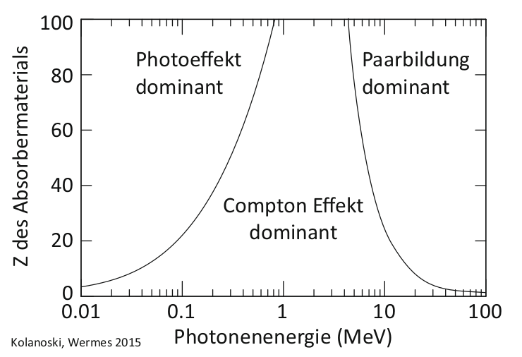

# Hinweise für den Versuch Gammaspektroskopie

## Gammaspektroskopie [1/4]

### Spektrum, Histogramm und Dichte

Als Spektrum bezeichnet man die Untersuchung eines Objekts $\mathcal{O}$ nach einer Eigenschaft $X$.  Die Fragestellung lautet: "Wie häufig treffe ich $\mathcal{O}$ mit der Eigenschaft $X$ an?"

Diese Untersuchung erfolgt zunächst durch die Darstellung der [Häufigkeitsverteilung](https://de.wikipedia.org/wiki/H%C3%A4ufigkeitsverteilung) als [Histogramm](https://de.wikipedia.org/wiki/Histogramm), mit einer vorgegebenen Anzahl an Kategorien (Bins) $i$. Auf der $x$-Achse des Histogramms werden die Werte (oder Ausprägungen) von $X$ aufgetragen, die bestimmen welchem Bin $i$ das Auftreten von $\mathcal{O}$ zuzuordnen ist. Auf der $y$-Achse wird die Häufigkeit $\Delta N_{i}$ aufgetragen, mit der im Laufe einer Messreihe ein Objekt $\mathcal{O}$ dem Bin $i$ zugeordnet wurde. 

Die Werte von $\Delta N_{i}$ hängen sowohl von der Gesamtanzahl der Beobachtungen, als auch von der Breite der Bins $\Delta x_{i}$ ab. Teilt man $\Delta N_{i}$ durch jeweils beide Größen, bezeichnet man die entstehende Verteilung als [Dichtefunktion](https://de.wikipedia.org/wiki/Dichtefunktion). Sind alle $\Delta x_{i}$ gleich, ist die Form der Häufigkeitsverteilung zur Form der Dichtefunktion gleich, was nicht der Fall ist, wenn $\Delta x_{i}$ für unterschiedliche $i$ variiert.  Im Grenzübergang unendlich vieler Bins verschwindend kleiner Breiten $\Delta x_{i}$ geht der Differenzenquotient in die Ableitung über: 
$$
\begin{equation*}
\lim\limits_{i\to\infty} \frac{\Delta N_{i}}{\Delta x_{i}} = \frac{\mathrm{d}N}{\mathrm{d}x}; \quad \text{mit: }\Delta x_{i}\to 0.
\end{equation*}
$$
Man findet daher auch oft Bezeichnungen, wie $\mathrm{d}N/\mathrm{d}x$ an der $y$-Achse eines Histogramms, bei dem die Häufigkeiten durch $\Delta x_{i}$ geteilt wurde. 

### Photondetektor

In diesem Versuch bestimmen Sie, wie häufig ein einlaufendes Photon $\gamma$ mit der Energie $E_{\gamma}$ in einer vorgenommenen Messreihe auftritt. Die Bestimmung von $E_{\gamma}$ erfolgt über den Nachweis elektrischer Ladung in einem geeigneten Detektormaterial. Die Ladung wird durch Photoeffekt, Compton-Effekt und Paarbildung im Detektormaterial primär erzeugt. **Abbildung 5** zeigt, in welchen Bereichen von $E_{\gamma}$ welcher Prozess die Wechselwirkung von Photonen mit Materie dominiert. Dabei bezeichnet $Z$ die Kernladungszahl des Detektormaterials.

  

**Abbildung 5** (Dominante Bereiche für Photoeffekt, Compton-Effekt und Paarbildung, aus [H. Kolanoski, N. Wermes *Teilchendetektoren* (DOI 10.1007/978-3-45350-6)](file:///home/rwolf/Downloads/978-3-662-45350-6-1.pdf).)

---

#### Elektromagnetischer Schauer

Für $E_{\gamma}\gg 10\,\mathrm{MeV}$ erfolgt der Energieverlust in Materie durch ein Wechselspiel aus Paarbildung und Bremsstrahlung der entstehenden Elektron-Positron-Paare. Dies ist der Fall, bis eine bestimmte Energieschwelle unterschritten wird. Für Elekronen (Positronen) bezeichnet man diese Schwelle als [kritische Energie](https://de.wikipedia.org/wiki/Strahlungsl%C3%A4nge) ($E_{\mathrm{krit.}}$). Für $E_{\mathrm{e}}\lesssim E_{\mathrm{krit.}}$ überwiegt bei Elektronen (Positronen) der Energieverlust durch Ionisation den Energieverlust durch Bremsstrahlung. Als Faustformel für die Berechnung gilt:
$$
\begin{equation*}
E_{\mathrm{krit.}} \approx \frac{610\,\mathrm{MeV}}{Z+1.24}.
\end{equation*}
$$
Tabellarische Werte können z.B. [hier](https://pdg.lbl.gov/2015/AtomicNuclearProperties/) nachgeschlagen werden. 

Für Photonen überwiegt im Bereich zwischen $E_{\gamma}=100\,\mathrm{keV}$ bis $10\,\mathrm{MeV}$ der Compton-Effekt, für $E_{\gamma}\lesssim100\,\mathrm{keV}$ dominiert schließlich der Photoeffekt. Das Produkt jeder Reaktion sind Elektronen, Positronen und sekundäre Photonen mit jeweils niedrigerer Energie, wobei mit sinkender Energie schließlich der Photoeffekt als Prozess für die Entstehung weiterer Photonen im Detektormaterial die Vorherrschaft übernimmt. 

Aus einem einlaufenden Photon mit $E_{\gamma}\gg 10\,\mathrm{MeV}$ entsteht im Detektormaterial auf diese Weise eine große Zahl an Ladungsträgern, proportional zu $E_{\gamma}$, mit Energien im Bereich weniger $\mathrm{eV}$. Man bezeichnet diesen Vorgang als [elektromagnetischen Schauer](https://de.wikipedia.org/wiki/Elektromagnetischer_Schauer). Einfache Modelle zur Beschreibung elektromagnetischer Schauer gehen ebenfalls auf Walter Heitler zurück. 

#### Detektormaterial

Detektoren zur Bestimmung von Teilchenenergien bezeichnet man allg. als [Kalorimeter](https://de.wikipedia.org/wiki/Kalorimeter_(Teilchenphysik)). Ein Kalorimeter sollte eine hohe Energieauflösung und kurze Nachweiszeiten aufweisen. Es sollte außerdem groß genug sein, so dass Sekundärteilchen, z.B. eines elektromagnetischen Schauers, das aktive Detektormaterial möglichst nicht verlassen können. 

Man unterscheidet zwei Nachweisprinzipien der im elektromagnetischen Schauer entstandenen Ladungsträger: 

- Sie werden durch äußere elektrische Felder getrennt und direkt als abfallende Spannung über einen Lastwiderstand ausgelesen (Ionisationkalorimeter).
- Sie regen das Detektormaterial selbst wiederum zum Leuchten, d.h. zur Emission von Photonen, an. Diese Methode nutzt das Phänomen der [Szintillation](https://de.wikipedia.org/wiki/Szintillator), das einige Materialien aufweisen, die sich daher als Detektormaterial besonders gut eignen. Das entstehende Licht wird gesammelt, durch Photoeffekt wieder in ein elektrisches Signal umgewandelt und daraufhin als abfallende Spannung über einen Lastwiderstand ausgelesen (Szintillationskalorimeter).

Um $E_{\gamma}$ in diesem Versuch zu bestimmen verwenden wir einen anorganischen [Szintillationszähler](https://de.wikipedia.org/wiki/Szintillationsz%C3%A4hler), bestehend aus mit Tallium dotiertem $\mathrm{NaJ}$ ($\mathrm{NaJ(Tl)}$). Dieser Nachweis hat den Vorteil, dass man i.a. keine äußere Spannung an das u.U. großflächig verbaute aktive Detektormaterial anlegen muss. Ein Nachteil besteht darin, dass nicht jedes Elektron (Positron) aus dem elektromagnetischen Schauer zur Emission eines Szintillations-Photons führt. Wichtige Eigenschaften nach denen Szintillationsmaterialien ausgewählt werden sind: 

- Es sollten möglichst viele Szintillationsniveaus im Material angeregt werden, um eine möglichst hohe Ausbeute an Szintillationslicht pro Ladungsträger zu erreichen.
- Die Lebensdauer dieser Niveaus ([Relaxationszeit](https://de.wikipedia.org/wiki/Relaxation_(Naturwissenschaft))) sollte nicht zu hoch sein, damit der Detektor zeitlich dicht aufeinander folgende Signale auflösen kann. 
-  Der Detektor sollte für das erzeugte Szintillationslicht möglichst transparent sein.
- Es sollte eine zur Wellenlänge des Szintillationslichts passende Photokathode mit hoher [Quantenausbeute](https://de.wikipedia.org/wiki/Quantenausbeute) existieren (siehe nächster Abschnitt). 

Als Szintillator hat $\mathrm{NaJ(Tl)}$ die folgenden konkreten Eigenschaften:

- Maximale Wellenlänge des emittierten Lichts: $423\,\mathrm{nm}$ (d.h. ${\approx}3\,\mathrm{eV}$);
- Erwartete Anzahl emittierter Photonen pro $\mathrm{MeV}$: 43000;
- Relaxationszeit der Anregung: $245\,\mathrm{ns}$.

Damit hat dieser Szintillator, im Vergleich zu anderen Materialien eine hohe Ausbeute an Szintillationsphotonen; im Gegenzug weist er eine vergleichsweise hohe Relaxationszeit auf. Die Prozesse des oben beschriebenen elektromagnetischen Schauers laufen deutlich schneller ab, so dass die individuellen Prozesse zur Deposition von $E_{\gamma}$ zeitlich nicht aufgelöst sondern als ein Prozess ausgelesen werden. 

# Navigation

[Main](https://gitlab.kit.edu/kit/etp-lehre/p2-praktikum/students/-/tree/main/Gammaspektroskopie) | [Weiter](https://gitlab.kit.edu/kit/etp-lehre/p2-praktikum/students/-/tree/main/Gammaspektroskopie/doc/Hinweise-Gammaspektroskopie-a.md)
