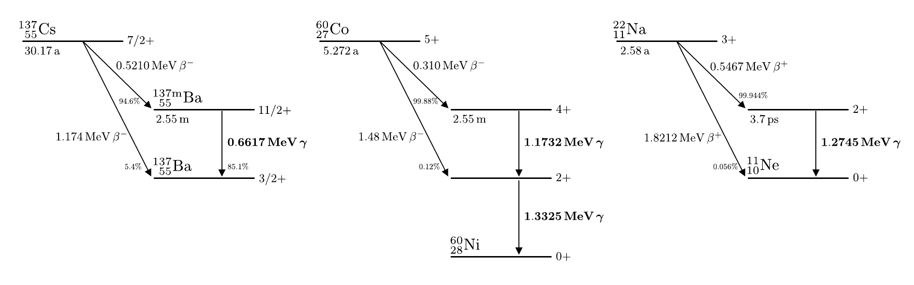

# Hinweise für den Versuch Gammaspektroskopie

## Radioaktive Strahlung

### Einordnung von $\gamma$-Strahlen

Grundsätzlich unterscheidet man drei Formen radioaktiver Strahlung:

- **$\alpha$-Strahlung**, d.h. Abstrahlung eines $\mathrm{He}$-Kerns. Die Kernladungszahl $Z$ und Massenzahl $A$ des Mutterkerns nehmen dabei jeweils um zwei ab.
- **$\beta$-Strahlung**, d.h. Abstrahlung eines Elektrons (oder Positrons). Dabei nimmt $Z$ um eins (Elektron) zu oder (Positron) ab und $A$ bleibt gleich. 
- **$\gamma$-Strahlung**, d.h. Abstrahlung eines (hoch-energetischen) Lichtteilchens (Photons, $\gamma$). Dabei bleiben sowohl $Z$, als auch $A$ gleich. 

Im Versuch Gammaspektroskopie treten sowohl $\beta$- als auch $\gamma$-Strahlung auf. Zur Einordnung der $\gamma$-Strahlung geben wir einige Energiebereiche von Licht an, die Ihnen geläufig sein sollten: 

- $\gamma$-Strahlung: $\mathcal{O}(\mathrm{MeV})$;
- Röntgenstrahlen: $\mathcal{O}(\mathrm{keV})$;
- Sichtbares Licht, blau ($\lambda_{\mathrm{blau}}=400\ \mathrm{nm}$): $3\ \mathrm{eV}$;
- Sichtbares Licht, rot ($\lambda_{\mathrm{rot}}=800\ \mathrm{nm}$): $1.5\ \mathrm{eV}$.

Die Energie der $\gamma$-Strahlung, die für Vorgänge in der Kernphysik charakteristisch ist, liegt also drei Größenordnungen über der Energie der Röntgenstrahlung, die für Vorgänge in der Atomphysik charakteristisch ist, und sechs Größenordnungen über der Energie sichtbaren Lichts, das unser Alltagsleben bestimmt. Die Skalen erklären sich aus der Kleinheit des Kerns, in dem neben der starken Kernkraft, auch sehr starke elektromagnetische Kräfte wirken. Das Verhältnis Kern- zu Atomausdehnung von $\approx1000$ erklärt den Unterschied zwischen $\gamma$- und Röntgenstrahlung. 

### Radioaktive Quellen für diesen Versuch

Für diesen Versuch verwenden wir drei in Technik, Medizin und Lehre häufig verwendete radioaktive Quellen, [Cäsium-137](https://en.wikipedia.org/wiki/Caesium-137) ($`^{137}_{55}\mathrm{Cs}`$), [Cobalt-60](https://en.wikipedia.org/wiki/Cobalt-60) ($`^{60}_{27}\mathrm{Co}`$) und [Natrium-22](https://en.wikipedia.org/wiki/Isotopes_of_sodium) ($`^{22}_{11}\mathrm{Na}`$). Cäsium zerfällt durch $\beta^{-}$-Strahlung in Barium, Cobalt in Nickel und Natrium durch $\beta^{+}$-Strahlung in Neon. In allen drei Fällen treten angeregte Zustände der Tochterkerne auf, die durch anschließende $\gamma$-Strahlung in ihren Grundzustand übergehen. Die relevanten Zerfallsschemata und weitere Details zu den Zerfällen können Sie **Abbildung 1** entnehmen:

**Abbildung 1** (Zerfallsschemata von (links) Cäsium-137, (mitte) Cobalt-60 und (rechts) Natrium-22)

---

Wie diese Zerfälle genau ablaufen lernen Sie in den Experimentalphysik-Vorlesungen des Bachelor-Studiums kennen. Weitere technische Daten über die entsprechenden Isotope können Sie [hier](https://www.periodensystem-online.de/index.php) erhalten. 

Die Elektronen und Positronen der entstehenden $\beta$-Strahlung können durch dünne Metallschichten bereits hinreichend abgeschirmt werden. Sie haben für diesen Versuch keine Bedeutung. Für diesen Versuch von Relevanz sind die entstehenden $\gamma$-Strahlen mit den folgenden Energien: 

- 0.6617 MeV (aus dem Zerfall von Cäsium-137),
- 1.1732 MeV (aus dem Zerfall von Cobalt-60),
- 1.3325 MeV (aus dem Zerfall von Cobalt-60),
- 1.2745 MeV (aus dem Zerfall von Na-22)
- 0.5110 MeV (aus der Annihilation der Positronen der Betastrahlung von Na-22).

Im Rahmen dieses Versuchs werden Sie die $\gamma$-Spektren der oben genannten Quellen charakterisieren und u.a. die oben genannten Energien zur Kalibration Ihres Messaufbaus verwenden. 

# Navigation

[Main](https://gitlab.kit.edu/kit/etp-lehre/p2-praktikum/students/-/tree/main/Gammaspektroskopie)

