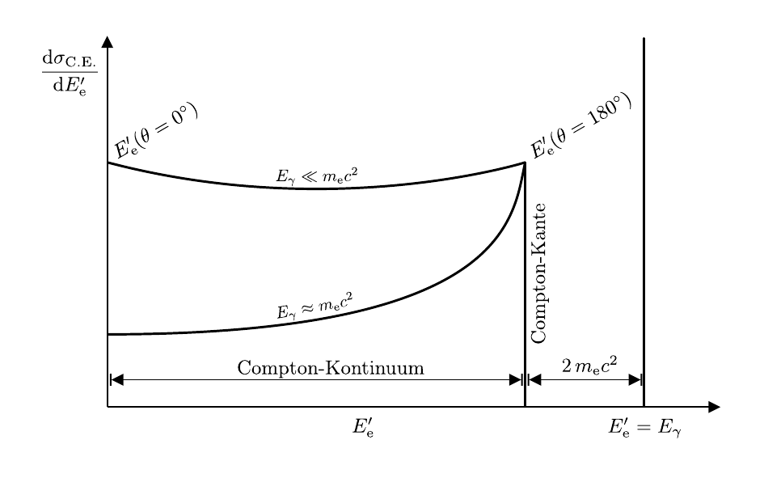

# Hinweise für den Versuch Gammaspektroskopie

## Wechselwirkung von Photonen mit Materie [2/2]

### Compton-Effekt

Compton-Effekt ist der dominierende Wechselwirkungsprozess für Photonen im Energiebereich von $E_{\gamma}=100\ \mathrm{keV}$ bis $10\ \mathrm{MeV}$ mit Materie. Er wurde 1922 erstmals von [Arthur Compton](https://de.wikipedia.org/wiki/Arthur_Holly_Compton) nachgewiesen, erklärt und untersucht. Compton stellte fest, dass bei der Streuung von Röntgenstrahlung an Graphit, die Wellenlänge $\lambda'$ des gestreuten Lichts größer als die Wellenlänge $\lambda$ des eingestrahlten Lichts ist. Für die Änderung der Wellenlänge gilt der einfache Zusammenhang: 
$$
\begin{equation*}
\begin{split}
&\Delta\lambda=\lambda'-\lambda = \frac{h}{m_{\mathrm{e}}\,c}\left(1-\cos\theta\right);\\
&\\
&\text{mit:} \\
&\\
&\lambda_{\mathrm{C}} = \frac{h}{m_{\mathrm{e}}\,c}.
\end{split}
\end{equation*}
$$
Dabei bezeichnet $\lambda_{\mathrm{C}}$ die sogenannte Compton-Wellenlänge und $\theta$ den Streuwinkel (im Laborsystem). Es ist bemerkenswert, dass der Energieübertrag von $\gamma$, der zu $\Delta\lambda$ korrespondiert, nur von $\theta$ und nicht von $E_{\gamma}$ abhängt. Er wird bei der Rückstreuung von $\gamma$ (d.h. für $\theta=180^{\circ}$) maximal. Die Energie $E_{\mathrm{e}}'$ des gestreuten Elektrons und die Energie $E_{\gamma}'$ des gestreuten Photons lassen sich unter der Annahme, dass es sich um eine elastische Zwei-Körper-Streuung von $\gamma$ (mit $E_{\gamma}=h\,\nu$ und $p_{\gamma}=h/\lambda$) an einem ruhenden, freien Elektron (mit $E_{\mathrm{e}}=m_{\mathrm{e}}c^{2}$ und $p_{\mathrm{e}}=0$) handelt, quasi-klassisch berechnen: 
$$
\begin{equation}
\begin{split}
&E'_{\gamma}(\theta) = \frac{E_{\gamma}}{1+\frac{E_{\gamma}}{E_{\mathrm{e}}}\left(1-\cos\theta\right)};
\qquad
E'_{\mathrm{e}}(\theta) = E_{\gamma}-E'_{\gamma}(\theta).\\
&\\
&E^{\prime\,\mathrm{max}}_{\mathrm{e}} = E^{\prime}_{\mathrm{e}}(\theta=180^{\circ}) = \frac{E_{\gamma}}{1+\frac{E_{\mathrm{e}}}{2\,E_{\gamma}}},\\
\end{split}
\end{equation}
$$
wobei $E^{\prime\,\mathrm{max}}_{\mathrm{e}}$ die Energie des Elektrons nach maximalem Energieübertrag ist. Diesen Punkt im Spektrum der gestreuten Elektronen bezeichnet man als Compton-Kante. Zu niedrigen Energien hin schließt sich das sog. Compton-Kontinuum, an die Compton-Kante an. 

Zwar stimmen die auf quasi-klassischem Wege bestimmten Beziehungen für $E_{\mathrm{e}}'(\theta)$ und $E_{\gamma}'(\theta)$ "zufällig" mit den im Rahmen der QED gewonnenen Ergebnissen überein, der exakte Verlauf des Spektrums lässt sich jedoch erst mit Hilfe des [Klein-Nishina-Wirkungsquerschnitts](https://de.wikipedia.org/wiki/Klein-Nishina-Wirkungsquerschnitt) vollständig verstehen. Eine schematische Darstellung des erwarteten Energiespektrums für die Compton-Streuung eines Photons mit $E_{\gamma}$ ist in **Abbildung 4** gezeigt: 

**Abbildung 4** (Schematische Darstellung des erwarteten Energiespektrums für die Compton-Streuung eines Photons mit der Energie $E_{\gamma}$. Die vertikale Linie rechts im Bild markiert die vollständige Absorption des Photons im Detektor, z.B. durch den Photoeffekt. Für das Compton-Kontinuum sind die verläufe für zwei unterschiedliche Energien $E_{\gamma}$ skizziert)

---

Auf der $x$-Achse ist die Energie $E_{\mathrm{e}}'$, auf der $y$-Achse der Wirkungsquerschnitt $\mathrm{d}\sigma_{\mathrm{C.E.}}/\mathrm{d}E_{\mathrm{e}}'$  aufgetragen. Die vertikale Linie rechts im Bild markiert die vollständige Absorption von $\gamma$ im Detektor, z.B. durch den Photoeffekt.  

Die Abhängigkeit von $\sigma_{\mathrm{C.E.}}$ von $Z$ und $E_{\gamma}$ beträgt 
$$
\begin{equation*}
\sigma_{\mathrm{C.E.}}(E_{\gamma}, Z)\propto\frac{Z}{E_{\gamma}}; \qquad \text{f\"ur: } E_{\gamma}\gg m_{\mathrm{e}}c^{2}.
\end{equation*}
$$

### Paarbildung

Aus Gründen der Energie- und Impulserhaltung ist dieser Prozess nur oberhalb der kinematischen Schwelle von $E_{\gamma}\gtrsim 2\,m_{\mathrm{e}}c^{2}$ und auch nur im elektrischen Feld, z.B. eines Atomkerns möglich. Erstmals wurde dieser Prozess 1934 von [Hans Bethe](https://de.wikipedia.org/wiki/Hans_Bethe) und [Walter Heitler](https://de.wikipedia.org/wiki/Walter_Heitler) gemeinsam mit dem zur Paarbildung sehr ähnlichen Prozess der Bremsstrahlung beschrieben und erklärt, weshalb beide Prozesse auch als Bethe-Heitler-Prozesse bezeichnet werden. 

Für $E_{\gamma}\gg m_{\mathrm{e}}c^{2}$ ist $\sigma_{\mathrm{pair}}$ unabhängig von $E_{\gamma}$, die Abhängigkeit von $\sigma_{\mathrm{pair}}$ von $Z$ beträgt 
$$
\begin{equation*}
\sigma_{\mathrm{pair}}(E_{\gamma}, Z)\propto Z^{2}.
\end{equation*}
$$
insbesondere für schwere Kerne erfolgt Paarbildung vor allem im hohen elektromagnetischen Feld des Atomkerns; das elektromagnetische Feld der Elektronen in der Atomhülle spielt nur bei sehr leichten Elementen eine Rolle. 

Im Material wird das Positron abgebremst, bis es mit einem Elektron aus dem Material rekombiniert und über den Prozess der [Elektron-Positron-Annihiliation](https://de.wikipedia.org/wiki/Annihilation) zerstrahlt. Aus dieser Reaktion gehen zwei, zueinander anti-parallel auslaufende Photonen mit der charakteristischen Energie $E_{\gamma}=m_{\mathrm{e}}c^{2}$ hervor, die selbst wieder mit dem Material in Wechselwirkung treten können.

# Navigation

[Zurück](https://gitlab.kit.edu/kit/etp-lehre/p2-praktikum/students/-/tree/main/Gammaspektroskopie/doc/Hinweise-Wechselwirkungen.md) | [Main](https://gitlab.kit.edu/kit/etp-lehre/p2-praktikum/students/-/tree/main/Gammaspektroskopie)

