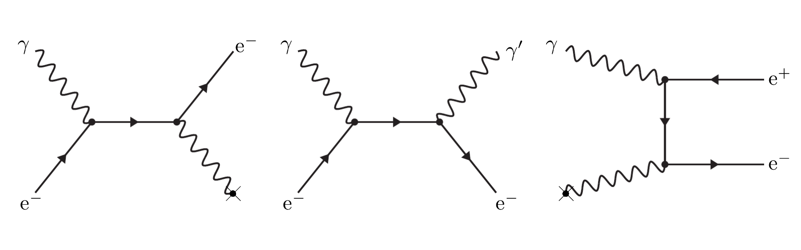

# Hinweise für den Versuch Gammaspektroskopie

## Wechselwirkung von Photonen mit Materie [1/2]

Es gibt drei Arten, auf die ein Photon $\gamma$ mit der Energie $E_{\gamma}$ mit Materie in Wechselwirkung treten kann: 

- [**Photoeffekt**](https://de.wikipedia.org/wiki/Photoelektrischer_Effekt): Das Photon trifft auf ein Elektron aus der Atomhülle des Materials, überträgt dabei seine gesamte Energie und wird voll absorbiert. Der Energieübertrag erfolgt zunächst virtuell. Die erneute Reaktion des Elektrons mit dem elektromagnetischen Feld, z.B. eines Atomkerns stellt Energie- und Impulserhaltung im Endzustand der Reaktion sicher. Das Elektron wird aus der Atomhülle ausgeschlagen und bewegt sich zunächst als freie Ladung durch das Material. 
- [**Compton-Effekt**](https://de.wikipedia.org/wiki/Compton-Effekt): Auch in diesem Fall erfolgt der Impulsübertrag zwischen $\gamma$ und Elektron zunächst virtuell, das ausgeschlagene Elektron emittiert unmittelbar ein neues Photon $\gamma'$ mit der Energie $E_{\gamma}'\lt E_{\gamma}$. Dieser Prozess kann als elastischer Stoßprozess zwischen Elektron und Photon angesehen werden. Es handelt sich jedoch nicht um einen elastischen Stoßprozess im klassischen Sinne, sondern um einen Prozess der [Quantenelektrodynamik](https://de.wikipedia.org/wiki/Quantenelektrodynamik) (QED), bei dem $\gamma$ zerstört und $\gamma^{\prime}$ erzeugt wird.
- [**Paarbildung**](https://de.wikipedia.org/wiki/Paarbildung_(Physik)): In diesem Fall zerfällt $\gamma$ in ein Elektron-Positron-Paar. Aus Gründen der Energie- und Impulserhaltung ist dieser Prozess nur oberhalb der kinematischen Schwelle von $E_{\gamma}\gtrsim 2\,m_{\mathrm{e}}c^{2}$ und ebenfalls nur im elektromagnetischen Feld, z.B. eines Atomkerns möglich. Dabei entspricht $m_{\mathrm{e}}$ der Masse des Elektrons bzw. Positrons.

Die Häufigkeit, mit der jeweils einer der oben genannten Prozesse stattfindet wird durch die Wirkungsquerschnitte $\sigma_{\mathrm{P.E.}}$ (für Photoeffekt), $\sigma_{\mathrm{C.E.}}$ (für Compton-Effekt) und $\sigma_{\mathrm{pair}}$ (für Paarbildung) quantifiziert. In **Abbildung 2** sind die drei Reaktionen schematisch dargestellt:

**Abbildung 2** (Schematische Darstellung des (links) Photon-, (mitte) Compton- und (rechts) Paarbildungseffekts. Das Kreuz symbolisiert jeweils die Wechselwirkung mit dem elektromagnetischen Feld, z.B. eines Atomkerns)

---

Elektronen sind dabei durch gerade Linien mit Pfeilen und Photonen durch Wellenlinien dargestellt. In den jeweiligen Diagrammen sind die in die Reaktion einlaufenden Teilchen links und die aus der Reaktion auslaufenden Teilchen rechts dargestellt. Linien, die kein freies Ende haben gelten als virtuell, d.h. sie verletzen im Rahmen der [Heisenbergschen Unschärferelation](https://de.wikipedia.org/wiki/Heisenbergsche_Unsch%C3%A4rferelation) kurzfristig Energie- und Impulserhaltung. Das Kreuz symbolisiert jeweils die Wechselwirkung mit dem elektromagnetischen Feld, z.B. eines Atomkerns. 

Im linken Diagramm (für den Photoeffekt) läuft das Photon $\gamma$ von links in die Reaktion ein und trifft auf ein quasifreies Elektron. Durch die unmittelbare Wechselwirkung des Elektrons mit dem elektromagnetischen Feld, z.B. eines Atomkerns sind Energie- und Impulserhaltung im Endzustand der Reaktion sichergestellt. Das Elektron läuft schließlich auf der rechten Seite  des Diagramms aus der Reaktion aus. 

Im mittleren Diagramm (für den Compton-Effekt) läuft das Photon $\gamma$ von links in die Reaktion ein und trifft auf ein quasifreies Elektron. Das Elektron strahlt das Photon $\gamma'$ ab und läuft ebenso, wie $\gamma'$ auf der rechten Seite des Diagramms aus der Reaktion aus.

Im rechten Diagramm (für die Paarbildung) zerfällt das von links einlaufende Photon $\gamma$ in ein Elektron-Positron-Paar. Das Elektron koppelt unmittelbar an das elektromagnetische Feld, z.B. eines Atomkerns, wodurch Energie- und Impulserhaltung im Endzustand sichergestellt sind. Danach laufen das Elektron und das Positron auf der rechten Seite des Diagramms aus der Reaktion aus. 

Im Folgenden gehen wir auf die einzelnen Prozesse etwas näher ein. 

### Photoeffekt

Beim Photoeffekt geht $E_{\gamma}$ vollständig auf das gestreute Elektron über. Dieser Effekt ist nur im elektromagnetischen Feld, z.B. eines Atomkerns, möglich. Der Atomkern nimmt dabei als Rückstoßpartner zusätzlichen Impuls aus der Reaktion auf, so dass im Endzustand der Reaktion Energie- und Impulserhaltung gewährleistet sind. Dies ist umso leichter möglich, je stärker das Elektron an den Atomkern gebunden ist, weshalb der Photoeffekt hauptsächlich mit Elektronen aus den K- und L-Schalen von Atomen mit großer Kernladungszahl $Z$ auftritt. Die vollständige theoretische Beschreibung dieses Prozesses über den gesamten Bereich von $E_{\gamma}$ ist schwierig und auf Näherungen angewiesen. Die Abhängigkeit von $\sigma_{\mathrm{P.E.}}$ von $Z$ und $E_{\gamma}$ beträgt 
$$
\begin{equation*}
\sigma_{\mathrm{P.E.}}(E_{\gamma}, Z)\propto\frac{Z^{n}}{E_{\gamma}^{m}}; \qquad \text{mit: } n=4\ldots5; \, m\leq 3.5,
\end{equation*}
$$
weshalb der Photoeffekt gerade bei kleinen Werten von $E_{\gamma}$ und großen Werten von $Z$ die anderen beiden Effekte dominiert. Für $E_{\gamma}\gg m_{\mathrm{e}}c^{2}$ gilt $m\to 1$, $\sigma_{\mathrm{P.E.}}$ fällt also mit zunehmender Energie $E_{\gamma}$ weniger stark ab.

Im Material erfolgt die Absorption durch Photoeffekt nicht durch eine einzige Reaktion sondern in mehreren, schnell aufeinander folgenden Schritten: Das Photon $\gamma$ schlägt ein Elektron, z.B. aus der K-Schale eines Atoms aus; dieses verliert Energie durch [Ionisation](https://de.wikipedia.org/wiki/Bethe-Formel) oder [Bremsstrahlung](https://de.wikipedia.org/wiki/Bremsstrahlung), d.h. Emission eines weiteren Photons $\gamma'$ niedrigerer Energie $E_{\gamma}'\lt E_{\gamma}$. Die Lücke in der K-Schale des Atoms wird, z.B. durch ein Elektron aus einer höheren Schale aufgefüllt, wobei wiederum ein Photon $\gamma^{\prime\prime}$ mit $E_{\gamma}^{\prime\prime}\ll E_{\gamma}$ emittiert wird. Aufgrund der niedrigeren Energien $E_{\gamma}^{\prime}$ und $E_{\gamma}^{\prime\prime}$ steigt die Wahrscheinlichkeit für den Photoeffekt für $\gamma'$ und $\gamma^{\prime\prime}$, wodurch eine Absorptionskaskade in Gang gesetzt wird, bis $E_{\gamma}$ vollständig auf Elektronen übertragen wurde.

# Navigation

[Main](https://gitlab.kit.edu/kit/etp-lehre/p2-praktikum/students/-/tree/main/Gammaspektroskopie) | [Weiter](https://gitlab.kit.edu/kit/etp-lehre/p2-praktikum/students/-/tree/main/Gammaspektroskopie/doc/Hinweise-Wechselwirkungen-a.md)

