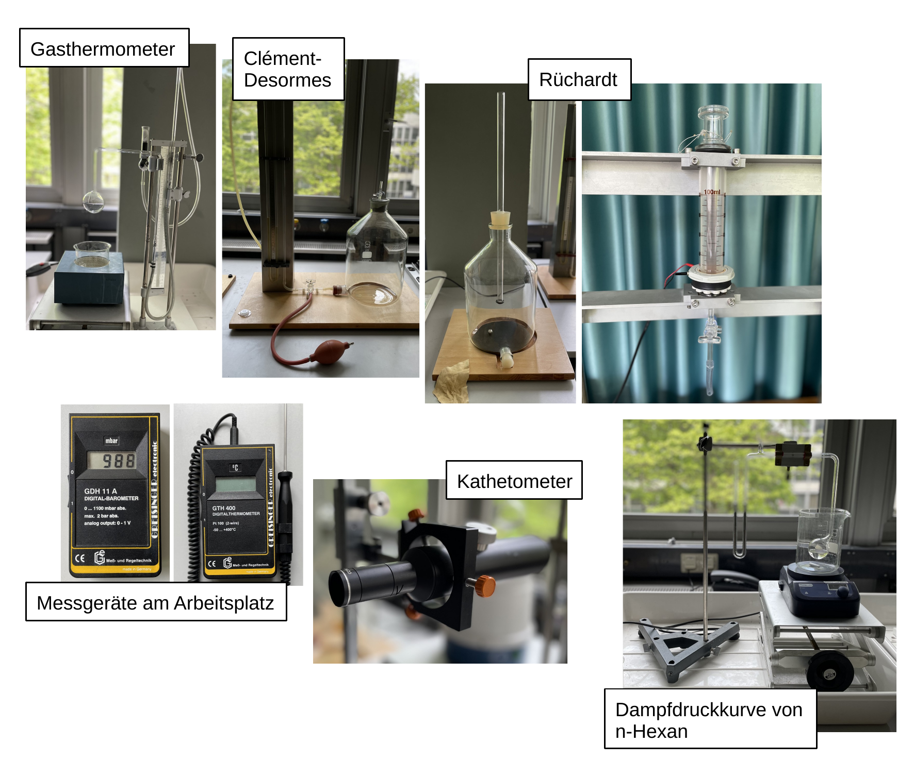

# Fakultät für Physik

## Physikalisches Praktikum P2 für Studierende der Physik

Versuch P2-47, 48, 49 (Stand: April 2024)

[Raum F1-08](https://labs.physik.kit.edu/img/Praktikum/Lageplan_P2.png)

# Ideales und reales Gas

## Motivation

Unter Begriffen wie Temperatur und Wärme kann sich jede:r von uns etwas vorstellen. In der Physik sind es zentrale Begriffe der Wärmelehre ([Thermodynamik](https://de.wikipedia.org/wiki/Thermodynamik)), die sich bei näherer Betrachtung jedoch sehr schnell als schwer physikalisch fassbar herausstellen. Die Entwicklung der Thermodynamik als eine Disziplin zwischen Physik und Ingeneurswissenschaft hat ab Mitte des 19. Jahrunderts v.a. durch die Arbeiten von [Nicolas Carnot](https://de.wikipedia.org/wiki/Nicolas_L%C3%A9onard_Sadi_Carnot), [Julius Mayer](https://de.wikipedia.org/wiki/Julius_Robert_Mayer), [James Joule](https://de.wikipedia.org/wiki/James_Prescott_Joule) oder [Rudolf Clausius](https://de.wikipedia.org/wiki/Rudolf_Clausius) rasante Entwicklungen genommen. Eine Anbindung zur mikroskopischen Beschreibung physikalischer Vorgänge erfuhr sie durch wegweisende Arbeiten von [Ludwig Boltzmann](https://de.wikipedia.org/wiki/Ludwig_Boltzmann), durch die ihre Begriffswelt eine mikroskopisch anschauliche Interpretation erhielt. Heutzutage ist die quantenmechansiche Beschreibung thermodynamischer Gößen ein kanonisches Anwendungsgebiet der Quantenfeldtheorie. Die in diesem Versuch zusammengestellten Experimente bieten Ihnen die Möglichkeit sich mit den Vorgängen der Thermodynamik experimentell vertraut zu machen. Im Zentrum aller Versuche stehen die grundlegenden Eigenschaften idealer und realer Gase.

## Lehrziele

Wir listen im Folgenden die wichtigsten **Lehrziele** auf, die wir Ihnen mit dem Versuch **Ideales und reales Gas** vermitteln möchten: 

- Sie bestimmen den absoluten Nullpunkt der Thermodynamik $\vartheta_{0}$ in $^{\circ}\mathrm{C}$, mit Hilfe eines [Gasthermometers](https://de.wikipedia.org/wiki/Gasthermometer).
- Sie bestimmen den Adiabetnexponenten ([Isentropenexponenten](https://de.wikipedia.org/wiki/Isentropenexponent)) $\kappa$ sowohl nach der Methode von [Clément-Desormes](https://de.wikipedia.org/wiki/Experiment_von_Cl%C3%A9ment-Desormes), als auch nach der Methode von [Rüchardt](https://de.wikipedia.org/wiki/R%C3%BCchardt-Experiment). Letztere verbindet die Messung thermodynamischer Größen mit Messprinzipien, wie Sie sie aus der Mechanik kennen.  
- Sie bestimmen die [Dampfdruckkurve](https://de.wikipedia.org/wiki/Dampfdruck) von n-[Hexan](https://de.wikipedia.org/wiki/Hexan) und schätzen daraus dessen molare Verdampfungswärme $Q_{\mathrm{M}}$ ab. 

## Versuchsaufbau

Typische Aufbauten für diesen Versuch sind in **Abbildung 1** gezeigt: 

**Abbildung 1**: (Typische Aufbauten für den Versuch "Ideales und reales Gas")

---

Bei diesem Versuch führen Sie drei Messungen thermodynamischer Größen durch, die alle mit idealen und realen Gasen zu tun haben: Die Messung des absoluten Nullpunkts der Temperatur $\vartheta_{0}$ (in $^{\circ}\mathrm{C}$) führen Sie mit Hilfe eines Gasthermometers durch (**Abbildung 1** oben links). Für die Bestimmung von $\kappa$ nach den Methoden von Clément-Desormes und Rüchardt beobachten Sie verschiedene Zustandsänderungen von Luft (und ggf. Argon $\mathrm{Ar}$, **Abbildung 1** oben rechts). Die Vermessung der Kurve des [Sättigungsdampfdrucks](https://de.wikipedia.org/wiki/S%C3%A4ttigungsdampfdruck) von $1\ \mathrm{mol}$ n-Hexan zwischen $\vartheta=0-20^{\circ}\mathrm{C}$ erfolgt mit Hilfe eines Quecksilber ($\mathrm{Hg}$)-Manometers (**Abbildung 1** unten rechts). 

## Wichtige Hinweise

- Bei den hier verwendeten Glasgeräten handelt es sich z.T. um eigens angefertigte empfindliche Präzisionsapparaturen klassischer Experimente der Thermodynaik. **Gehen Sie vorsichtig mit den Geräten um und halten Sie sie sauber.** 
- Beginnen Sie alle Versuche **erst nach Rücksprache** mit Ihrem:r Tutor:in. 
- Beachten Sie die Hinweise zum [Umgang mit $\mathrm{Hg}$](https://labs.physik.kit.edu/163.php?tab=%5B367%5D#tabpanel-367) auf den Webseiten des P1/P2. 
- Um Stromschlägen vorzubeugen fassen Sie bei Feuchtigkeit nicht in den eingeschalteten Heizpilz.

# Navigation

- [Hinweise-Thermodynamik.md](https://gitlab.kit.edu/kit/etp-lehre/p2-praktikum/students/-/blob/main/Ideales_und_reales_Gas/doc/Hinweise-Thermodynamik.md): Grundlagen der Thermodynamik.
- [Hinweise-Gasthermometer.md](https://gitlab.kit.edu/kit/etp-lehre/p2-praktikum/students/-/blob/main/Ideales_und_reales_Gas/doc/Hinweise-Gasthermometer.md): **Messprinzip eines Gasthermometers**.
- [Hinweise-Clement-Desormes.md](https://gitlab.kit.edu/kit/etp-lehre/p2-praktikum/students/-/blob/main/Ideales_und_reales_Gas/doc/Hinweise-Clement-Desormes.md): **Messprinzip der Methode von Clément-Desormes zur Bestimmung von $\kappa$**.
- [Hinweise-Ruechardt.md](https://gitlab.kit.edu/kit/etp-lehre/p2-praktikum/students/-/blob/main/Ideales_und_reales_Gas/doc/Hinweise-Ruechardt.md): **Messprinzip der Methode von Rüchardt zur Bestimmung von $\kappa$**.
- [Hinweise-Versuchsdurchfuehrung.md](https://gitlab.kit.edu/kit/etp-lehre/p2-praktikum/students/-/blob/main/Ideales_und_reales_Gas/doc/Hinweise-Versuchsdurchfuehrung.md): Wichtige Hinweise und **Tipps zur Versuchsdurchführung**.
- [Datenblatt.md](https://gitlab.kit.edu/kit/etp-lehre/p2-praktikum/students/-/blob/main/Ideales_und_reales_Gas/Datenblatt.md): **Wichtige technische Details** zu den Versuchsaufbauten.
