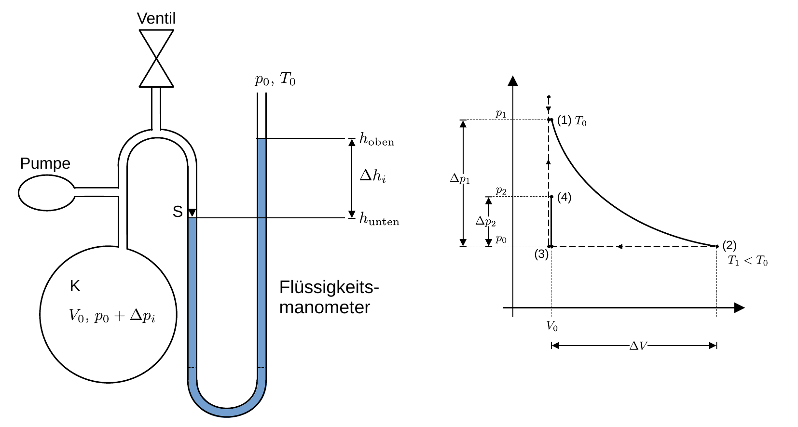

# Hinweise für den Versuch: "Ideales und reales Gas" 

## Messung des Adiabatenexponenten nach der Methode von [Clément-Desormes](https://de.wikipedia.org/wiki/Experiment_von_Cl%C3%A9ment-Desormes)

Diese Methode zur Bestimmung von $\kappa$ ist nach [Nicolas Clément](https://de.wikipedia.org/wiki/Nicolas_Cl%C3%A9ment) und [Charles Desormes](https://de.wikipedia.org/wiki/Charles-Bernard_Desormes) benannt. Eine Skizze zur Beschreibung des Verfahrens ist in **Abbildung 4** links gezeigt: 

**Abbildung 4**: (Links: Apparatur zur Bestimmung von $\kappa$ nach dem Verfahren von Clément-Desormes. Rechts: Phasendiagramm zum Messverfahren. Entlang der gestrichtelten Linien findet Stoffaustausch statt ($n\neq const.$))

---

Im Zentrum der Apparatur steht ein Kolben K in den mit einer geeigneten Pumpe (mit nicht allzu hohem Überdruck) zusätzliches Arbeitsgas (in unserem Fall Luft) gepumpt werden kann. Ein Flüssigkeitsmanometer dient zur Bestimmung des Drucks in K. Über ein Ventil kann der Überdruck in K abgelassen werden. 

Aus dem Anfangszustand $(p_{0},\ V_{0},\ T_{0})$ gehen Sie wie folgt vor:

- **Zustand (1)**: Erzeugen Sie mit dem Handblasebalg als Pumpe einen (nicht allzu großen) Überdruck in K. Warten Sie daraufhin einige Minuten lang den Temperaturausgleich duch **isochore Abkühlung** ab (gestrichelte Linie von **(3) nach (1) in Abbildung 4** rechts). Dabei fällt der Überdruck wieder leicht ab. Das System hat nun den Zustand $(p_{1},\ V_{0},\ T_{0})$ mit $p_{1}\equiv p_{0}+\Delta p_{1}$ und $p_{1}\gt p_{0}$.

- **Zustand (2)**: Öffnen Sie das Ventil der Flasche (für ${\approx}3\ \mathrm{s}$) und schließen Sie es unmittelbar wieder, so dass es zu einem Druckausgleich mit der Umgebung durch **adiabatische Expansion** kommen kann (durchgezogene Linie von **(1) nach (2) in Abbildung 4** rechts). Das System hat daraufhin den Zustand $(p_{0},\ V_{0}+\Delta V,\ T_{1})$ mit $T_{1} = T_{0} - \Delta T$ und $T_{1}\lt T_{0}$. 

- **Zustand (3)**: Nach Schließen des Ventils ist $V_{0}$ in der Flasche wieder als äußere Randbedingung vorgegeben (gestrichelte Linie von **(2) nach (3) in Abbildung 4** rechts). Das System hat somit den Zustand $(p_{0},\ V_{0},\ T_{1})$.

- **Zustand (4)**: Durch Temperaturausgleich (nach einer Wartezeit von ${\approx}10\,\mathrm{s}$) stellt sich aufgrund **isochorer Erwärmung** erneut ein Überdruck ein (duchgezogene Linie von **(3) nach (4) in Abbildung 4** rechts). Das System hat daraufhin den Zustand $(p_{2},\ V_{0},\ T_{0})$ mit $p_{2}\equiv p_{0}+\Delta p_{2}$ und $p_{1}\gt p_{2}\gt p_{0}$.

Aus **(4)** kehrt die Apparatur durch Belüftung wieder in **(3)** zurück. **(1)** ist der Zustand mit dem die Messung beginnt; **(3)** dient dazu das Volumen $V_{0}$ wieder durch äußere Randbedingungen vorzugeben. Beachten Sie, das in beiden Fällen die Stoffmenge $n$ des betrachteten Arbeitsgases nicht konstant ist (gestrichelte Linien in **Abbildung 4** rechts). Für die Bestimmung von $\kappa$ sind die Änderungen von **(1) nach (2)** und von **(3) nach (4)** von Relevanz.  

### Übergang von (1) nach (2)

Für die **adiabatische Expansion** beim Übergang von **(1) nach (2)** gilt (nach den Gleichungen **(2)** [hier](https://gitlab.kit.edu/kit/etp-lehre/p2-praktikum/students/-/blob/main/Ideales_und_reales_Gas/doc/Hinweise-Thermodynamik.md)): 
$$
\begin{equation*}
\begin{split}
&\left(p_{0}+\Delta p_{1}\right)\,V_{0}^{\kappa} = p_{0}\,\left(V_{0}+\Delta V\right)^{\kappa}\\
&\\
&T_{0}\,V_{0}^{\kappa-1} = \left(T_{0}-\Delta T\right)\,\left(V_{0}+\Delta V\right)^{\kappa-1}.\\
\end{split}
\end{equation*}
$$
Für kleine Volumenänderungen $\Delta V\ll V_{0}$ gilt die Näherung  

$$
\begin{equation*}
\left(V_{0}+\Delta V\right)^{\kappa}\approx V_{0}^{\kappa}\left(1+\kappa\frac{\Delta V}{V_{0}}\right),
\end{equation*}
$$
woraus nach Umformung

$$
\begin{equation}
\begin{split}
&\frac{\Delta p_{1}}{p_{0}} = \kappa \frac{\Delta V}{V_{0}}\\
&\\
&\frac{\Delta T}{T_{0}}\approx\frac{\Delta T}{T_{0}-\Delta T} = \left(\kappa-1\right)\frac{\Delta V}{V_{0}}\\
&\\
&\frac{\Delta T}{T_{0}} = \frac{\kappa-1}{\kappa}\frac{\Delta p_{1}}{p_{0}}\\
\end{split}
\end{equation}
$$
folgt.

### Übergang von (3) nach (4):

Für die **isochore Erwärmung** beim Übergang von **(3) nach (4)** gilt (nach Gleichung **(1)** [hier](https://gitlab.kit.edu/kit/etp-lehre/p2-praktikum/students/-/blob/main/Ideales_und_reales_Gas/doc/Hinweise-Thermodynamik.md)):

$$
\begin{equation}
\begin{split}
&\frac{T_{0}-\Delta T}{T_{0}} = \frac{p_{0}}{p_{0}+\Delta p_{2}};\\
&\\
&\frac{\Delta T}{T_{0}} = 1-\frac{p_{0}}{p_{0}+\Delta p_{2}}
\approx \frac{\Delta p_{2}}{p_{0}},\\
\end{split}
\end{equation}
$$
wobei der Quotient auf der rechten Seite von Gleichung **(2)** unten für $\Delta p_{2}\ll p_{0}$ durch eine geometrischen Reihe genähert wurde. 

### Berechnung von $\kappa$ 

Gleichsetzen der Gleichungen **(1)** und **(2)** führt auf:

$$
\begin{equation*}
\begin{split}
&\frac{\kappa-1}{\kappa}\Delta p_{1} = \Delta p_{2}; \\
&\kappa = \frac{\Delta p_{1}}{\Delta p_{1} - \Delta p_{2}}
\end{split}
\end{equation*}
$$
Für die Manometerkuppen im Flüssigkeitsmanometer gilt: 

$$
\begin{equation*}
\begin{split}
& p(\Delta h_{i}) = p_{0} + \rho\,g\,\Delta h_{i};\\
&\\
&\Delta p_{i} = p(\Delta h_{i}) - p_{0} = \rho\,g\,\Delta h_{i}
\end{split}
\end{equation*}
$$
wobei $\rho$ der Dichte der Manometerflüssigkeit und $g$ der Erdbeschleunigung entsprechen, woraus sich direkt die finale Bestimmungsgleichung für $\kappa$ ergibt: 
$$
\begin{equation*}
\kappa = \frac{\Delta h_{1}}{\Delta h_{1}- \Delta h_{2}}
\end{equation*}
$$

Eine numerische Simulation für den Versuch von Clément-Desormes (für $\mathrm{Ar}$) finden Sie [hier](https://ressources.univ-lemans.fr/AccesLibre/UM/Pedago/physique/02/thermo/clement.html).

# Navigation

[Main](https://gitlab.kit.edu/kit/etp-lehre/p2-praktikum/students/-/tree/main/Ideales_und_reales_Gas)

