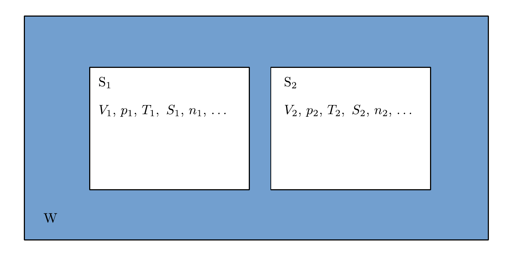
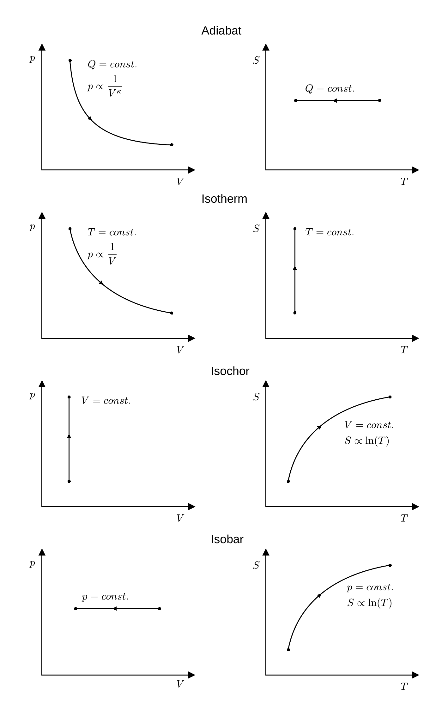

# Hinweise für den Versuch: "Ideales und reales Gas" 

##  Grundlagen der Thermodynamik

### Grundbegriffe

Die [Thermodynamik](https://de.wikipedia.org/wiki/Thermodynamik) beschäftigt sich mit den Eigenschaften makroskopisch ausgedehnter Systeme $\mathrm{S_{i}}$, die durch [Zustandsgrößen](https://de.wikipedia.org/wiki/Zustandsgr%C3%B6%C3%9Fe), wie 

- Volumen ($V$); 
- Druck ($p$);
- Stoffmenge ($n$);
- Dichte ($\rho$);
- innere Energie ($U$);
- [Entropie](https://de.wikipedia.org/wiki/Entropie) ($S$); 
- [Temperatur](https://de.wikipedia.org/wiki/Temperatur) ($T$) 

charakterisiert sind. Die $\mathrm{S_{i}}$ sind Teil einer größeren Systemumgebung $\mathrm{W}$, mit konstanter Temperatur $T$, mit der sie Wärme austauschen können. Man bezeichnet diese Umgebung als [Wärmebad](https://de.wikipedia.org/wiki/W%C3%A4rmebad). Wir betrachten zwei Systeme $\mathrm{S_{1}}$ und $\mathrm{S_{2}}$ in $\mathrm{W}$ für die alle Zustandsvariablen gleiche Werte besitzen, wie in **Abbildung 1** skizziert:

**Abbildung 1**: (Zwei Systeme $\mathrm{S_{1}}$ und $\mathrm{S_{2}}$ im Wämebad $\mathrm{W}$)

---

Eine Zustandsgröße heisst [extensiv](https://de.wikipedia.org/wiki/Intensive_und_extensive_Gr%C3%B6%C3%9Fen), wenn sich ihr Wert verdoppelt sobald man $\mathrm{S_{1}}$ und $\mathrm{S_{2}}$ zusammenfasst und [intensiv](https://de.wikipedia.org/wiki/Intensive_und_extensive_Gr%C3%B6%C3%9Fen) wenn ihr Wert gleich bleibt. Beispiele für extensive Zustandvariablen sind $V$ und $n$. Beispiele für intensive Zustandvariablen sind $p$ und $T$. Wir gehen im Folgenden der Einfachheit immer von $n=const.$ aus. Zueinander **adjungierte Variablen** zur vollständigen Beschreibung des Zustands eines solchen thermodynamischen Systems sind $(p,\,V)$ und $(S,\,T)$. Zustandsänderungen werden in $pV$- oder (seltener in) $ST$-Diagrammen in den durch diese Variablenpaare aufgespannten Zustandsräumen dargestellt. 

Ein zentrales Studienobjekt der Thermodynamik ist das [ideale Gas](https://de.wikipedia.org/wiki/Ideales_Gas). Typische Zustandsänderungen eines idealen Gases im $pV$- und $ST$-Diagramm sind in **Abbildung 2** gezeigt:  

**Abbildung 2**: (Beispiele für adiabate, isotherme, isochore und isobare Zustandsänderungen (links) im $pV$- und (rechts) im $ST$-Diagramm.

---

Zustandsänderungen von Systemen, die umkehrbar sind, ohne dass $\mathrm{W}$ dadurch bleibende Änderungen erfährt nennt man [reversibel](https://de.wikipedia.org/wiki/Reversibler_Prozess). Einen statischen Zustand ohne Zustandsänderungen bezeichnet man als [thermodynamisches Gleichgewicht](https://de.wikipedia.org/wiki/Thermodynamisches_Gleichgewicht). 

### Zustandsgleichungen

Mathematisch werden Zustandsänderungen thermodynamischer Systeme durch [Zustandsgleichungen](https://de.wikipedia.org/wiki/Zustandsgleichung) beschrieben. Die wichtigste Zustandsgleichung zur Beschreibung idealer Gase ist die [ideale Gasgleichung](https://de.wikipedia.org/wiki/Thermische_Zustandsgleichung_idealer_Gase) die in zwei Formen gebräuchlich ist:
$$
\begin{equation}
\begin{split}
&pV=n\,R\,T; \\
&\\
&pV=N\,k_{B}\,T. \\
\end{split}
\end{equation}
$$
Dabei entprechen $R$ der idealen [Gaskonstanten](https://de.wikipedia.org/wiki/Gaskonstante), $N$ der Anzahl der Teilchen im Gas und $k_{B}$ der [Boltzmann-Konstanten](https://de.wikipedia.org/wiki/Boltzmann-Konstante). 

Führt man einem idealen Gas Wärme $\delta Q$ zu ändert sich seine Temperatur. **Diese Änderung ist von der Art und Weise abhängig, wie dies geschieht!** Erlaubt man z.B. eine Volumenänderung $\mathrm{d} V$ und hält dabei den Druck konstant ($p=const.$) fällt die Temperaturänderung $\mathrm{d} T$ geringer aus, als wenn man das Volumen konstant hält ($V=const.$) und Druckänderungen zulässt. Diese beiden Vorgänge werden durch die [kalorischen Zustandsgleichungen](https://de.wikipedia.org/wiki/Zustandsgleichung#Die_kalorische_Zustandsgleichung) des idealen Gases beschrieben: 
$$
\begin{equation*}
\begin{split}
&\delta Q = n\,c_{V}\,\mathrm{d} T; \\
&\\
&\delta Q = n\,c_{p}\,\mathrm{d} T, \\
\end{split}
\end{equation*}
$$
wobei $c_{V}$ und $c_{p}$ als die **spezifischen Wärmekapazitäten** bei konstantem Volumen und konstantem Druck bezeichnet werden. In beiden Fällen ist die Änderung der Temperatur proportional zur zugeführten Wärme, es gilt jedoch $c_{p}\gt c_{V}$. 

Der [erste Hauptsatz der Wärmelehre](https://de.wikipedia.org/wiki/Thermodynamik#Erster_Hauptsatz) besagt: 
$$
\begin{equation*}
\mathrm{d}U = \delta Q + \delta W,
\end{equation*}
$$
wobei $\mathrm{d}U$ der Änderung der [inneren Energie](https://de.wikipedia.org/wiki/Innere_Energie), $\delta Q$ der dem System zugeführten Wärme und $\delta W$ der am System geleisteten Arbeit entsprechen. Dabei versteht sich, dass $\delta W$ das System nicht als Ganzes beeinflusst. Daraus erklärt sich der Unterschied der spezifischen Wärmekapazitäten, wie folgt: 
$$
\begin{equation*}
\begin{split}
&\left.\delta Q\right|_{V=const.} = \mathrm{d}U \\
&\hphantom{\left.\delta Q\right|_{V=const.}}= n\,c_{V}\,\mathrm{d}T; \\
&\\
&\left.\delta Q\right|_{p=const.} = \mathrm{d}U - \delta W \\
&\hphantom{\left.\delta Q\right|_{p=const.}}=  n\,c_{V}\,\mathrm{d}T + p\,\mathrm{d} V;\\
&\hphantom{\left.\delta Q\right|_{p=const.}}=  n\,c_{V}\,\mathrm{d}T + n\,R\,\mathrm{d}T;\\
&\hphantom{\left.\delta Q\right|_{p=const.}}=  n\,c_{p}\,\mathrm{d}T.\\
\end{split}
\end{equation*}
$$
Beachten Sie, dass in diesem Fall das System beim Erwärmen selbst Arbeit verrichtet, für die am System geleistete Arbeit gilt also 
$$
\begin{equation*}
\delta W=- p\,\mathrm{d} V.
\end{equation*}
$$
Die Spezifische Wärmekapazität bei konstantem Druck $c_{p}$ ist um den Betrag der bei der Erwärmung durch das System geleisteten Arbeit $\delta W$ größer als $c_{V}$:
$$
\begin{equation*}
c_{p} = c_{V}+R.
\end{equation*}
$$
 Den Quotienten $\kappa = c_{p}/c_{V}$ bezeichnet man als [Adiabetanexponenten](https://de.wikipedia.org/wiki/Isentropenexponent). 

Für Prozesse idealer Gase bei denen **kein Wärmeaustausch stattfindet** ($\delta Q=0$) erhält man mit der [Adiabatengleichung](https://de.wikipedia.org/wiki/Adiabatische_Zustands%C3%A4nderung) eine weitere wichtige Zustandsgleichung: 
$$
\begin{equation*}
\begin{split}
&\delta Q = 0 \quad\Rightarrow\quad \mathrm{d}U = \delta W \\
&\\
&\vphantom{\frac{\mathrm{d}V}{V};}
n\,c_{V}\,\mathrm{d}T = p\,\mathrm{d}V; \\
&\hphantom{n\,c_{V}\,\mathrm{d}T} = n\,R\,T\,\frac{\mathrm{d}V}{V}; \\
&\\
&c_{V}\,\frac{\mathrm{d}T}{T} = R\,\frac{\mathrm{d}V}{V};\\
&\\
&T\,V^{\frac{R}{c_{V}}} = const.\\
\end{split}
\end{equation*}
$$
Durch Einsetzen von Geichung **(1)** erhält man die Adiabatengleichung in drei Formen: 
$$
\begin{equation}
T\,V^{\kappa-1}=const;\qquad
p\,V^{\kappa}=const.;\qquad
p\,T^{\frac{1-\kappa}{\kappa}}=const.
\end{equation}
$$

# Navigation

[Main](https://gitlab.kit.edu/kit/etp-lehre/p2-praktikum/students/-/tree/main/Ideales_und_reales_Gas)

