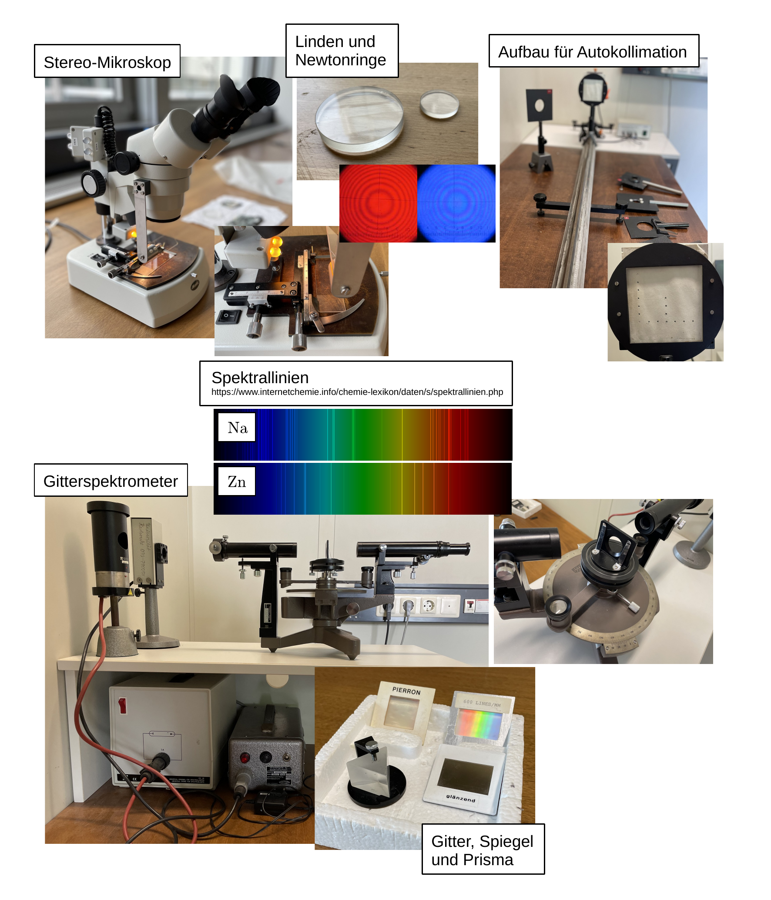

# Fakultät für Physik

## Physikalisches Praktikum P2 für Studierende der Physik

Versuch P2-13 (Stand: Mai 2024)

[Raum F1-09](https://labs.physik.kit.edu/img/Praktikum/Lageplan_P2.png)

# Interferenz

## Motivation

Beugung und Interferenz sind die wichtigsten charakterisierenden Eigenschaften von Wellenphänomenen. Sie beruhen auf einer physikalischen Observablen, die i.a. schwer zu beobachten ist, der Phase einer Welle. Die Phase einer einzelnen Welle ist für physikalische Beobachtungen zumeist irrelevant. Bedeutung gewinnt sie, wenn Wellen feste Phasenbeziehungen zueinander haben. Diesen Zustand bezeichnet man als [Kohärenz](https://de.wikipedia.org/wiki/Koh%C3%A4renz_(Physik)). Auch in der Quantenmechanik, wo Materie Wellencharakter aufweist, ist Kohärenz eine zentrale physikalische Eigenschaft. Bahnbrechende Experimente, wie das [Doppelspaltexperiment](https://de.wikipedia.org/wiki/Doppelspaltexperiment) beruhen auf der Demonstration von Interferenzeffekten von Materiewellen. Die systematische Untersuchung statischer Kristallstrukturen beruht auf der Auswertung komplexer Interferenzbilder am Kristallgitter. Darüber hinaus erlaubt die geschickte Verwendung von Interferenzeffekten, z.B. in der [Interferometrie](https://de.wikipedia.org/wiki/Interferometrie) Messungen mit nahezu atemberaubender Präzision. Beugung und Interferenz nehmen damit zu Recht eine zentrale Position in der modernen Physik ein. Dies ist Motivation genug mit den Eigenschaften von Beugung und Interferenz gut vertraut zu sein. Dieser Versuch bietet Ihnen die Möglichkeit sich mit beiden Phänomenen und ihrem Wechselspiel im Experiment auseinanderzusetzen, sie gezielt unter Laborbedingungen mit sichtbarem Licht herbeizuführen und zu studieren. 

## Lehrziele

Wir listen im Folgenden die wichtigsten **Lehrziele** auf, die wir Ihnen mit dem Versuch **Interferenz** vermitteln möchten: 

- Sie üben sich in der Verwendung optischer Geräte.
- Sie vertiefen Ihr Verständnis für die Phänomene der Beugung und Interferenz an Spalt und Gitter.
- Sie untersuchen die Spektren von $\mathrm{Na}$ und $\mathrm{Zn}$. 

## Versuchsaufbau

Typische aufbauten für diesen Versuch sind in **Abbildung 1** gezeigt:

**Abbildung 1**: (Typische Aufbauten für den Versuch Interferenz)

---

Im ersten Aufgabenteil untersuchen Sie das Phänomen der [Newtonschen Ringe](https://de.wikipedia.org/wiki/Newtonsche_Ringe) am einfachsten Beispiel planconvexer Linsen, mit Hilfe eines Stereo-Mikroskops. Sie bestimmen die optische Dichte von Wasser und die optische Dichte der verwendeten Linse. Letztere bestimmen Sie aus den Messungen von Krümmungsradius und Brennweite. Die Brennweite bestimmen Sie mit Hilfe von [Autokolllimation](https://de.wikipedia.org/wiki/Autokollimation#:~:text=Mit%20Autokollimation%20ist%20auch%20die,der%20anderen%20Seite%20der%20Linse.). Im zweiten Teil nehmen Messungen mit Hilfe eines Gitterinterferometers. Hierbei messen Sie Linien der Spektren von $\mathrm{Na}$ und $Zn$ aus. 

# Navigation

- [Hinweise-Newtonringe.md](https://gitlab.kit.edu/kit/etp-lehre/p2-praktikum/students/-/blob/main/Interferenz/doc/Hinweise-Newtonringe.md): Grundlagen zum Themnkomplex der Newtonshcen Ringe.
- [Hinweise-Gitter.md](https://gitlab.kit.edu/kit/etp-lehre/p2-praktikum/students/-/blob/main/Interferenz/doc/Hinweise-Gitter.md): Grundlagen zu Beugung und Interferenz von Einzelspat bis zum Gitter.
- [Hinweise-Gitterspektrometer.md](https://gitlab.kit.edu/kit/etp-lehre/p2-praktikum/students/-/blob/main/Interferenz/doc/Hinweise-Gitterspektrometer.md): Grundlagen und Anmerkungen zu Aufbau und Funktionsweise eines Gitterspektrometers.
- [Hinweise-Versuchsdurchfuehrung.md](https://gitlab.kit.edu/kit/etp-lehre/p2-praktikum/students/-/blob/main/Interferenz/doc/Hinweise-Versuchsdurchfuehrung.md): Wichtige Hinweise und **Tipps zur Versuchsdurchführung**.
- [Datenblatt.md](https://gitlab.kit.edu/kit/etp-lehre/p2-praktikum/students/-/blob/main/Interferenz/Datenblatt.md): **Wichtige technische Details** zu den Versuchsaufbauten.

