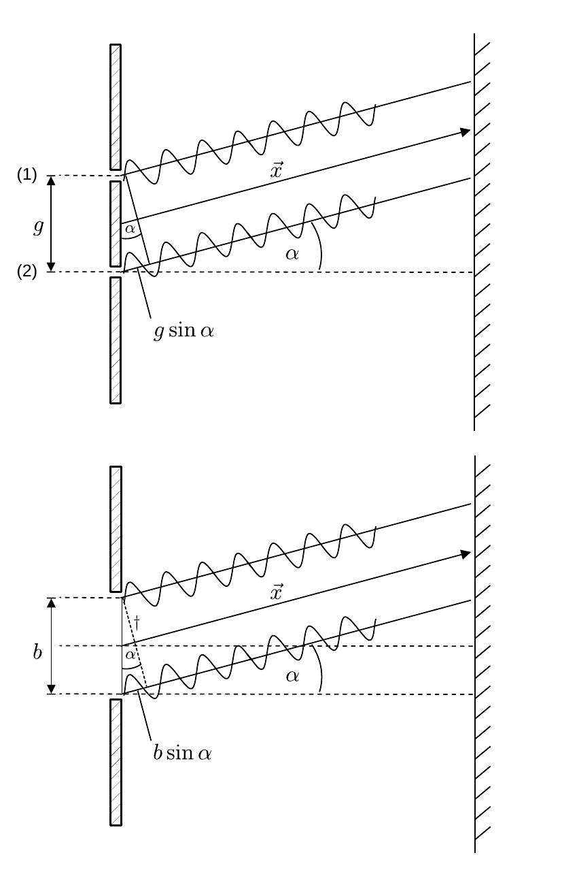
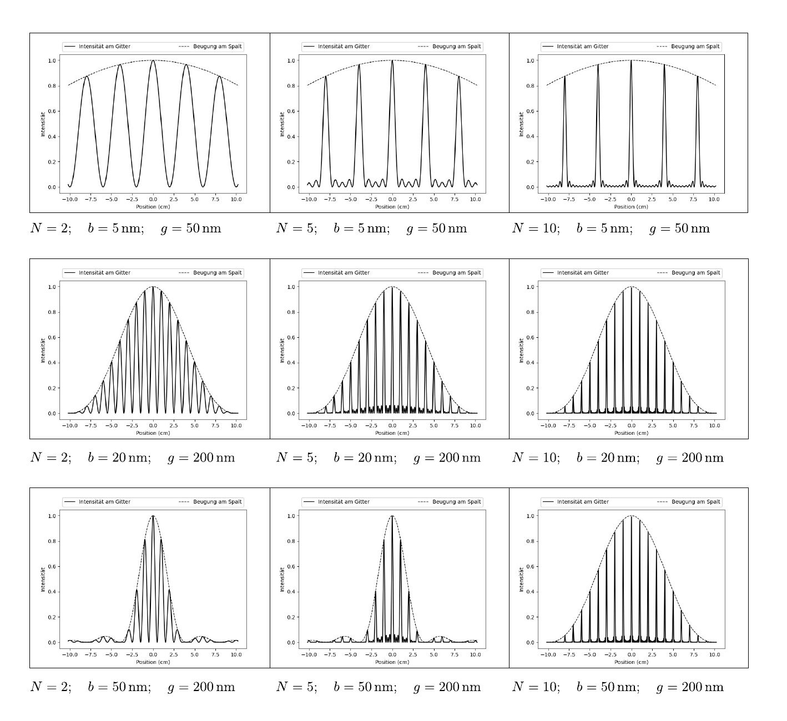

# Hinweise für den Versuch "Interferenz"

## Interferenz und Beugung am Doppel- und Einfachspalt

Eine schematische Darstellung zur Erklärung von Interferenz und Beugung am Doppel- und Einfachspalt ist in **Abbildung 4** gezeigt: 



**Abbildung 4**: (Inteferenz am Doppelspalt und Beugung am Einfachspalt)

---

Die hier gemachten Ausführungen gelten für ein **ideales periodisches Gitter** mit perfekter Transmission in und perfekter Extinktion zwischen den Spalten. Neben diesem gibt es noch eine ganze Reihe weiterer Gittertypen. Einige Beispiele sind:

- Reflexionsgitter mit sowohl ebenen als geneigten Furchen. Letztere (die sog. **Echelette-Gitter**) liefern die Hauptintensität in der ersten statt in der nullten Ordnung.
- Bei sinusförmig schwankender Durchlässigkeit (sog. **Sinusgitter**) erhält man nur Maxima erster Ordnung. Solche Gitter lassen sich z.B. durch Photographie von Interferenzbildern erzeugen.
- **Phasengitter** sind überall durchsichtig, aber ihr Brechungsindex ändert sich periodisch. Aufgrund der resultierenden Dichteunterschiede erhält man ein solches Gitter z.B. bei stehenden Schallwellen in Flüssigkeiten.
- Schließlich seien neben den bisher genannten eindimensionalen noch zwei- und dreidimensionale Gitter erwähnt.

### Interferenz am Doppelspalt

Zur Erklärung der Interferenz am Doppelspalt (**Abbildung 4** oben) vernachlässigen wir zunächst die endliche Ausdehnung $b$ der Spalten (1) und (2), relativ zur Wellenlänge $\lambda$ des Lichts ($b\ll\lambda$) und interpretieren beide Spalten als Quellen zweier kohärenter [Elementarwellen](https://de.wikipedia.org/wiki/Huygenssches_Prinzip) $\psi^{(j)},\ j=1,\ 2$ die sich zu einer Gesamtwelle 
$$
\begin{equation*}
\psi(\alpha) = \sum\limits_{j=1}^{2}\frac{\psi_{0}}{2}e^{ikx_{j}}
\end{equation*}
$$
überlagern. Zur Vereinfachung der Notation formulieren wir die $\psi^{(j)}$ als ebene Wellen, vernachlässigen die für diese Diskussion irrelevante Zeitabhängigkeit, und wählen $\vec{x}$ entlang der Beobachtungsrichtung $\alpha$, so dass $\vec{k}\cdot\vec{x} = |\vec{k}|\ |\vec{x}| = k\ x$. Schließlich wählen wir den Ursprung des Koordinatensystems in der Mitte zwischen den Spalten. Wir erhalten so für die Amplitude von $\psi(\alpha)$ 
$$
\begin{equation}
\begin{split}
\psi(\alpha) &= \frac{\psi_{0}}{2}\left(e^{ik\,g/2\sin\alpha}+e^{-ik\,g/2\sin\alpha}\right) \\
&\\
&= \psi_{0}\cos(k\,g/2\sin\alpha). \\
\end{split}
\end{equation}
$$
**Die Intensitätsverteilung hinter dem Doppelspalt ergibt sich aus dem Betragsquadrat der Amplitude**. Destruktive Interferenz der $\psi^{(j)}$ liegt unter der Bedingung
$$
\begin{equation*}
\begin{split}
&k\,g/2\sin\alpha = m\frac{\pi}{2};\qquad m\in\mathbb{N} \\
&\\
&\text{mit:}\\
&\\
&k=\frac{2\pi}{\lambda}\\
&\\
&g\sin\alpha = m\frac{\lambda}{2}
\end{split}
\end{equation*}
$$
vor. 

### Beugung am Einfachspalt

Im Fall der Beugung am Einfachspalt (**Abbildung 4** unten) gehen wir von einer kontinuierlichen Verteilung kohärent überlagerter Elementarwellen 
$$
\begin{equation}
\psi(\alpha) 
   = \sum\limits_{j<b\sin\alpha/\Delta x} \psi_{0}\frac{\Delta x}{b\sin\alpha}\,e^{ikx_{j}}
\end{equation}
$$
enlang der Spaltbreite $b$ aus. Diese konstruieren wir wie folgt:

- Wir zerlegen die Wellenfront $\psi(\alpha)$ über der vollen Breite von $b$ in $n$ Teilwellen $\psi^{(j)},\ j=1,\ldots n$ der Amplitude $\psi_{0}^{(j)}/n$.

- Alle $\psi^{(j)}$ entlang der gepunkteten Linie ($\dagger$) in **Abbildung 4** unten addieren sich mit ihrer festen Phase am Ort $x_{j}$. Dabei gilt $\Delta x = x_{j} - x_{j-1}$ und
  ```math
  \begin{equation*}
  \sum\limits_{j=1}^{n} \Delta x n\,\Delta x= b\sin\alpha.
  \end{equation*}
  ```

- Die Normierung lässt sich somit durch 

  ```math
  \begin{equation*}
  \psi_{0}^{(j)}/n = \psi_{0} \frac{\Delta x}{b\sin\alpha}
  \end{equation*}
  ```

  ausdrücken. 

Im Grenzübergang $\Delta x\to0;\,n\to\infty$ geht die Summe aus Gleichung **(2)** in das Integral
$$
\begin{equation}
\begin{split}
   \psi(\alpha) &= \int\limits_{-b/2\sin\alpha}^{+b/2\sin\alpha} \psi_{0}\frac{\mathrm{d}x}{b\sin\alpha}\,e^{ikx} 
= \left[\frac{\psi_{0}}{b\sin\alpha}\frac{e^{ikx}}{ik}
\right]_{-b/2\sin\alpha}^{+b/2\sin\alpha} \\
&\\
&= \frac{\psi_{0}}{b/2\sin\alpha} \left(\frac{e^{ik\,b/2\sin\alpha} - 
e^{-ik\,b/2\sin\alpha}}{2ik} \right) \\
&\\
&= \psi_{0}\cdot\underbrace{\frac{\sin(k\,b/2\sin\alpha)}{k\,b/2\sin\alpha}} = \psi_{0}\cdot\mathrm{si}(k\,b/2\sin\alpha)\\
&\hphantom{= \psi_{0}\cdot\psi cccc}\equiv f_{S}
\end{split}
\end{equation}
$$
über. Der Term $f_{S}$ in Gleichung **(3)** wird auch als [Spaltfunktion](https://de.m.wikipedia.org/wiki/Sinc-Funktion) oder **Sinus cardinalis** $\mathrm{si(\ \cdot\ )}$ bezeichnet. Die vermeintliche Singularität bei $k\ b/2\sin\alpha=0$ ist hebbar, wie sich aus der Reihenentwicklung des Sinus ersehen lässt. Bei $\mathrm{si}(\ \cdot\ )$ handelt es sich um die [Fourier-Transformierte](https://de.wikipedia.org/wiki/Fourier-Transformation) der skalierten [Rechteckfunktion](https://de.m.wikipedia.org/wiki/Rechteckfunktion)
$$
\begin{equation*}
\mathrm{rect}(y) = \left\{\begin{array}{ll}
\frac{1}{b\sin\alpha}
&-b/2\sin\alpha\leq y<b/2\sin\alpha\\ 0 & \text{sonst.}\end{array}\right.
\end{equation*}
$$
Die Nullstellen von $\mathrm{si}(\ \cdot\ )$ liegen bei 
$$
\begin{equation*}
\begin{split}
&k\,b/2\sin\alpha = m\,\pi;\qquad m\in\mathbb{N} \\
&\\
&\text{mit:}\\
&\\
&k=\frac{2\pi}{\lambda}\\
&\\
&b\sin\alpha = m\,\lambda.
\end{split}
\end{equation*}
$$
**Im Gegensatz zur Interferenz am Doppelspalt liegen die Intensitätsminima bei der Beugung am Einfachspalt nicht bei ganzzahligen Vielfachen von $\lambda/2$ sondern bei ganzzahligen Vielfachen von $\lambda$**.

### Doppelspalt mit endlicher Spaltbreite

Wir kehren nun wieder zur Interferenz am Doppelspalt zurück. Ist dabei $b$ im Verhältnis zu $\lambda$ nicht mehr venachlässigbar ($b\gtrsim\lambda$) hat das Interferenzbild hinter dem Spalt die Funktion $f_{S}$ als Einhüllende. 
$$
\begin{equation}
\begin{split}
&\psi(\alpha) = \psi_{0}\cdot\underbrace{\frac{\sin(k\,b/2\sin\alpha)}{k\,b/2\sin\alpha}}\cdot\cos(k\,g/2\sin\alpha).\\
&\hphantom{\psi(\alpha) = \psi_{0}\psi(\alpha)\psi}= f_{S}\\
\end{split}
\end{equation}
$$
Die Interferenzbedingungen am Doppelspalt bleiben erhalten. Gleichzeitig gelten jedoch die Beugungsbedingungen am jeweiligen Einfachspalt. Das lässt sich wie folgt verstehen: Liegt unter $\alpha$ ein Beugungsminimum für jeden der einzelnen Spalte vor kommt es trotz potentiell konstruktiver Interferenz am Doppelspalt zus Auslöschung. 

### Vom Doppelspalt zum Gitter

Für $N$ (beleuchtete) Spalte nimmt $\psi(\alpha)$ die Form
$$
\begin{equation}
\begin{split}
&\psi(\alpha) = \frac{\psi_{0}}{N}\cdot
\underbrace{\frac{\sin(k\,b/2\sin\alpha)}{k\,b/2\sin\alpha}\vphantom{\frac{\sin(N\,k\,b/2\sin\alpha)}{k\,b/2\sin\alpha}}}\cdot
\underbrace{\frac{\sin(N\,k\,g/2\sin\alpha)}{\sin(k\,g/2\sin\alpha)}}.\\
&\hphantom{\psi(\alpha) = \psi_{0}\psi(\alpha)\psi\psi}= f_{S}
\hphantom{\psi(\alpha) = \psi_{0}\psi}\equiv f_{G}\\
\end{split}
\end{equation}
$$
an. Der Abstand der Gitterlinien $g$ wird dabei auch als **Gitterkonstante** und die Funktion $f_{G}$ als **Gitterinterferenzfunktion** bezeichnet. 

Die Wahl $N=1$ führt auf $f_{G}\equiv 1$ und somit auf Gleichung **(3)** zurück. Die Wahl $N=2$ führt, wie man unter Anwendung der [Additionstheoreme für die Sinusfunktion](https://de.wikipedia.org/wiki/Formelsammlung_Trigonometrie#Produkte_der_Winkelfunktionen)
$$
\begin{equation*}
\begin{split}
\sin(2x) = 2 \sin(x)\cos(x)
\end{split}
\end{equation*}
$$
ersehen kann, auf Gleichung **(4)** zurück. Einige Beispiele für Intensitätsverteilungen hinter dem Gitter sind in **Abbildung 5** gezeigt:



**Abbildung 5**: (Intensitätsverteilungen hinter dem Gitter für verschiedene Werte von $b$, $g$, und $N$)

---

Die gestrichelten Linien in **Abbildung 5** zeigen jeweils die Einhüllenden ($f_{S}$) zu Gleichung **(5)**. 

- Erhöht man $b$ reduzierte sich die Breite von $f_{S}$.

- Erhöht man $g$ reduziert sich der Abstand zwischen den sich ausbildenden Maxima.

- Erhöht man $N$ entstehen zwischen den sich ausbildenden Hauptmaxima $N-1$ Nebenminima und $N-2$ Nebenmaxima mit deutlich reduzierter Intensität. Die Hauptmaxima bilden sich an Stellen mit 
  ```math
  \begin{equation*}
  \begin{split}
  &\sin(N\,k\,g/2\sin\alpha)=\sin(k\,g/2\sin\alpha)=0\\
  &\\
  &\alpha = \arcsin\left(\frac{m\,\lambda}{g}\right);\quad m\in\mathbb{N_{0}}
  \end{split}
  \end{equation*}
  ```

  aus und haben die Höhe $N$, wobei $m$ der Ordnung des Maximums entspricht.   

### Spektrales Auflösungsvermögen des Gitters

Das **spektrale Auflösungvermögen $R$** ist definiert als
$$
\begin{equation*}
\begin{split}
&R=\frac{\lambda}{\delta \lambda},\\
&\\
&\text{mit:}\\
&\\
&\delta\lambda=\lambda'-\lambda;\qquad \lambda'>\lambda\, \text{(ObdA)}
\end{split}
\end{equation*}
$$
wobei $\delta\lambda$ der Wellenlängendifferenz entspricht, die bei der Wellenlänge $\lambda$ mit Hilfe des Gitters noch getrennt dargestellt werden kann. 

Es ist praktikabel $\lambda$ und $\lambda'$ als aufgelöst zu bezeichnen, wenn das Hauptmaximum der Ordnung $m$ zu $\lambda'$ in das erste Minimum neben dem Hauptmaximum gleicher Ordnung zu $\lambda$ fällt, d.h.:   
$$
\begin{equation*}
\begin{split}
&\text{Hauptmaximum der Ordnung }m \text{ f\"ur }\lambda\text{:}\\
&\\
&m\,\lambda;\quad m\in\mathbb{N}\\
&\\
&\text{Erstes Minimum daneben:}\\
&\\
&\lambda\left(m + \frac{1}{N}\right).\\
&\\
&\text{Hauptmaximum der Ordnung }m \text{ f\"ur }\lambda'\text{:}\\
&\\
&m\,\lambda'= m\,(\lambda+\delta\lambda).\\
\end{split}
\end{equation*}
$$
Aus der zuvor formulierten Forderung folgt daraus: 
$$
\begin{equation}
\begin{split}
&\lambda\left(m + \frac{1}{N}\right) = m(\lambda+\delta\lambda);\\
&\\
&\frac{\lambda}{N} = m\,\delta\lambda;\\
&\\
&\frac{\lambda}{\delta\lambda} = m\,N.\\
\end{split}
\end{equation}
$$
Das spektrale Auflösungsvermögen nimmt also sowohl mit der betrachteten Ordnung $m$ des Hauptmaximums, als auch mit der Anzahl der beleuchteten Spalte $N$ linear zu. Es ist i.a. duch die Breite des Kohärenzspalts vor dem Gitter (siehe [Hinweise zum Gitterspektrometer](https://gitlab.kit.edu/kit/etp-lehre/p2-praktikum/students/-/blob/main/Interferenz/doc/Hinweise-Gitterspektrometer.md)) begrenzt.

# Navigation

[Main](https://gitlab.kit.edu/kit/etp-lehre/p2-praktikum/students/-/tree/main/Interferenz)

