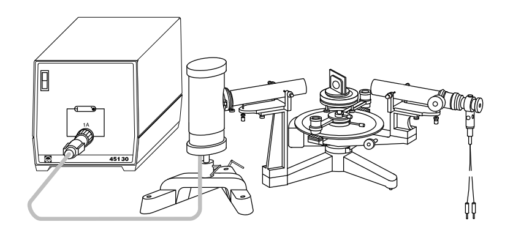

# Hinweise für den Versuch "Interferenz"

## Gitterspektrometer

Eine schematische Darstellung des [Gitterspektrometers](https://de.wikipedia.org/wiki/Gitterspektrometer), wie es Ihnen für den Versuch **Interferenz** zur Verfügung steht ist in **Abbildung 6** gezeigt: 

**Abbildung 6**: (Schematischer Aufbau des Gitterspektrometers, wie es Ihnen für den Versuch **Interferenz** zur Verfügung steht)

---

Es besteht aus einem Grundstativ, auf das der sog. **Prismentisch** monitiert ist, einem **Spaltrohr** (in der Mitte des Bildes) und einem **Fernrohr** (rechts im Bild). Links neben dem Spektrometer ist die Spektrallampe dargestellt. 

Auf dem Prismentisch wird das Gitter montiert. Vor dem Spaltrohr befindet sich die Spektrallampe als Lichtquelle. In der Spektrallampe entsteht Licht durch stochastische Anregung von $\mathrm{Na}$- oder $\mathrm{Zn}$-Atomen, die beim Übergang in den Grundzustand Licht von charakteristischen Wellenlängen abstrahlen. Die Untersuchungen am Gitter erfordern [kohäerent](https://de.wikipedia.org/wiki/Koh%C3%A4renz_(Physik)) und parallel eingestrahltes Licht. Dies wird durch den Einsatz des Spaltrohrs erreicht, das als [Kollimator](https://de.wikipedia.org/wiki/Kollimator) Strahlen mit geringer räumlicher Divergenz erzeugt. Durch die Lebensdauer der angeregten Zustände ist für (näherungsweise) parallel auslaufende Strahlen bereits eine [Kohärenzlänge](https://de.wikipedia.org/wiki/Koh%C3%A4renzl%C3%A4nge) von bis zu $3\ \mathrm{m}$ garantiert. Die vom Gitter auslaufenden Strahlen werden mit einem Fernrohr beobachtet, das (in telekopischer Einstellung) auf Lichtstrahlen aus großer Entfernung fokussiert ist (siehe P1-Versuch [Geometrische Optik](https://gitlab.kit.edu/kit/etp-lehre/p1-praktikum/students/-/tree/main/Geometrische_Optik)). Das Fernrohr ist mit einer feinen Winkelskala am Grundstativ drehbar monitert, so dass es als [Goniometer](https://de.wikipedia.org/wiki/Goniometer) fungieren kann.   

Bei der Justierung des Spektrometers ist es wichtig Spaltrohr, Prismentisch und Fernrohr gut in einer Ebene und ohne gegenseitige Verdrehungen oder Verkantungen zu positionieren. Die Öffnung des Spalts am Spaltrohr sollte geeignet vorgenommen werden, Spalt und Gitterfurchen parallel zur Drehachse des Fernrohrs verlaufen und das Fernrohr auf das durch den parallelen Strahlengang erzeugte Bild des Spalts fokussiert sein. Eine detaillierte Anleitung zur Justierung des Spektrometers finden Sie in den [Datenblättern der verwendeten Apparatur](https://gitlab.kit.edu/kit/etp-lehre/p2-praktikum/students/-/tree/main/Interferenz/doc/Leybold-Versuch-Gitterspektrometer.pdf). Eine Kurzanleitung in den [Hinweisen zur Versuchsdurchführung](https://gitlab.kit.edu/kit/etp-lehre/p2-praktikum/students/-/tree/main/Interferenz/doc/Hinweise-Versuchsdurchfuehrung.md). 

Sie verwenden das Gitterspektrometer zur Ausmessung der einiger Spektrallinien von $\mathrm{Na}$ und $\mathrm{Zn}$.  

## Spektrallampen

Die für diesen Versuch relevanten Linien des $\mathrm{Na}$-Spektrums haben die Wellenlängen: 

- $\lambda_{\mathrm{D_{1}}} = 589.59\ \mathrm{nm}$ (gelb)
- $\lambda_{\mathrm{D_{2}}} = 589.00\ \mathrm{nm}$ (gelb)

Die Bezeichnungen der Linien mit $\mathrm{D}_{1}$ und $\mathrm{D}_{2}$ sind historisch. Die für diesen Versuch relevanten Linien des $\mathrm{Zn}$-Spektrums haben die Wellenlängen:

- $\lambda_{1} = 636.23\ \mathrm{nm}$ (rot)
- $\lambda_{2} = 481.05\ \mathrm{nm}$ (blaugrün)
- $\lambda_{3} = 472.22\ \mathrm{nm}$ (blau)
- $\lambda_{4} = 468.01\ \mathrm{nm}$ (violettblau)

Die beobachteten Spektrallinien besitzen eine endliche spektrale Breite, die durch die folgenden Effekte bestimmt wird:

### Natürliche Linienbreite

Die normale Lebensdauer angeregter Atomzustände liegt im Bereich von $\tau\approx10\,\mathrm{ns}$. Daraus folgt eine natürliche [Linienbreite](https://de.wikipedia.org/wiki/Linienbreite) von 
$$
\begin{equation*}
\begin{split}
&\delta\nu = \frac{1}{2\pi\,\tau}; \\
&\\
&\delta\lambda = \frac{\lambda^{2}}{2\pi\,c\,\tau} \\
&\hphantom{\Delta\lambda}=\frac{(589.3\,\mathrm{nm})^{2}}{2\pi\cdot2.99\times10^{8}\,\mathrm{m/s}\cdot 10\, \mathrm{nm}} = 1.8\times10^{-5}\,\mathrm{nm}
\end{split}
\end{equation*}
$$

### Dopplerverbreiterung

Da sich die strahlenden Atome bei einer Gasentladung nicht in Ruhe befinden, kommt es zusätzlich zur natürlichen Linienbreite zur [Dopplerverbreiterung](https://de.wikipedia.org/wiki/Dopplerverbreiterung): 
$$
\begin{equation*}
\delta\lambda = \frac{\lambda}{c}\sqrt{\frac{8\, k_{B}\, T\, \ln(2)}{M}},
\end{equation*}
$$
wobei $M$ der Teilchenmasse (in $\mathrm{kg}$) entspricht. Für $\langle\lambda\rangle=589.3\ \mathrm{nm}$ ergibt sich eine Dopplerverbreiterung von $1.5\times10^{-3}\ \mathrm{nm}$. 

### Druckverbreiterung

Zusätzlich beeinflussen Stöße der Atome untereinander die Lebensdauer angeregter Zustände und führen somit zur sog. Stoß- oder [Druckverbreiterung](https://de.wikipedia.org/wiki/Druckverbreiterung) der Linien. Dieser Effekt spielt wegen des niedrigen Druckes in den verwendeten Spektrallampen jedoch eine untergeordnete Rolle.

## Spalt des Gitterspektrometers

Das Gitter im Spektrometer wird im Idealfall mit köhärent und parallel eingestrahltem Licht beleuchtet. Dieser Zustand wäre z.B. durch eine perfekte Punktlichtquelle im Brennpunkt einer idealen Linse gegeben. Im realen Leben ist ein solcher Zustand nicht zu erreichen. Er wird angenähert, indem man das Bild der zwangsläufig räumlich ausgedehnten Gasentladung durch einen schmalen Spalt der Breite $d$, den **Kohärenzspalt** beschränkt. Dieser erzwingt die [Verdetsche Köhärenzbedingung](https://de.wikipedia.org/wiki/Verdetsche_Koh%C3%A4renzbedingung)
$$
\begin{equation}
d\sin\epsilon\leq \lambda,
\end{equation}
$$
wobei $\lambda$ der Wellenlänge des beobachteten Lichts und $\epsilon$ dem halben Öffnungswinkel des Lichtstrahls entsprechen.

Der Winkel $\epsilon$ ist durch die Apparatur vorgegeben (siehe [Datenblatt](https://gitlab.kit.edu/kit/etp-lehre/p2-praktikum/students/-/blob/main/Interferenz/Datenblatt.md)). Um Gleichung **(6)** [hier](https://gitlab.kit.edu/kit/etp-lehre/p2-praktikum/students/-/blob/main/Interferenz/doc/Hinweise-Gitter.md) voll ausnutzen zu können würde man $d$ so groß wie möglich wählen, um möglichst viele Gitterspalte zu beleuchten. Für die Breite des Spalts gibt es jedoch zwei begrenzende Randbedingungen: 

- Ist $d$ zu groß geht die Kohärenzbedingung aus Gleichung **(1)** verloren. 
- Für die Sichtbarkeit der zu beobachtenden Linien muss der Spalt eine gewisse Mindestbreite haben. Er wird aber auch mit $d$ ins Fernrohr abgebildet. Soll Gleichung **(6)** [hier](https://gitlab.kit.edu/kit/etp-lehre/p2-praktikum/students/-/blob/main/Interferenz/doc/Hinweise-Gitter.md) die Unterscheidung von Differenzen der Wellenlänge von $\delta\lambda$ zulassen, darf das Bild von $d$ im Fernrohr nicht breiter sein als die Trennung der Linien aufgrund von $\delta\lambda$ die sonst überlappen.

# Navigation

[Main](https://gitlab.kit.edu/kit/etp-lehre/p2-praktikum/students/-/tree/main/Interferenz)

