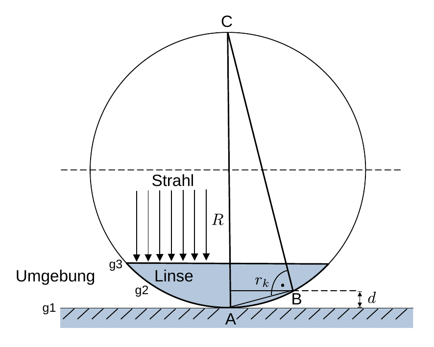
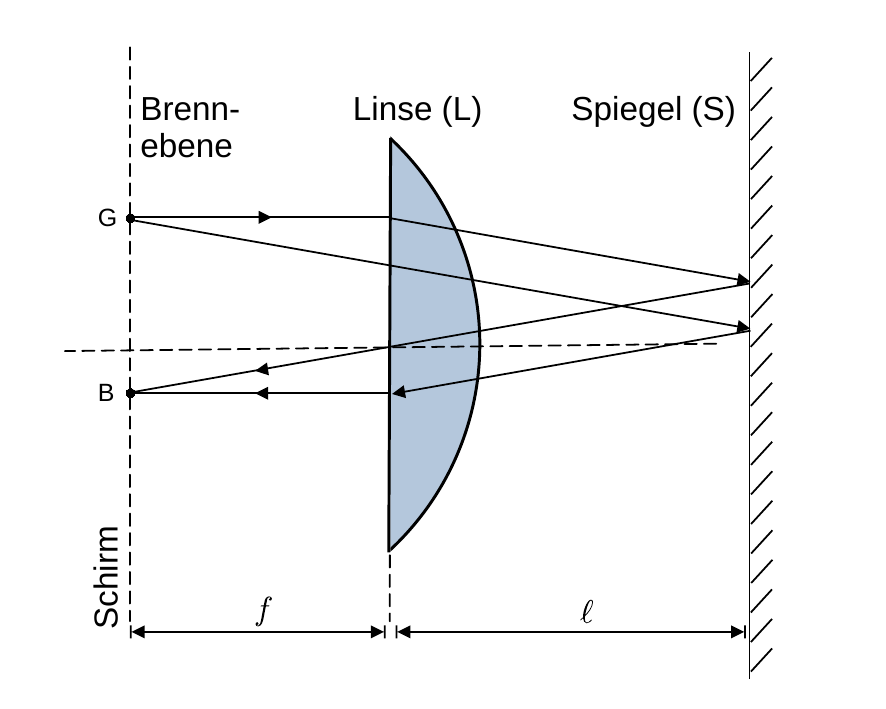

# Hinweise für den Versuch "Interferenz"

## Newtonsche Ringe

Zur Vereinfachung der Diskussion betrachten wir eine symmetrische Linse, die auf einer ebenen Fläche aufliegt, wie in **Abbildung 1** skizziert: 

**Abbildung 1**: (Geometrische Anordnung zur Erklärung Newtonscher Ringe)

---

Die Auflagefläche (Grenzfläche g1) und die Linse sind in der Abbildung blau eingefärbt. Die Linse ist auf der Unterseite (Grenzfläche g2) mit dem Radius $R$ konvex und auf der Oberseite (Grenzfläche g3) plan (plankonvex). Die optischen Dichten sowohl der Linse als auch der Auflagefläche sind ungleich der optischen Dichte $n$ der Umgebung. 

Scheint ein Lichtstrahl (der Wellenlänge $\lambda$) senkrecht von oben auf die Linse wird an jeder Grenzfläche ein Teil des Strahls reflektiert. Dabei kommt es zu Interferenzeffekten der an g1 und g2 reflektierten Strahlen, die zu dunklen Ringen in den Abständen $r_{k}$ vom Zentrum der Linse führen. Diesen Effekt bezeichnet man als [Newtonsche Ringe](https://de.wikipedia.org/wiki/Newtonsche_Ringe). 

Newton beobachtete und beschrieb das nach ihm benannte Phänomen ertsmal 1666 in der Abhandlung *Of Colours*. Erste dokumentierte Beobachtungen gehen jedoch 1665 auf [Robert Hook](https://de.wikipedia.org/wiki/Robert_Hooke), in seinem Werk *Micrographia* zurück. Interessanterweise vertrat Newton Zeit seines Lebens die Theorie, dass es sich bei Licht um Teilchen handele (Korpuskulartheorie), er konnte dieses Phänomen also nicht als Eigenschaft des Lichts erklären.

Wir diskutieren im Folgenden den Fall $n=1$, Für den Fall $n\neq 1$ ist in allen folgenden Gleichungen von Relevanz die Ersetzung 
$$
\begin{equation*}
\lambda \to \frac{\lambda}{n}
\end{equation*}
$$
vornzunehmen. Unter Berücksichtigung des Phasensprungs von $\lambda/2$ bei der Reflexion am optisch dichteren Medium beträgt der Gangunterschied der reflektierten Strahlen laut **Abbildung 1**
$$
\begin{equation}
s=2d + \frac{\lambda}{2}.
\end{equation}
$$
Ist dieser ein Vielfaches von $\lambda/2$ 
$$
\begin{equation}
s=\frac{2\,k+1}{2}\lambda;\qquad k\in\mathbb{N}_{0}
\end{equation}
$$
kommt es zur destruktiven Interferenz und somit zur Abschwächung oder Auslöschung der interferierenden Strahlen. Gleichsetzen der Gleichungen **(1)** und **(2)** führt auf die Beziehung: 
$$
\begin{equation}
2d = k\,\lambda.
\end{equation}
$$
Beim Halbkreis über dem Dreieck ABC in **Abbildung 1** handelt es sich um den [Thaleskreis](https://de.wikipedia.org/wiki/Satz_des_Thales) über der Strecke AC, das Dreick ABC ist also im Punkt B rechtwinklig und es gilt der [Höhensatz](https://de.wikipedia.org/wiki/H%C3%B6hensatz) am rechwinkligen Dreieck
$$
\begin{equation*}
\begin{split}
& r_{k}^{2} = (2R-d)\,d = 2Rd - d^{2}\approx 2Rd; \\
&\\
&\text{mit:}\\
&\\
&d\ll R,\\
\end{split}
\end{equation*}
$$
 woraus Gleichung **(3)** die folgende Form erhält 
$$
\begin{equation*}
\frac{r_{k}^{2}}{R} = k\,\lambda.
\end{equation*}
$$

## Autokollimation

[Autokollimation](https://de.wikipedia.org/wiki/Autokollimation) ist u.a. ein einfaches und elegantes Verfahren zur Brennweitenbestimmung von Linsen. Das Verfahren ist in **Abbildung 2** skizziert: 

**Abbildung 2**: (Prinzip der Autokollimation)

---

Ein möglichst selbstleuchtender Gegenstang G (mit Schirm), die Linse L deren Brennweite $f$ zu bestimmen ist, sowie ein Spiegel S werden entlang der optischen Achse des Systems montiert. S sollte ungefähr parallel zur Hauptebene von L ausgerichtet sein, damit der reflektierte Strahl L trifft. L wird so lange zwischen G und S verschoben, bis auf dem Schirm ein scharfes reelles Bild B von G entsteht. Sobald dies der Fall ist befindet sich der Schirm in der Brennebene im Abstand $f$ der Hauptebene von L. Als Spezialfall wird der Brennpunkt in sich selbst abgebildet. 

Alle Punkte in der Brennebene werden durch L in parallel verlaufende Strahlen gebrochen (siehe **Abbildung 2** rechts). Durch S werden die parallel verlaufenden Strahlen auf L zurückgeworfen und hinter L wieder auf einen Punkt in der Brennebene vereint. B erscheint relativ zu G punktgespiegelt. Da alle Strahlen aus der Bennebene zwischen L und S parallel verlaufen, sind sowohl die genaue Ausrichtung von S, als auch der Abstand $\ell$ zwischen L und S unerheblich, solange L vom reflektierten Strahl getroffen wird. Es empfiehlt sich $\ell$ kein zu wählen. G sollte selbstleuchtend sein, damit B auch nach größeren Lichtwegen noch auf dem Schirm zu sehen ist. 

## Brechungsindex der Linse

Sind bei einer plankonvexen Linse $R$ und $f$ bekannt lässt sich daraus der Brechungsindex $n_{L}$ der Linse bestimmen. Die den folgenden Überlegungen zugrunde liegende geometrische Anordnung ist in **Abbildung 3** dargestellt:

**Abbildung 3**: (Geometrische Anordnung zur Berechnung des Brechungsindex $n_{L}$ der Linse)

---

Aus dem Brennpunkt der Linse wird ein Lichtstrahl an der Grenzfläche g2 parallel zur optischen Achse der Linse hin gebrochen, die Grenzfläche g3 passiert er ungebrochen. Nach dem [Snelliusschen Brechungsgesetzt](https://de.wikipedia.org/wiki/Snelliussches_Brechungsgesetz) gilt
$$
n_{L}\sin\alpha = n\sin(\alpha+\beta).
$$
Unter Vernachlässigung der Dicke $d$ der Linse gilt 
$$
\begin{equation*}
\sin\alpha=\frac{h}{R}; \qquad \sin\beta \approx \frac{h}{f} \\
\end{equation*}
$$
 und unter der Kleinwinkelnäherung zusätzlich
$$
\begin{equation}
\begin{split}
\sin(\alpha+\beta)&= \sin\alpha\cos\beta+\sin\beta\cos\alpha \\
&\\
&\approx\sin\alpha+\sin\beta  = \frac{h}{R} + \frac{h}{f}\\
\end{split}
\end{equation}
$$
Aus Gleichung **(4)** und **(5)** ergibt sich daraus unter Verwendung von $n\approx1$ (für Luft)
$$
\begin{equation*}
\begin{split}
&n_{L} = \frac{R}{R} + \frac{R}{f} = 1+\frac{R}{f}\\
&\\
&R = (n_{L}-1)\,f.
\end{split}
\end{equation*}
$$

# Navigation

[Main](https://gitlab.kit.edu/kit/etp-lehre/p2-praktikum/students/-/tree/main/Interferenz)

