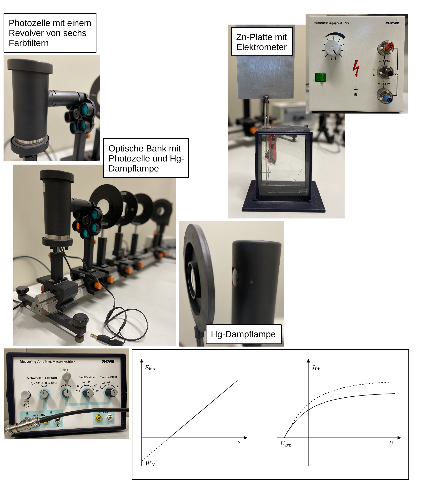

# Fakultät für Physik

## Physikalisches Praktikum P2 für Studierende der Physik

Versuch P2-63, 64, 65 (Stand: April 2024)

[Raum F1-08](https://labs.physik.kit.edu/img/Praktikum/Lageplan_P2.png)

# Photoeffekt

## Motivation

Kein experimenteller Effekt steht so sehr für den Übergang von klassischer zu moderner Physik, wie der Photoeffekt ([photoelektrischer Effekt](https://de.wikipedia.org/wiki/Photoelektrischer_Effekt)). Beim äußeren photoelektrischen Effekt, auch Photoemission oder Hallwachs-Effekt genannt, werden durch die Einstrahlung von Licht mit hinreichend hoher Frequenz Elektronen aus der Kathode einer evakuierten Diode ausgeschlagen, die als Photostrom $I_{\mathrm{Ph}}$ zwischen Kathode und Anode nachweisbar sind. Die Wechselwirkung von Photonen mit Materie hat die Physik des vorletzten Jahrhunderts über nahezu 70 Jahre begleitet.   

Die Freisetzung von Ladungsträgern aus einer blank polierten Metalloberfläche in einer elektrolytischen Flüssigkeit durch Lichteinstrahlung wurde erstmals 1839 von [Alexandre Bequerel](https://de.wikipedia.org/wiki/Alexandre_Edmond_Becquerel) beobachtet. Bequerel war damals erst 19 Jahre alt! Der Einfluss ultravioletter Strahlung auf Metalloberflächen wurde 1886 von [Heinrich Hertz](https://de.wikipedia.org/wiki/Heinrich_Hertz) untersucht. Diese Untersuchungen wurden später von [Wilhelm Hallwachs](https://de.wikipedia.org/wiki/Wilhelm_Hallwachs_(Physiker)), nach dem der Effekt der Photoemission auch benannt ist, systematisch weitergeführt. Die gemachten Beobachtungen waren im Rahmen klassisch-physikalischer Modellvorstellungen nicht zu erklären. Eine Erklärung lieferte 1905 erstmals Albert Einstein in §8 seiner bahnbrechenden Arbeit [Ueber einen die Erzeugung und Verwandlung des Lichtes betreffenden heuristischen Gesichtspunkt](http://myweb.rz.uni-augsburg.de/~eckern/adp/history/einstein-papers/1905_17_132-148.pdf), für die er **1921 den Nobelpreis für Physik** erhielt.

## Lehrziele

Wir listen im Folgenden die wichtigsten **Lehrziele** auf, die wir Ihnen mit dem Versuch **Photoeffekt** vermitteln möchten: 

- Sie führen Versuche mit einer Photozelle durch, im Rahmen derer Sie den Effekt der Photoemission mit eigenen Augen beobachten.
- Sie bestimmen das Plancksche Wirkungsquantum ([Planck-Konstante](https://de.wikipedia.org/wiki/Planck-Konstante)) $h$, eine zentrale Naturkonstante der Quantenmechanik.
- Bei diesem Versuch haben Sie mit Strömen im $\mathrm{nA}$-Bereich zu tun, die einen sehr sorgfältigen und genauen Umgang mit den verwendeten Apparaturen erfordern. 

## Versuchsaufbau

Einen typischer Aufbau der Apparatur für diesen Versuch ist in **Abbildung 1** gezeigt:

**Abbildung 1**: (Ein typischer Aufbau des Versuchs Photoeffekt)

---

Auf einer optischen Bank sind, einander gegenüberstehend, eine Quecksilberdampflampe (Hg) und eine Photozelle montiert. Dazwischen befinden sich eine Irisblende, Linsen zur Fokussierung des emittierten Lichts, eine Halterung für einen Graufilter und eine Revolverhalterung mit sechs Fabry-Pero-Farbfiltern, um einzelne Frequenzen des von Hg emittierten Lichts auszuwählen. Die Photozelle ist durch einen Lichtschutzkollimator vor der Einstrahlung von Umgebungslicht geschützt. Die Irisblende dient zum einen dem Schutz der Photokathode, zum anderen soll sie verhinden, dass durch Lichteinfall von Hg Elektronen aus der Ringanode ausgeschlagen werden. Zu Demonstrationszwecken dient eine Zinkplatte (Zn) mit statischem Elektrometer (E). 

## Wichtige Hinweise

- Bei diesem Versuch arbeiten Sie mit **Hochspannung**. Beachten Sie die entsprechenden [Sicherheitshinweise im Umgang mit Elektrizität](https://labs.physik.kit.edu/163.php?tab=%5B311%5D#tabpanel-311) auf den Webseiten des P1/P2.
- Schalten Sie Hg und das Elektrometer für **Aufgabe 2** frühzeitig ein, um einen stabilen Betrieb der Geräte zu gewährleisten. Die volle Intensität von Hg wird erst ${\approx}10\ \mathrm{min}$ nach Inbetriebnahme erreicht. Die Lampe muss nach dem Ausschalten einige Zeit abkühlen, bevor sie wieder eingeschaltet werden kann. **Schalten Sie sie daher also nicht aus!**
- Da ein signifikanter Anteil der Emissionslinien von Hg im UV-Bereich liegt sollten Sie vermeiden offen in das Licht der Lampe zu sehen. 
- Beim Messen so geringer Ströme, wie für diesen Versuch ist es essentiell die gesamte Messapparatur auf dem gleichen wohldefinierten elektrischen Potential zu halten, so dass das Elektrometer nicht auf störende Streusignale reagiert. Bei unzureichender Erdung können winzige Umladeströme und Kontaktpotentiale, die bei jeglicher Form von Reibung und oder Berührung auftreten einen störenden Einfluss haben. Das Reiben der Füße auf dem Boden oder elektrostatisch aufgeladene Textilien gehören z.B. zu solchen Einflüssen.

# Navigation

- [Hinweise-Photoeffekt.md](https://gitlab.kit.edu/kit/etp-lehre/p2-praktikum/students/-/blob/main/Photoeffekt/doc/Hinweise-Photoeffekt.md): **Grundlagen des Photoeffekts**.
- [Hinweise-Versuchsdurchfuehrung.md](https://gitlab.kit.edu/kit/etp-lehre/p2-praktikum/students/-/blob/main/Photoeffekt/doc/Hinweise-Versuchsdurchfuehrung.md): Wichtige Hinweise und **Tipps zur Versuchsdurchführung**.
- [Datenblatt.md](https://gitlab.kit.edu/kit/etp-lehre/p2-praktikum/students/-/blob/main/Photoeffekt/Datenblatt.md): **Wichtige technische Details** zu den Versuchsaufbauten.
