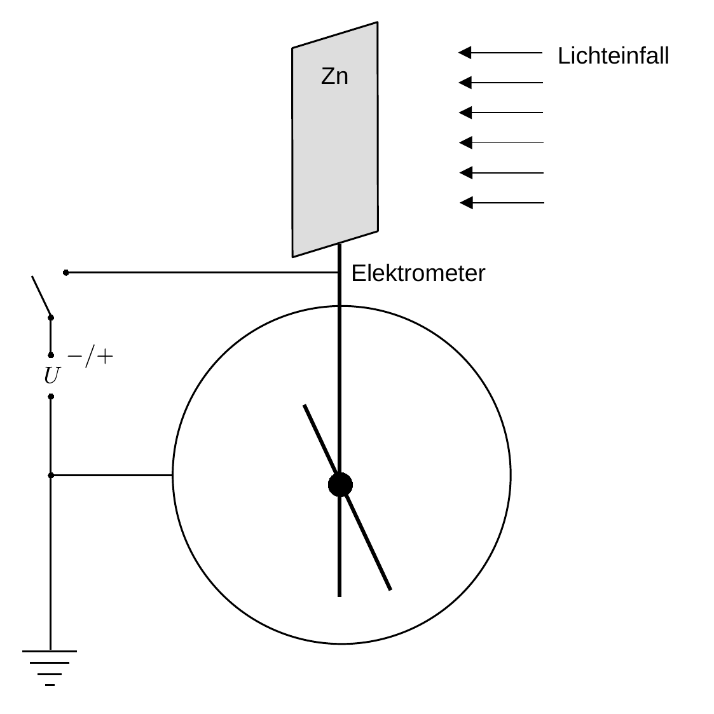
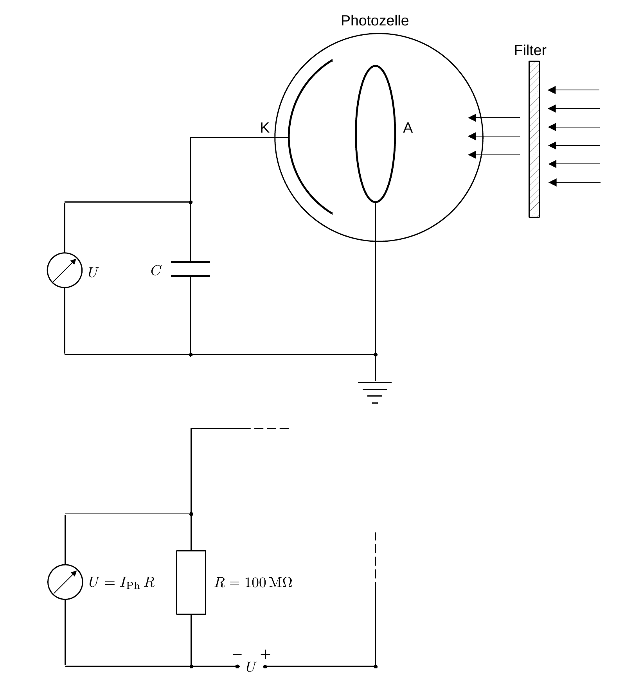

# Hinweise für den Versuch Photoeffekt

## Messprinzip

### Qualitative Beobachtung des äußeren photoelektrischen Effekts

Eine Skizze für die qualitative Beobachtung des äußeren photoelektrischen Effekts, wie Sie sie für **Aufgabe 1.1** vornehmen ist in **Abbildung 1** gezeigt:

**Abbildung 1**: (Poliertes $\mathrm{Zn}$-Blech (Zn) und ein statisches Elektrometer (E), wie Sie es für **Aufgabe 1.1** zur qualitativen Beobachtung des äußeren photoelektrischen Effekts verwenden)

---

Ein statisches [Elektroskop](https://de.wikipedia.org/wiki/Elektroskop) (E), wie es bereits um 1600 von [William Gilbert](https://de.wikipedia.org/wiki/William_Gilbert) verwendet wurde ist mit einer polierten $\mathrm{Zn}$-Platte (Zn) leitend verbunden. Die ins Gehäuse ragende Aufhängung mit drehbarem Zeiger ([Versorium](https://de.wikipedia.org/wiki/Versorium)) ist gegen das auf Masse liegende Gehäuse isoliert. Zn kann wahlweise mit positiver oder negativer Spannung aufgeladen werden, wodurch es (unabhängig vom Vorzeichen der Ladung) zur Abstoßung und somit zur Auslenkung des Versoriums kommt. 

Wird Zn negativ aufgeladen und anschließend mit Licht von geeignet kurzer Wellenlänge bestrahlt kommt es zur schrittweisen Entladung. Nicht so, wenn Zn positiv aufgeladen wird. 

Bei negativer Ladung treten durch den äußeren photoelektroischen Effekt Elektronen aus, wodurch Zn schrittweise entladen wird. Die ausgetretenen Elektronen bilden dabei eine Raumladungswolke, die mit zunehmender Zeit das Austreten weiterer Elektronen erschwert. Bringt man eine Anode A in die Nähe von Zn wird die Raumladungswolke von A abgesaugt, was das Austreten von Elektronen wieder begünstigt.  

### Bestimmung von $h$ aus der Spannung $U_{\mathrm{Ph}}$ der Photozelle

Eine Skizze des Messprinzips zur Bestimmung von $h$ mit Hilfe der Spannung $U_{\mathrm{Ph}}$ der Photozelle ist in **Abbildung 2** oben gezeigt:

**Abbildung 2**: (Skizze des Messprinzips zur Bestimmung von $h$ (oben) mit Hilfe der Spannung $U_{\mathrm{Ph}}$ der Photozelle und (unten) mit Hilfe einer regelbaren externen Spannung $U_{o}$)

---

Im Zentrum des Messaufbaus steht die evakuierte Photozelle mit der Kathode K und einer ringförmigen Anode A. Ohne Lichteinstrahlung liegt zwischen K und A die **Kontaktspannung** 
$$
\begin{equation}
U_{c} = \frac{W_{A}-W_{K}}{e}
\end{equation}
$$
an, wobei $e$ der Elementarladung, $W_{K}$ der Austrittsarbeit von K und $W_{A}$ der Austrittsarbeit von A entsprechen. Wir definieren dabei zweckmäßig $`U_{c}>0`$ für $`W_{A}>W_{K}`$, ein Elektron aus K auszulösen und in A einzufügen würde also Arbeit freisetzen, was wir mit einer positiven Spannungsdifferenz gleichsetzen.    

Durch ein Eintrittsfenster tritt (in der Skizze von rechts kommend) monochromatisches Licht der Frequenz $\nu$ ein, dessen Strahlengang durch A hindurch verläuft und auf K trifft. Ist die Energie der einlaufenden Photonen $E_{\gamma}=h\nu$ hinreichend groß, um $W_{K}$ zu überwinden schlagen die Photonen Elektronen mit der kinetischen Energie
$$
\begin{equation*}
E_{\mathrm{kin}}= h\nu - W_{K}
\end{equation*}
$$
aus K aus. Auf ihrem Weg durch die Photozelle treffen einige dieser Elektronen auf A, wodurch A statisch aufgeladen und (zusätzlich zu $U_{c}$) eine nicht verschwindende Spannung $U_{\nu}$ zwischen A und K erzeugt wird, die der Bewegung der Elektronen **entgegen gerichtet** ist. Die freigesetzten Elektronen laufen im folgenden mit der Energie $E_{\mathrm{kin}}$ gegen $U_{\nu}$ an. Dieser Prozess läuft so lange ab, bis schließlich bei einer maximalen Spannung $U_{\nu}^{\mathrm{max}}$ aus kinematischen Gründen kein Elektron mehr A erreicht und der Ladungsfluss zum Erliegen kommt. Für $U_{\nu}^{\mathrm{max}}$ gilt: 
$$
\begin{equation*}
\begin{split}
&E_{\mathrm{kin}}+e\,\underbrace{(U_{\nu}^{\mathrm{max}}-U_{c})}=0;\\
&\hphantom{E_{\mathrm{kin}}=e\,cccc}\equiv U_{\mathrm{Ph}}\\
&\\
&E_{\mathrm{kin}}=h\nu - W_{K}; \\
&\\
&U_{\mathrm{Ph}}= -\frac{h}{e}\nu + \frac{W_{K}}{e}.\\
\end{split}
\end{equation*}
$$
Mit der in **Abbildung 2** oben skizzierten Messanordnung bestimmen Sie $U_{\mathrm{Ph}}=U_{\nu}^{\mathrm{max}}-U_{c}$. Beachten Sie, dass bei diesem Vorgang A negativ aufgeladen wird, daher ist $U_{\mathrm{Ph}}$ in dieser Anordnung negativ. Weiterhin ist $U_{\nu}^{\mathrm{max}}$ der Kontaktspannung $U_{c}$ nach der Definition von Gleichung **(1)** entgegen gerichtet.

Trägt man $e\,U_{\mathrm{Ph}}$ für verschiedene Werte von $\nu$ auf stellt sich ein linearer Zusammenhang ein, aus dem man das Verhältnis $h$ (als negative Steigung), sowie $W_{K}$ (als $y$-Achsenabschnitt) bestimmen kann. 

### Spannungsmessung mit dem Messverstärker

Da die Photozelle nur sehr geringe Ströme erzeugt würde sie bei direkter Messung mit einem einfachen Multimeter direkt über dessen Innenwiderstand entladen werden. Spannungen an der Photozelle oder über den Arbeitswiderstand $R$ werden in diesem Versuch daher über einen Messverstärker (M) gemessen, der im Vergleich zu einem Multimeter einen deutlich höheren Innenwiderstand $R_{i}$ aufweist. Die Arbeitsweise von Messverstärkern lernen Sie im Versuch [Operationsverstärker](https://gitlab.kit.edu/kit/etp-lehre/p2-praktikum/students/-/tree/main/Operationsverstaerker) kennen. Am Ausgang von M können Sie die Spannung mit dem Multimeter abnehmen ohne die am Eingang von M anliegende Spannung zu beeinflussen. Durch M wird die Photozelle also effektiv vom Multimeter entkoppelt, so dass der Einfluss der Messung auf die Photozelle so gering wie möglich ist. 

### Bestimmung von $h$ aus einer anliegenden externen Spannung $U_{o}$

In **Abbildung 2** unten ist eine Schaltung gezeigt, mit der Sie mit Hilfe von M den Strom der Photozelle $I_{\mathrm{Ph}}$ als Funktion einer anliegenden externen Spannung $U_{o}$ aufnehmen können. Damit Sie die Spannung variieren können, wird K mit einer Batterie als variabler Gleichspannungsquelle $U_o$ in Serie geschaltet.

$I_{\mathrm{Ph}}$ wird (wieder mit Hilfe von M) als Spannung $U_{E}=I_{\mathrm{Ph}}R$ gemessen, die über einen bekannten Arbeitswiderstand $R=100\ \mathrm{M\Omega}$ abfällt, der ebenfalls mit $U_o$ und der Kathode in Serie geschaltet ist. Je nach Polung agiert $U_{o}$ als Beschleunigungs- oder Gegenspannung für die emittierten Elektronen. 

Beachten Sie, dass in dieser Schaltung die abzulesende Einstellung von $U_{o}(I_{\mathrm{Ph}}=0)$ an der Batterie die Kontaktspannung $U_{c}$ nicht mehr mit einschließt, es gilt also 
$$
\begin{equation*}
\begin{split}
&E_{\mathrm{kin}}+e\,(\underbrace{U_{\nu}^{\mathrm{max}}}-U_{c})=0;\\
&\hphantom{E_{\mathrm{kin}}=e\,c}\equiv U_{o}\\
&\\
&E_{\mathrm{kin}}=h\nu - W_{K}; \\
&\\
&U_{o}= -\frac{h}{e}\nu + \frac{W_{A}}{e}.\\
\end{split}
\end{equation*}
$$
Sie messen in diesem Fall also $W_{A}$ und nicht $W_{K}$ als $y$-Achsenabschnitt. 

### Effektive Austrittsarbeit

Beim Betrieb der Photozelle kommt es mit der Zeit zu Einlagerungen des Kathodenmaterials auf der Oberfläche von A, wodurch aus $U_{o}$ nicht mehr $W_{A}$ sondern eine effektive Austrittsarbeit $W_{A}^{(\mathrm{eff})}$ bestimmt wird. Der Wert von $W_{A}^{(\mathrm{eff})}$ kann in diesem Fall sehr nahe bei $W_{K}$ liegen, weil Ladungen auf A bevorzugt über  diese Einlagerungen abfließen.  

# Navigation

[Main](https://gitlab.kit.edu/kit/etp-lehre/p2-praktikum/students/-/tree/main/Photoeffekt)
