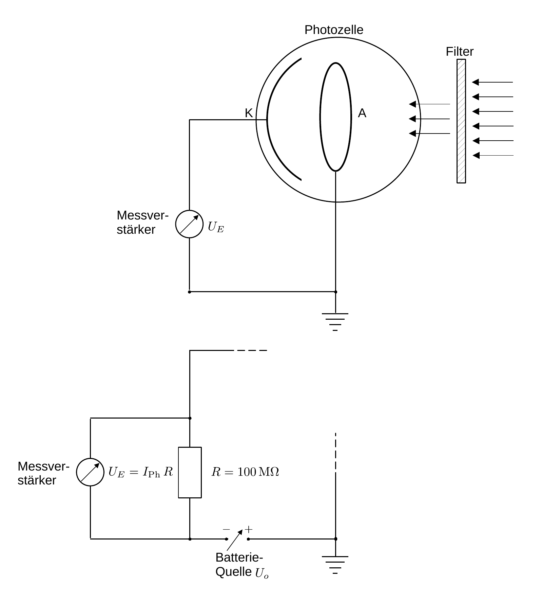

# Hinweise für den Versuch Photoeffekt

## Messprinzip

### Qualitative Beobachtung des äußeren photoelektrischen Effekts

Eine Skizze für die qualitative Beobachtung des äußeren photoelektrischen Effekts, wie Sie sie für **Aufgabe 1.1** vornehmen ist in **Abbildung 1** gezeigt:

**Abbildung 1**: (Poliertes $\mathrm{Zn}$-Blech (Zn) und ein statisches Elektrometer (E), wie Sie es für **Aufgabe 1.1** zur qualitativen Beobachtung des äußeren photoelektrischen Effekts verwenden)

---

Ein statisches [Elektroskop](https://de.wikipedia.org/wiki/Elektroskop) (E), wie es bereits um 1600 von [William Gilbert](https://de.wikipedia.org/wiki/William_Gilbert) verwendet wurde ist mit einer polierten $\mathrm{Zn}$-Platte (Zn) leitend verbunden. Die ins Gehäuse ragende Aufhängung mit drehbarem Zeiger ([Versorium](https://de.wikipedia.org/wiki/Versorium)) ist gegen das auf Masse liegende Gehäuse isoliert. Zn kann wahlweise mit positiver oder negativer Spannung aufgeladen werden, wodurch es (unabhängig vom Vorzeichen der Ladung) zur Abstoßung und somit zur Auslenkung des Versoriums kommt. 

Wird Zn negativ aufgeladen und anschließend mit Licht von geeignet kurzer Wellenlänge bestrahlt kommt es zur schrittweisen Entladung. Nicht so, wenn Zn positiv aufgeladen wird. 

Bei negativer Ladung treten durch den äußeren photoelektroischen Effekt Elektronen aus, wodurch Zn schrittweise entladen wird. Die ausgetretenen Elektronen bilden dabei eine Raumladungswolke, die mit zunehmender Zeit das Austreten weiterer Elektronen erschwert. Bringt man eine Anode A in die Nähe von Zn wird die Raumladungswolke von A abgesaugt, was das Austreten von Elektronen wieder begünstigt.  

### Bestimmung von $h$ aus der Spannung $U_{\mathrm{Ph}}$ der Photozelle

Eine Skizze des Messprinzips zur Bestimmung von $h$ mit Hilfe der Spannung $U_{\mathrm{Ph}}$ der Photozelle ist in **Abbildung 2** oben gezeigt:

**Abbildung 2**: (Skizze des Messprinzips zur Bestimmung von $h$ (oben) mit Hilfe der Spannung $U_{\mathrm{Ph}}$ der Photozelle und (unten) mit Hilfe einer regelbaren externen Spannung $U_{o}$)

---

Im Zentrum des Messaufbaus steht die evakuierte Photozelle mit der Kathode K und einer ringförmigen Anode A. Ohne Lichteinstrahlung liegt zwischen K und A die Kontaktspannung 
$$
\begin{equation*}
U_{K} = \frac{W_{K}-W_{A}}{e}
\end{equation*}
$$
an, wobei $e$ der Elementarladung, $W_{K}$ der Austrittsarbeit von K und $W_{A}$ der Austrittsarbeit von A entsprechen. 

Durch ein Eintrittsfenster tritt (in der Skizze von rechts) monochromatisches Licht der Frequenz $\nu$ ein, dessen Strahlengang durch A hindurch verläuft und in K endet. Ist die Energie der einlaufenden Photonen $E_{\gamma}=h\nu$ hinreichend groß, um $W_{K}$ zu überwinden schlagen die Photonen Elektronen mit der kinetischen Energie
$$
\begin{equation*}
E_{\mathrm{kin}}= h\nu - W_{K}
\end{equation*}
$$
aus K aus. Auf ihrem Weg durch die Photozelle treffen einige dieser Elektronen auf A. A wird auf diese Weise statisch aufgeladen und erzeugt damit (zusätzlich zu $U_{K}$) eine nichtverschwindende Spannung $U$ zwischen A und K, die der Bewegung der Elektronen entgegengerichtet ist. Die freigesetzten Elektronen laufen im folgenden mit $E_{\mathrm{kin}}$ gegen U an. Dieser Prozess läuft so lange ab, bis schließlich bei einer maximalen Spannung $U_{\mathrm{Ph}}$ der Photozelle aus kinematischen Gründen kein Elektron mehr A erreicht und der Ladungsfluss zum Erliegen kommt. Für $U_{\mathrm{Ph}}$ gilt: 
$$
\begin{equation*}
\begin{split}
&E_{\mathrm{kin}}=e\,U_{\mathrm{Ph}}+W_{K}-W_{A}\\
&\\
&E_{\mathrm{kin}}=h\nu - W_{K}; \\
&\\
&U_{\mathrm{Ph}}= \frac{h}{e}\nu - \frac{W_{A}}{e}.\\
\end{split}
\end{equation*}
$$
Trägt man $U_{\mathrm{Ph}}$ für verschiedene Werte von $\nu$ auf stellt sich ein linearer Zusammenhang ein, aus dem man das Verhältnis $h/e$ (als Steigung), sowie $W_{A}/e$ (als $y$-Achsenabschnitt) bestimmen kann. 

### Effektive Austrittsarbeit

Beim Betrieb der Photozelle kommt es mit der Zeit zu Einlagerungen des Kathodenmaterials auf der Oberfläche von A, wodurch aus $U_{\mathrm{Ph}}$ nicht mehr $W_{A}$ sondern eine effektive Austrittsarbeit $W_{A}^{(\mathrm{eff})}$ bestimmt wird.

### Bestimmung von $h$ aus einer anliegenden externen Spannung $U_{o}$

In **Abbildung 2** unten ist eine Schaltung gezeigt, mit der Sie mit dem Elektrometer den Strom der Photozelle $I_{\mathrm{Ph}}$ als Funktion einer anliegenden externen Spannung $U_{o}$ aufnehmen können. Damit Sie auch eine Gegenspannung ($`U_{o}<0`$) anlegen können, liegt A in diesem Fall nicht mehr auf Masse, $I_{\mathrm{Ph}}$ wird mit Hilfe des Elektrometers als Spannung $U_{\mathrm{Ph}}=I_{\mathrm{Ph}}\,R$ gemessen, die über einen bekannten Arbeitswiderstand $R$ abfällt. 

Die Kathoden- und Anodenklemmen der Photozelle werden bei einer solchen Schaltung mit einem Arbeitswiderstand von $R=0.1\ \mathrm{G\Omega}$ kurzgeschlossen und eine regelbare externe Spannungsquelle $U_{o}$ zu $R$ parallel geschaltet. Mit Hilfe des Elektrometers kann $I_{\mathrm{Ph}}$ als Funktion von $U_{o}$ untersucht werden. Je nach Polung agiert $U_{o}$ als Beschleunigungs- oder als Gegenspannung. Die Spannung $U_{o}(I_{\mathrm{Ph}}=0)$ ist zu $U_{\mathrm{Ph}}$ aus den obigen Betrachtungen äquivalent, wobei diese Messung nicht durch den Innenwiderstand (ohnehin sehr großen) $R_{i}$ des Elektrometers verfälscht ist.    

# Navigation

[Main](https://gitlab.kit.edu/kit/etp-lehre/p2-praktikum/students/-/tree/main/Photoeffekt)
