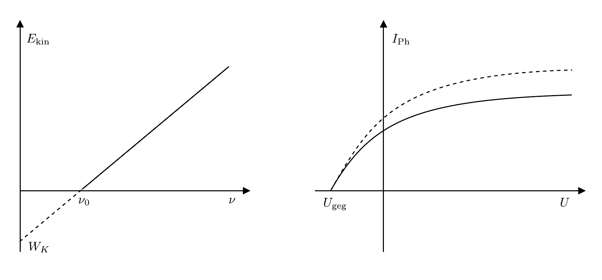
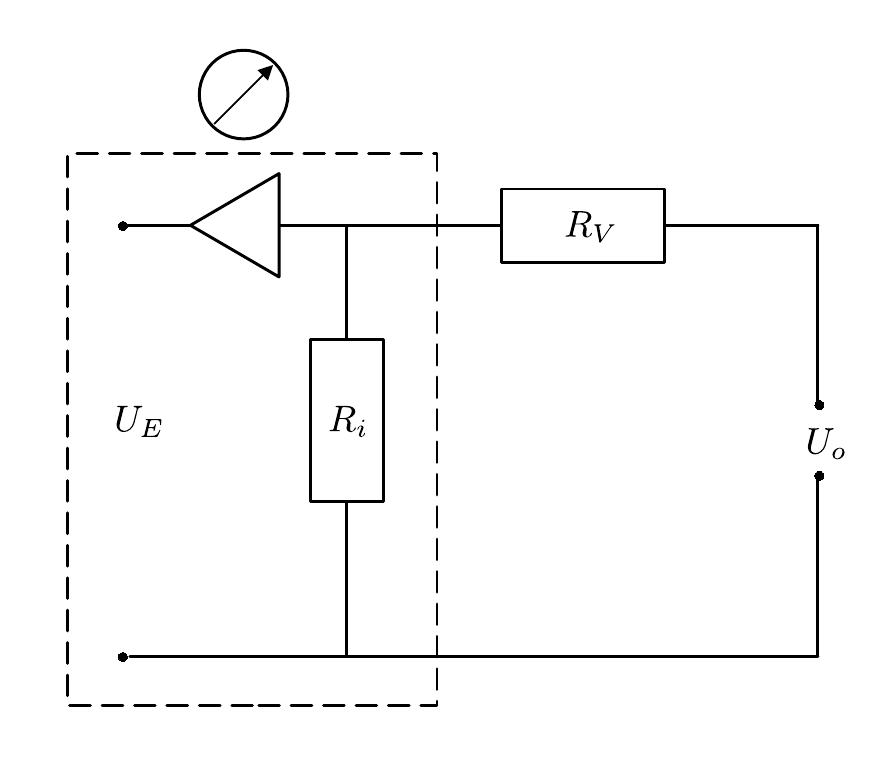

# Hinweise für den Versuch Photoeffekt

## Versuchsdurchführung

### Hg-Dampflampe

[Hg](https://de.wikipedia.org/wiki/Quecksilberdampflampe) besitzt u.a. die folgenden für diesen Versuch relevanten diskreten Emissionslinien 

- $\lambda=365.01\ \mathrm{nm}$ (UV);
- $\lambda=404.66\ \mathrm{nm}$ (violett);
- $\lambda=407.78\ \mathrm{nm}$ (violett);
- $\lambda=435.83\ \mathrm{nm}$ (blau);
- $\lambda=491.60\ \mathrm{nm}$ (cyan);
- $\lambda=546.07\ \mathrm{nm}$ (grün);
- $\lambda=576.96\ \mathrm{nm}$ (orange);
- $\lambda=579.07\ \mathrm{nm}$ (orange).

In der Überlagerung ergibt sich eine grünliche Farbe. Einzelne Wellenlängen können mit Hilfe von sechs Fabry-Pero-Farbfiltern weiter ausgewählt werden, die für die folgenden Wellenlängen durchlässig sind:

- $\lambda^{(1)}_{\mathrm{CWL}}=360\ \mathrm{nm}$;
- $\lambda^{(2)}_{\mathrm{CWL}}=400\ \mathrm{nm}$;
- $\lambda^{(3)}_{\mathrm{CWL}}=440\ \mathrm{nm}$;
- $\lambda^{(4)}_{\mathrm{CWL}}=490\ \mathrm{nm}$;
- $\lambda^{(5)}_{\mathrm{CWL}}=540\ \mathrm{nm}$;
- $\lambda^{(6)}_{\mathrm{CWL}}=590\ \mathrm{nm}$.

Die Abkürzung CWL steht dabei für *central wavelength*; es ist die Wellenlänge in der Mitte des Filterbandpasses. Laut Hersteller haben die Filter eine [Halbwertsbreite](https://de.wikipedia.org/wiki/Halbwertsbreite) von $\pm10\, \mathrm{nm}$, aus der Sie die Standardabweichung des eingestrahlten Lichts bestimmen können. Beachten Sie dabei die Umrechnung zwischen Halbwertsbreite und Standardabweichung unter Annahme einer Normalverteilung. 

### Qualitativer Verlauf von Strom, Spannung und $E_{\mathrm{kin}}$ der austretenden Elektronen

Eine Skizze des qualitativen Verlaufs von Strom, Spannung und $E_{\mathrm{kin}}$ der austretenden Elektronen ist in **Abbildung 3** gezeigt: 

**Abbildung 3**: (Qualitativer Verlauf von Strom, Spannung und $E_{\mathrm{kin}}$ der austretenden Elektronen für den äußeren photoelektrischen Effekt)

---

Erst ab einer charakteristischen Frequenz $\nu_{0}$ treten Elektronen aus K aus. Der Verlauf von $E_{\mathrm{kin}}$ als Funktion von $\nu$ ist daraufhin linear. Extrapoliert man den Verlauf bis zum Abszissenschnittpunkt erhält man die Austrittsarbeit der Elektronen aus dem Kathodenmaterial $W_{K}$. Als Funktion einer externen Spannung $U_{o}$ folgt der Photostrom $I_{\mathrm{Ph}}$, abhängig von den Abmessungen der Photozelle, dem [Raumladungsgesetz](https://de.wikipedia.org/wiki/Raumladungsgesetz). Ab einer maximalen Gegenspannung $U_{o}(I_{\mathrm{Ph}}=0)$ kommt $I_{\mathrm{Ph}}$ zum Erliegen. In der Praxis kann eine zusätzliche Kontanktspannung $U_{c}$ zwischen A und K auch ohne Lichteinstrahlung zu einem resultierenden Stromfluss führen. Dies führt i.a. zu einer Parallelverschiebung des Verlaufs von $I_{\mathrm{Ph}}$ entlang der $y$-Achse.

### Aufgabe 1.1: Qualitative Beobachtung des äußeren photoelektrischen Effekts

- Eine sich mit der Zeit bildende Oxydschicht kann die Photoemission stark beeinträchtigen. Polieren Sie Zn daher vor Versuchsbeginn sorgfältig. Laden Sie Zn daraufhin mit einer Spannung von etwa $\pm2\ \mathrm{kV}$ auf. (Sie können hierfür die grobe Skala auf der Hochspannungsquelle nutzen)

- Zur Demonstration verwenden Sie ein statisches Elektrometer (E). Der Ausschlag von E ist vom Vorzeichen der Ladung unabhängig; er ändert sich nur sehr langsam.

- Nach Beleuchten mit Hg sollten Sie beobachten, dass der Ausschlag von E (ebenfalls langsam) zurückgeht, wenn Sie Zn negativ aufgeladen haben. Er sollte erhalten bleiben, wenn Sie Zn positiv aufgeladen haben. 

- In der Praxis wird sich Zn aufgrund von Wechselwirkungen mit der Umgebung mit zunehmender Zeit immer entladen. Die Halbwertszeit für diesen Vorgang können Sie mit Hilfe einer Messung ohne Lichteinstrahlung abschätzen.

- Wenn Sie Zn negativ aufgeladen haben und eine positive Elektrode (A) in die Nähe von Zn bringen sollten Sie beobachten, dass der Entladevorgang deutlich schneller vonstatten geht.  

- Diskutieren Sie alle Beobachtungen, die Sie bei diesem Versuch machen.  

### Aufgabe 1.2: Charakterisierung des für die folgenden Aufgaben zu verwendeden Elektrometers

Die Ströme, die Sie bei diesem Versuch untersuchen liegen i.a. im Bereich von $1-100\ \mathrm{nA}$. 

Spannungsmessungen erfolgen direkt (siehe **Abbildung 2** oben [hier](https://gitlab.kit.edu/kit/etp-lehre/p2-praktikum/students/-/blob/main/Photoeffekt/doc/Hinweise-Photoeffekt.md)). Strommessungen erfolgen als Messung einer über einen bekannten Arbeitswiderstand $R=100\ \mathrm{M\Omega}$ abfallenden Spannung $U_{\mathrm{Ph}}$ (siehe **Abbildung 2** unten [hier](https://gitlab.kit.edu/kit/etp-lehre/p2-praktikum/students/-/blob/main/Photoeffekt/doc/Hinweise-Photoeffekt.md)). Für die Messungen verwenden Sie einen Messverstärker (M) mit sehr hohem Innenwiderstand $R_{i}$ (Dafür muss sich M für die Messung im Modus **Elektrometer** befinden; eine Abbildung der Frontfläche der Kontrollbox zur Steuerung des Elektrometers finden Sie [hier](https://gitlab.kit.edu/kit/etp-lehre/p2-praktikum/students/-/blob/main/Photoeffekt/figures/IMG_1600.jpg)). Verstärkt wird die Spannung, die am BNC-Eingang anliegt. Der Außenleiter ist intern mit der 4-mm-Erdungs-Buchse verbunden, der gelbe Eingang wird nicht verwendet.

Machen Sie sich mit M vertraut, indem Sie die folgenden Schritte ausführen. Sie werden M für alle weiteren Versuche verwenden.

#### Nullabgleich

Der Ausgang des Messverstärkers kann eine Offset-Spannung im Vergleich zur angelegten Spannung aufweisen. Mit den Nullabgleich stellen Sie sicher, dass dieser Offset für alle weiteren Messung Null ist.

Schließen Sie hierzu den Eingang des Messverstärkers kurz, so dass $0\ \mathrm{V}$ am Eingang anliegen und messen Sie die Ausgangsspannung mit dem Multimeter. Sie können die ausgegebene Spannung mit den Potentiometerschrauben zur Grob- und Feinjustierung variieren, bis auch das Multimeter $0\ \mathrm{V}$ anzeigt. Nehmen Sie die Justierung für die Verstärkung $v_{U}=100$ vor, damit können Sie den resultierenden Nullabgleich auch für geringere Verstärkungen verwenden.

#### Bestimmung des Innenwiderstands $R_{i}$ des Messverstärkers

Das Ersatzschaltbild für diese Aufgabe ist in **Abbildung 4** gezeigt:

**Abbildung 4**: (Ersatzschaltbild zur Bestimmung von $R_{i}$ des für die weiteren Aufgaben zu verwendenden Messverstärkers M)

---

Schalten Sie mit dem Innenwiderstand $R_{i}$ von M und dem Arbeitswiderstand $R_{V}$ einen Spannungsteiler. Legen Sie an diesen Spannungsteiler, mit Hilfe der Batterie-Spannungsquelle, eine äußere Spannung von $U_{o} = 5\ \mathrm{V}$ an. M ist durch die Schaltung innerhalb des gestrichelten Kastens dargestellt. Am Ausgang von M können Sie bei einer Verstärkung von $v_{U}=1$ die über $R_{i}$ abfallende Spannung $U_E$ messen. Nach den [Kirchhoffschen Regeln](https://de.wikipedia.org/wiki/Kirchhoffsche_Regeln) gilt:
$$
\begin{equation}
\begin{split}
&U_{E}=R_{i}\,I;\qquad U_{o}=(R_{V}+R_{i})\,I;\\
&\\
&U_{E} = U_{o}\,\frac{R_{i}}{R_{V}+R_{i}}\approx U_{o}\left(1-\frac{R_{V}}{R_{i}}\right); \\
%&\\
%&R_{i} = \frac{U_{E}}{U_{0}+U_{E}}\,R_{V}.\\
\end{split}
\end{equation}
$$
Gehen Sie zur Bestimmung von $R_{i}$ wie folgt vor: 

- Bestimmen Sie für eine Verstärkung von $v_{U}=1$ die gemessene Spannung $U_{E}$ für die zur Verfügung stehenden Vorwiderstände von $R_{V}=0.01,\ 0.1,\ 1,\ 10\ \mathrm{G\Omega}$ und tragen Sie die Messpunkte in einem Diagramm geeignet auf.
- Sie können $\Delta R_{V}/R_{V}=\pm 10\%$ und $\Delta U_{o}=\pm0.01\ \mathrm{V}$ annehmen. 
- Passen Sie an den Verlauf das Modell aus Gleichung **(1)** an.

**Beachten Sie, dass die maximal ausgegebene Spannung des Verstärkers $\pm10\ \mathrm{V}$ nicht übersteigt. Die $4\ \mathrm{mm}$-Massebuche links unten an der Frontfläche der Kontrollbox liegt auf dem gleichen Potential, wie der BNC-Außenleiter.** 

# Navigation

[Main](https://gitlab.kit.edu/kit/etp-lehre/p2-praktikum/students/-/tree/main/Photoeffekt) | [Weiter](https://gitlab.kit.edu/kit/etp-lehre/p2-praktikum/students/-/tree/main/Photoeffekt/doc/Hinweise-Versuchsdurchfuehrung-a.md)
