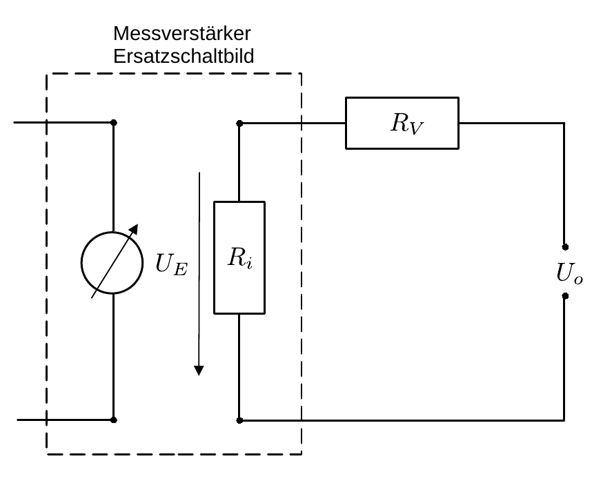

# Hinweise für den Versuch Photoeffekt

## Versuchsdurchführung

### Hg-Dampflampe

[Hg](https://de.wikipedia.org/wiki/Quecksilberdampflampe) besitzt u.a. die folgenden für diesen Versuch relevanten diskreten Emissionslinien 

- $\lambda=365.01\, \mathrm{nm}$ (UV);
- $\lambda=404.66\, \mathrm{nm}$ (violett);
- $\lambda=407.78\, \mathrm{nm}$ (violett);
- $\lambda=435.83\, \mathrm{nm}$ (blau);
- $\lambda=491.60\, \mathrm{nm}$ (cyan);
- $\lambda=546.07\, \mathrm{nm}$ (grün);
- $\lambda=576.96\, \mathrm{nm}$ (orange);
- $\lambda=579.07\, \mathrm{nm}$ (orange).

In der Überlagerung ergibt sich eine grünliche Farbe. Einzelne Wellenlängen können mit Hilfe von sechs Fabry-Pero-Farbfiltern weiter ausgewählt werden, die für die folgenden Wellenlängen durchlässig sind:

- $\lambda^{(1)}_{\mathrm{CWL}}=360\, \mathrm{nm}$;
- $\lambda^{(2)}_{\mathrm{CWL}}=400\, \mathrm{nm}$;
- $\lambda^{(3)}_{\mathrm{CWL}}=440\, \mathrm{nm}$;
- $\lambda^{(4)}_{\mathrm{CWL}}=490\, \mathrm{nm}$;
- $\lambda^{(5)}_{\mathrm{CWL}}=540\, \mathrm{nm}$;
- $\lambda^{(6)}_{\mathrm{CWL}}=590\, \mathrm{nm}$.

Die Abkürzung CWL steht dabei für *central wavelength*; es ist die Wellenlänge in der Mitte des Filterbandpasses. Laut Hersteller haben die Filter eine [Halbwertsbreite](https://de.wikipedia.org/wiki/Halbwertsbreite) von $\pm10\, \mathrm{nm}$, aus der Sie die Standardabweichung des eingestrahlten Lichts bestimmen können. Beachten Sie dabei die Umrechnung zwischen Halbwertsbreite und Standardabweichung unter Annahme einer Normalverteilung. 

### Qualitativer Verlauf von Strom, Spannung und $E_{\mathrm{kin}}$ der austretenden Elektronen

Eine Skizze des qualitativen Verlaufs von Strom, Spannung und $E_{\mathrm{kin}}$ der austretenden Elektronen ist in **Abbildung 3** gezeigt: 

**Abbildung 3**: (Qualitativer Verlauf von Strom, Spannung und $E_{\mathrm{kin}}$ der austretenden Elektronen für den äußeren photoelektrischen Effekt)

---

Erst ab einer charakteristischen Frequenz $\nu_{0}$ treten Elektronen aus K aus. Der Verlauf von $E_{\mathrm{kin}}$ als Funktion von $\nu$ ist daraufhin linear. Extrapoliert man den Verlauf bis zum Abszissenschnittpunkt erhält man die Austrittsarbeit der Elektronen aus dem Kathodenmaterial $W_{K}$. Als Funktion einer externen Spannung $U_{o}$ folgt der Photostrom $I_{\mathrm{Ph}}$, abhängig von den Abmessungen der Photozelle, dem [Raumladungsgesetz](https://de.wikipedia.org/wiki/Raumladungsgesetz). Ab einer maximalen Gegenspannung $U_{o}(I_{\mathrm{Ph}}=0)$ kommt $I_{\mathrm{Ph}}$ zum erliegen. In der Praxis kann eine zusätzliche Kontanktspannung $U_{K}$ zwischen A und K auch ohne Lichteinstrahlung zu einem resultierenden Stromfluss führen. Dies führt i.a. zu einer Parallelverschiebung des Verlaufs von $I_{\mathrm{Ph}}$ entlang der $y$-Achse.

### Aufgabe 1.1: Qualitative Beobachtung des äußeren photoelektrischen Effekts

- Eine sich mit der Zeit bildende Oxyschicht kann die Photoemission stark beeinträchtigen. Polieren Sie Zn daher vor Versuchsbeginn sorgfältig. Laden Sie Zn daraufhin mit einer Spannung von ${\approx}\pm2\ \mathrm{kV}$ auf. 

- Zur Demonstration verwenden Sie ein statisches Elektrometer (E). Der Ausschlag von E ist vom Vorzeichen der Ladung unabhängig; er ändert sich nur sehr langsam.

- Nach Beleuchten mit Hg sollten Sie beobachten, dass der Ausschlag von E (ebenfalls langsam) zurückgeht, wenn Sie Zn negativ aufgeladen haben. Er sollte erhalten bleiben, wenn Sie Zn positiv aufgeladen haben. 

- In der Praxis wird sich Zn aufgrund von Wechselwirkungen mit der Umgebung mit zunehmender Zeit immer entladen. Die Halbwertszeit für diesen Vorgang können Sie mit Hilfe einer Messung ohne Lichteinstrahlung abschätzen.

- Wenn Sie Zn negativ aufgeladen haben und eine positive Elektrode (A) in die Nähe von Zn bringen sollten Sie beobachten, dass der Entladevorgang deutlich schneller vonstatten geht.  

- Diskutieren Sie alle Beobachtungen, die Sie bei diesem Versuch machen.  

### Aufgabe 1.2: Charakterisierung des für die folgenden Aufgaben zu verwendeden Elektrometers

Die Ladungesbewegungen, die Sie bei diesem Versuch untersuchen sind i.a. sehr gering (im Bereich von $1-100\ \mathrm{nA}$). 

Spannungemessungen erfolgen direkt (siehe **Abbildung 1** oben [hier](https://gitlab.kit.edu/kit/etp-lehre/p2-praktikum/students/-/blob/main/Photoeffekt/doc/Hinweise-Photoeffekt.md)). Strommessungen erfolgen als Messung einer Spannung $U_{\mathrm{Ph}}$, die über einen bekannten Arbeitswiderstand $R=100\ \mathrm{M\Omega}$ abfällt (siehe **Abbildung 2** unten [hier](https://gitlab.kit.edu/kit/etp-lehre/p2-praktikum/students/-/blob/main/Photoeffekt/doc/Hinweise-Photoeffekt.md)). Hierzu verwenden Sie einen Messverstärker mit sehr hohem Innenwiderstand $R_{i}$. Einen solchen Aufbau bezeichnet man ebenfalls als Elektrometer. Eine Abbildung der Frontfläche der Kontrollbox zur Steuerung des Elektrometers finden Sie [hier]([hier](https://gitlab.kit.edu/kit/etp-lehre/p2-praktikum/students/-/blob/main/Photoeffekt/figures/IMG_1600.jpg)).  Im Folgenden sollen Sie sich mit dem für alle weiteren Versuche zu verwendenden Elektrometer vertraut machen in dem Sie die folgenden Schritte ausführen: 

#### Nullabgleich

Führen Sie einen Nullabgleich des Elektrometers duch. Sie tun dies, z.B. indem Sie eine Referenzspannung $U_{o}$ anschließen, die entsprechende Taste links am Schaltkasten des Messverstärkers gedrückt halten und die ausgegebene Spannung mit den Potentiometerschrauben zur Grob- und Feinjustierung variieren. Nehmen Sie die Justierung für die Verstärkung $V=100$ vor, damit können Sie den resultierenden Nullabgleich auch für geringere Verstärkungen verwenden. 

#### Bestimmung des Innenwiderstands $R_{i}$

Das Ersatzschaltbild hierzu ist in **Abbildung 4** gezeigt:

**Abbildung 4**: (Ersatzschaltbild zur Bestimmung von $R_{i}$ des für die weiteren Aufgaben zu verwendenden Elektrometers)

---

Von außen liegt die als bekannt angenommene Spannung $U_{o}$ an. Das Elektrometer ist durch die Schaltung innerhalb des gestrichelten Kastens dargestellt. Nach den [Kirchhoffschen Regeln](https://de.wikipedia.org/wiki/Kirchhoffsche_Regeln) gilt: 
$$
\begin{equation}
\begin{split}
&U_{E}=R_{i}\,I;\qquad U_{o}=(R_{V}+R_{i})\,I;\\
&\\
&U_{E} = U_{o}\,\frac{R_{i}}{R_{V}+R_{i}}\approx U_{o}\left(1-\frac{R_{V}}{R_{i}}\right); \\
%&\\
%&R_{i} = \frac{U_{E}}{U_{0}+U_{E}}\,R_{V}.\\
\end{split}
\end{equation}
$$
Zur Bestimmung von $R_{i}$ können Sie z.B. wie folgt vorgehen: 

- Bestimmen Sie für eine Verstärkung von $V=1$ die gemessene Spannung $U_{E}$ für die zu Verfügung stehenden Vorwiderstände von $R_{V}=0.1,\ 1,\ 10\ \mathrm{G\Omega}$ und tragen Sie die Messpunkte in einem Diagramm geeignet auf. 
- Nehmen Sie $\Delta R_{V}/R_{V}=\pm 10\%$ und $\Delta U_{o}=\pm0.01\ \mathrm{V}$ an. 
- Passen Sie an den Verlauf das Modell aus Gleichung **(1)** an.

**Beachten Sie, dass die maximal ausgegebene Spannung des Verstärkers $\pm10\ \mathrm{V}$ nicht übersteigt. Die $4\ \mathrm{mm}$-Massebuche links unten an der Frontfläche der Kontrollbox liegt auf dem gleichen Potential, wie der BNC-Außenleiter.** 

# Navigation

[Main](https://gitlab.kit.edu/kit/etp-lehre/p2-praktikum/students/-/tree/main/Photoeffekt) | [Weiter](https://gitlab.kit.edu/kit/etp-lehre/p2-praktikum/students/-/tree/main/Photoeffekt/doc/Hinweise-Versuchsdurchfuehrung-a.md)
