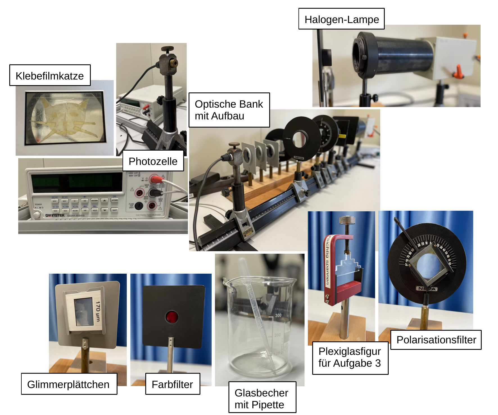

# Fakultät für Physik

## Physikalisches Praktikum P2 für Studierende der Physik

Versuch P2-11 (Stand: April 2024)

[Raum F1-14](https://labs.physik.kit.edu/img/Praktikum/Lageplan_P2.png)

# Polarisation und Doppelbrechung

## Motivation

Die Ausbreitungsgeschwindigkeit von Licht im Vakuum ist $c$. Das elektrische und magnetische Feld stehen immer senkrecht aufeinander ($\vec{E}\perp\vec{B}$).  Lichtwellen sind zudem transversal polarisiert, d.h. $\vec{E}$ (also auch $\vec{B}$) stehen senkrecht zur Ausbreitungsrichtung $\vec{k}$ der Welle. Eine einfache, ebene Welle ist **linear polarisiert**, d.h. $\vec{E}$ weist eine wohldefinierte, entlang $\vec{k}$ unveränderliche Ausrichtung auf. Durch Verschränkung zweier ebener Wellen ist es möglich eine **elliptisch oder zirkular polarisierte** Welle zu erzeugen, bei der die Vektoren $\vec{E}(t)$ und $\vec{B}(t)$ in der Ebene senkrecht zu $\vec{k}$ kreisen. Im allgemeinen Fall der elliptischen Polarisation verändern $\vec{E}(t)$ und $\vec{B}(t)$ dabei entlang $\vec{k}$ ihre Beträge; im Spezialfall der zirkularen Polarisation bleiben die Beträge zeitlich konstant. Aus natürlichen oder technischen Lichtquellen tritt Licht oft zunächst als [inkohärente](https://de.wikipedia.org/wiki/Koh%C3%A4renz_(Physik)) Überlagerung vieler Wellenpakete aus, deren Ausrichtung zufällig verteilt ist. Tatsächlich trifft man in der Natur aber öfter auf polarisiertes Licht als man zunächst annehmen möchte. Dieses tritt immer dann auf, wenn transparente Medien eine Vorzugsrichtung im Raum besitzen oder durch Reflexion eine solche Vorzugsrichtung entsteht. Uns fällt dies nicht direkt auf, weil wir – im Gegensatz zu Bienen – kein Organ besitzen, mit dem wir die Polarisation von Licht wahrnehmen können. Eine Anwendung, die Ihnen aus der Vorlesung bekannt sein dürfte, ist die Beobachtung von Licht beim Übergang in ein optisch dichteres Medium, wie Glas, unter dem [Brewster-Winkel](https://de.wikipedia.org/wiki/Brewster-Winkel).

In der Natur gibt es eine Vielzahl transparenter Kristalle, die aufgrund von Vorzugsrichtungen in ihrer Struktur sogenannte [doppelbrechende](https://de.wikipedia.org/wiki/Doppelbrechung) Eigenschaften besitzen, d.h. der Brechungsindex $n$ dieser Kristalle hängt von der Ausrichtung der Welle und oft zusätzlich noch von der Wellenlänge $\lambda$ ab. Solche Kristalle erzeugen auf natürliche Weise elliptisch polarisiertes Licht. Mathematisch ist die materielle Beschreibung der Doppelbrechung äußerst komplex. 

Im Rahmen dieses Versuchs werden Sie sich mit verschieden polarisiertem Licht und dem Phänomen der Doppelbrechung mit Hilfe einfacher Experimente praktisch vertraut machen. 

## Lehrziele

Wir listen im Folgenden die wichtigsten **Lehrziele** auf, die wir Ihnen mit dem Versuch **Polarisation und Doppelbrechung** vermitteln möchten: 

- Sie erzeugen und untersuchen verschieden polarisiertes Licht einer Halogen-Glühlampe.
- Sie untersuchen die Eigenschaften von [Glimmer](https://de.wikipedia.org/wiki/Glimmergruppe), als einem optisch positiv, biaxial doppelbrechenden Medium und leiten aus Ihren Untersuchungen einfache optische Eigenschaften von Glimmer ab.
- Sie beschäftigen sich experimentell und einführend mit dem komplexen Thema der Doppelbrechung, damit verbundenen Alltagsphänomenen und technischen Anwendungen.

## Versuchsaufbau

Einen typischer Aufbau der Apparatur für diesen Versuch ist in **Abbildung 1** gezeigt:

**Abbildung 1**: (Ein typischer Aufbau des Versuchs Polarisation und Doppelbrechung)

---

Auf einer optischen Bank sind, eine Halogen-Glühlampe (HL) und ein Phototransistor (PT) zur Messung der Intensität des emittierten Lichts montiert. Dazwischen lassen sich geeignet Polarisationsfilter, Linsen und [Verzögerungsplatten](https://de.wikipedia.org/wiki/Verz%C3%B6gerungsplatte) (VP) moniteren. Sie polarisieren das Licht mit Hilfe eines Polarisationsfilters (PF) im Strahlengang unmittelbar hinter HL, lassen es je nach Aufgabenstellung verschiedene VP durchlaufen und analysieren es vor PT mit Hilfe eines weiteren Polarisationsfilters (Analysators AF), dessen Polarisationsebene Sie entsprechend gegen PF verdrehen. 

# Navigation

- [Hinweise-Polarisation.md](https://gitlab.kit.edu/kit/etp-lehre/p2-praktikum/students/-/blob/main/Polarisation/doc/Hinweise-Polarisation.md): **Grundlagen zum Verständnis der Polarisation von Licht**.
- [Hinweise-Doppelbrechung.md](https://gitlab.kit.edu/kit/etp-lehre/p2-praktikum/students/-/blob/main/Polarisation/doc/Hinweise-Doppelbrechung.md): **Grundlagen zum Phänomen der Doppelbrechung in Kristallen**.
- [Hinweise-Versuchsdurchfuehrung.md](https://gitlab.kit.edu/kit/etp-lehre/p2-praktikum/students/-/blob/main/Polarisation/doc/Hinweise-Versuchsdurchfuehrung.md): Wichtige Hinweise und **Tipps zur Versuchsdurchführung**.
- [Datenblatt.md](https://gitlab.kit.edu/kit/etp-lehre/p2-praktikum/students/-/blob/main/Polarisation/Datenblatt.md): **Wichtige technische Details** zu den Versuchsaufbauten.
