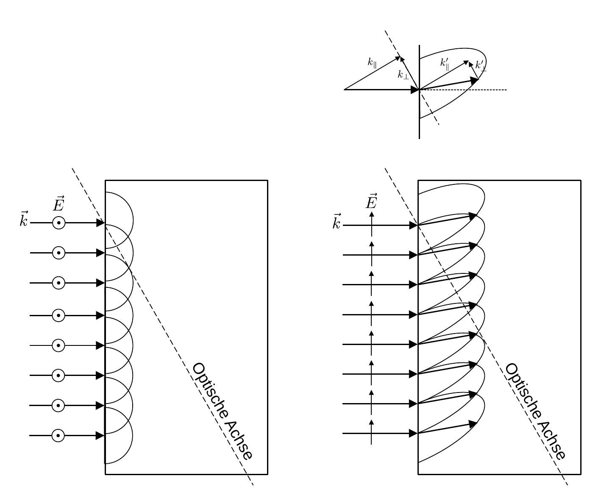

# Hinweise für den Versuch Polarisation und Doppelbrechung

## Doppelbrechung [1/2]

### Tensor der dielektrischen Moduln und Doppelbrechung

In einem dielektrischen Medium gilt für die Beziehung zwischen elektrischer Feldstärke $\vec{E}$ und dielektrischer Verschiebung $\vec{D}$ die Beziehung: 
$$
\begin{equation*}
\begin{split}
&\vec{D} = \epsilon_{0}\boldsymbol{\epsilon}\vec{E} \\
&\\
&\boldsymbol{\epsilon} = \left(\epsilon_{ij}\right).
\end{split}
\end{equation*}
$$
Für isotrope Medien, für die keine Raumrichtung ausgezeichnet ist wird die dielektrische Konstante $\boldsymbol{\epsilon}$ ([Permittivität](https://de.wikipedia.org/wiki/Permittivit%C3%A4t)) oft wie ein Skalar behandelt. Im Allgemeinen handelt es sich aber um einen **symmetrischen Tensor zweiter Stufe**. Das gleiche gilt für den Tensor $\boldsymbol{\eta}$ der dielektrischen Moduln
$$
\begin{equation*}
\begin{split}
&\vec{E} = \frac{1}{\epsilon_{0}}\boldsymbol{\eta}\vec{D} \\
&\\
&\boldsymbol{\eta} = \left(\eta_{ij}\right).
\end{split}
\end{equation*}
$$
Symmetrische Tensoren zweiter Stufe kennen Sie bereits z.B. den Trägheitstensor $\boldsymbol{\Theta}$ aus dem Versuch [Kreisel](https://gitlab.kit.edu/kit/etp-lehre/p1-praktikum/students/-/tree/main/Kreisel) des P1. 

Jeder symmetrische Tensor zweiter Stufe lässt sich durch [Hauptachsentransformation](https://de.wikipedia.org/wiki/Hauptachsentransformation) in Diagonalenform bringen 
$$
\begin{equation}
\boldsymbol{\eta} = 
\left(
\begin{array}{ccc}
\eta_{11} & 0 & 0 \\
0 & \eta_{22} & 0 \\
0 & 0 & \eta_{33} \\
\end{array}
\right),
\end{equation}
$$
aus deren Eigenwerten $\eta_{ii}$ sich die Hauptbrechungsindizes 
$$
\begin{equation*}
\begin{split}
&n_{\alpha} = \frac{1}{\sqrt{\eta_{11}}}; \qquad n_{\beta} = \frac{1}{\sqrt{\eta_{22}}}; \qquad n_{\gamma} = \frac{1}{\sqrt{\eta_{33}}} \\
\end{split}
\end{equation*}
$$
bestimmen lassen, die man konventionell ihrer Größe nach aufsteigend definiert. Für die weitere Diskussion führen wir zudem die Hauptachsenvektoren $\hat{\alpha}$, $\hat{\beta}$ und $\hat{\gamma}$ ein. In seinem Hauptachsensystem lässt sich $\boldsymbol{\eta}$ als sog. [Indexellipsoid](https://de.wikipedia.org/wiki/Indexellipsoid) mit den [Halbmessern](https://de.wikipedia.org/wiki/Radius) $n_{i}$ seiner [Hauptachsen](https://de.wikipedia.org/wiki/Halbachsen_der_Ellipse) darstellen. 

Die exakte Form von $\boldsymbol{\eta}$ ist durch die mikrokopische Struktur des Mediums vorgeben:

- Für **isotrope Medien**, die keine Raumrichtung auszeichnen liegen alle $n_{i}$ entartet vor. Dies ist bei Gasen oder Flüssigkeiten, aber auch z.B. bei [kubischen Kristallen](https://de.wikipedia.org/wiki/Kubisches_Kristallsystem) der Fall. 
- In einem dielektrisch anisotropen Medium liegen die $n_{i}$ nicht entartet vor, d.h. **die Ausbreitungsgeschwindigkeit eines Lichtstrahls in einem solchen Medium hängt von dessen Polarisationsrichtung ab**. Da der Brechungsindex nicht einen einzigen Wert annimmt spricht man bei Kristallen von [Doppelbrechung](https://de.wikipedia.org/wiki/Doppelbrechung). 
  - Bei optisch einachsigen (uniaxialen) Kristallen ([wirtelige Kristallsysteme](https://de.wikipedia.org/wiki/Wirteliges_Kristallsystem)) liegen zwei der $n_{i}$ entartet vor. 
  - Bei optisch zweiachsigen (biaxialen) Kristallen ([orthorhombische](https://de.wikipedia.org/wiki/Orthorhombisches_Kristallsystem), [monokline](https://de.wikipedia.org/wiki/Monoklines_Kristallsystem) und [trikline](https://de.wikipedia.org/wiki/Triklines_Kristallsystem) Kristallsysteme) unterscheiden sich alle $n_{i}$. 

Tatsächlich sind die meisten Kristalle anisotrop und daher doppelbrechend.

### Uniaxiale Kristalle und optische Achse

Für uniaxial doppelbrechende Kristalle liegen zwei $n_{i}$ entartet vor, es gilt also entweder $n_{\alpha}=n_{\beta}=n$ oder $n_{\beta}=n_{\gamma}=n$. In diesem Fall gibt es eine ausgezeichnete Richtung im Kristall, entlang derer die Geschwindigkeit eines Lichtstrahls und damit $n$ **nicht von der Polarisation des Strahls abhängen**. Diese Richtung bezeichnet man als [optische Achse](https://de.wikipedia.org/wiki/Optische_Achse_(Optik)). Sie fällt mit der Hauptachse des Indexellipsoids zusammen, die zum Brechungsindex gehört, der nicht entartet vorliegt, also entweder $n_{\gamma}$ oder $n_{\alpha}$. Entlang der optischen Achse verhält sich der Kristall isotrop. Verläuft ein Lichtstrahl nicht entlang der optischen Achse, **bilden sich zwei Strahlen aus**, die sich mit unterschiedlicher Geschwindigkeit durch den Kristall bewegen:

- Den Strahl, dessen Polarisation senkrecht zur optischen Achse verläuft, bezeichnet man als **ordentlichen Strahl**; den zugehörigen Brechungsindex bezeichnet man als $n_{o}$ ("o" für "ordinair"). Dieser Strahl folgt dem [Snelliusschen Brechungsgesetz](https://de.wikipedia.org/wiki/Snelliussches_Brechungsgesetz), d.h. er wird bei senkrechtem Einfall auf das Medium nicht gebrochen. Die Elementarwellen des ordentlichen Strahls bilden Kugelwellen.  
- Den Strahl, dessen Polarisation parallel zur optische Achse liegt, bezeichnet man als **außerordentlichen Strahl**; den zugehörigen Brechungsindex bezeichnet man als $n_{e}$ ("e" für "extraordinair"). Dieser Strahl folgt nicht dem Snelliusschen Brechungsgesetz, d.h. er wird selbst bei senkrechtem Einfall auf das Medium gebrochen. Die Elementarwellen des außerordentlichen Strahls bilden Rotationsellipsoide. 

Die Differenz $n_{e}-n_{o}$ bezeichnet man als **optische Orientierung**. Uniaxiale Kristalle mit $`n_{o}(=n_{\gamma})>n_{e}(=n)`$ bezeichnet man als optisch negativ. Hier bewegt sich der ordentliche Strahl langsamer durch das Medium, als der außerordentliche Strahl. Uniaxiale Kristalle mit $`n_{o}(=n)<n_{e}(=n_{\gamma})`$ bezeichnet man als optisch positiv. 

Eine Skizze des (links) ordentlichen und (rechts) außerordentlichen Strahls ist in **Abbilding 1** gezeigt: 

**Abbildung 1**: (Skizze des (links) ordentlichen und (rechts) außerordentlichen Strahls beim Durchgang durch einen uniaxial doppelbrechenden Kristall. Rechts oben ist die Konstruktion des gebrochenen Strahl skizziert)

---

Beispiele für uniaxial doppelbrechende Kristalle sind [Kalkspat](https://de.wikipedia.org/wiki/Calcit) (optisch negativ) oder Eis (optisch positiv). 

# Navigation

[Main](https://gitlab.kit.edu/kit/etp-lehre/p2-praktikum/students/-/tree/main/Polarisation) | [Weiter](https://gitlab.kit.edu/kit/etp-lehre/p2-praktikum/students/-/blob/main/Polarisation/doc/Hinweise-Doppelbrechung-a.md)

