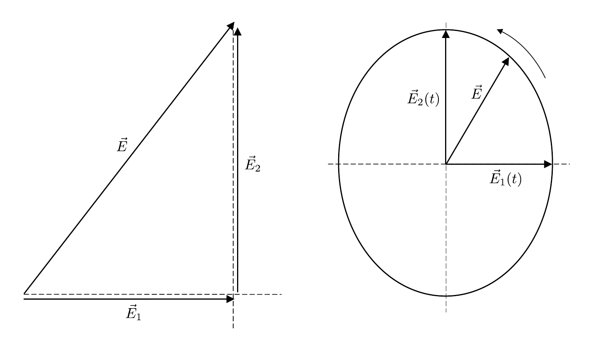
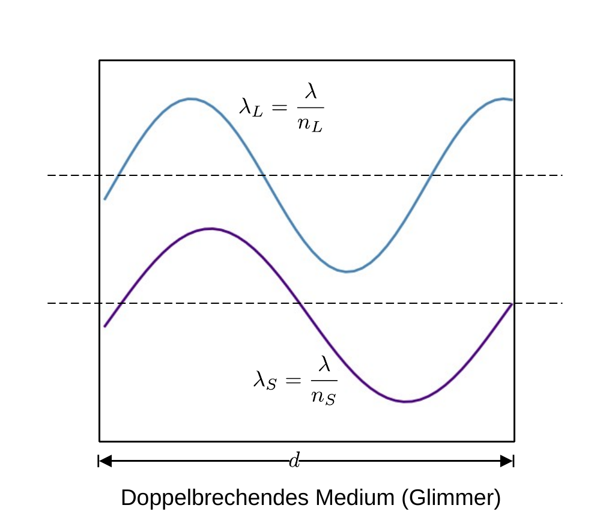
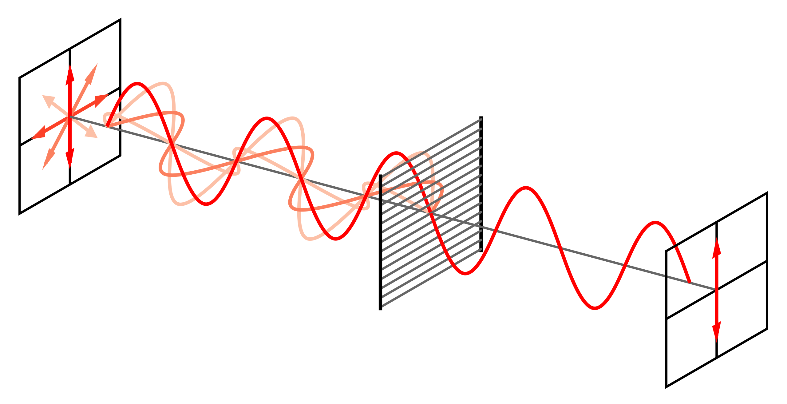
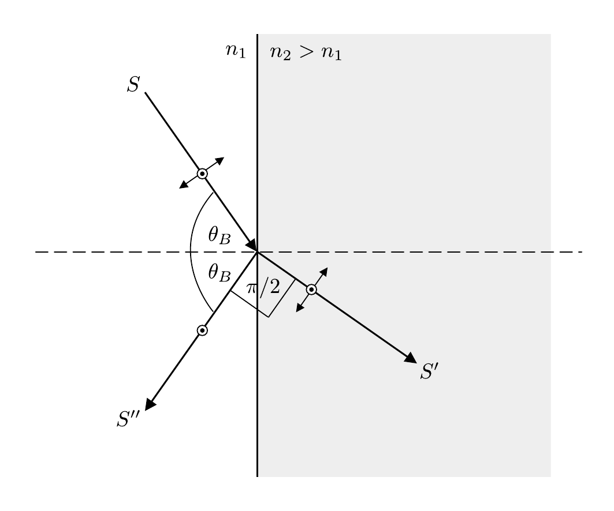

# Hinweise für den Versuch Polarisation und Doppelbrechung

## Polarisation

### Lineare, elliptische und zirkulare Polarisation

Elektromagnetsiche (em) Wellen sind transversale Wellen. Ihre Polarisation wird i.a. durch die Ausrichtung des elektrischen Feldstärkevektors $\vec{E}$ definiert. Zur besseren Übersicht nehmen wir für die weitere Diskussion ohne Beschränkung der Allgemeinheit die folgenden Einschränkungen vor:

- Die Welle wird durch ihre Entwicklung in $\vec{E}(x)$ dargestellt. Wir betrachten also die Ausbreitung entlang $x$ und unterdrücken die Abhängigkeit in $t$.  
- In diesem Abschnitt betrachten wir Wellen mit konstanter Wellenzahl $k$. 

Für **linear polarisierte Wellen** hat $\vec{E}$ eine feste, zeitlich unveränderliche Orientierung: 
$$
\begin{equation*}
\vec{E}(k, x) = \vec{E}\,e^{\pm ik\,x}.
\end{equation*}
$$
Jede linear polarisierte Welle mit der Amplitude $\vec{E}$ lässt sich in zwei senkrecht zueinander linear polarisierte Teilwellen mit den Amplituden $`\vec{E}_{1}\perp\vec{E}_{2}`$, wie in **Abbildung 1** dargestellt, zerlegen: 



**Abbildung 1**: ((Links) Aufspaltung des Vektors $\vec{E}$ in zwei senkrecht zueinander stehende Komponenten $`\vec{E}_{1}\perp \vec{E}_{2}`$ und (rechts) elliptische Polarisation für den Fall, dass zwischen den ebenen Wellen zu $`\vec{E}_{1}`$ und $`\vec{E}_{2}`$ bei gleicher Wellenzahl $k$ eine Phasendifferenz von $\Delta\phi=\pi/2$ besteht)

---

Je nachdem welche weiteren Randbedingungen für die Beträge $`|\vec{E}_{1}|`$ und $`|\vec{E}_{2}|`$ und Phasenbeziehung $\Delta\phi\in[0,\pi)$ zwischen den Wellen $`\vec{E}_{1}`$ und $`\vec{E}_{2}`$ besteht ist $\vec{E}$ unterschiedlich polarisiert: 

- Für $\Delta\phi=0$ ist $\vec{E}$ **linear polarisiert**. 

- Für $\Delta\phi=\pi/2$ und $`|\vec{E}_{1}|=|\vec{E}_{2}|`$ beschreibt die Spitze von $\vec{E}(x)$ einen Kreis in der Ebene senkrecht zur Ausbreitungsrichtung; man bezeichnet diese Art der Polarisation als **zirkulare Polarisation**.

- Für $\Delta\phi=\pi/2$ und $`|\vec{E}_{1}^{\prime}|\neq|\vec{E}_{2}^{\prime}|`$ beschreibt die Spitze von $\vec{E}(x)$ eine Ellipse senkrecht zur Ausbreitungsrichtung; man bezeichnet diese Art der Polarisation als **elliptische Polarisation**. Dieser Zustand ist äquivalent zu der Randbedingung $`|\vec{E}_{1}|=|\vec{E}_{2}|`$ und

  ```math
  \begin{equation*}
  \Delta\phi = \arctan\left(\frac{|\vec{E}_{1}^{\prime}|}{|\vec{E}_{2}^{\prime}|}\right).
  \end{equation*}
  ```

### Erzeugung von elliptisch polarisiertem Licht mit Hilfe einer Verzögerungsplatte

Eine [Verzögerungsplatte](https://de.wikipedia.org/wiki/Verz%C3%B6gerungsplatte) (VP) ist ein optisches Bauelement bestehend aus einem doppelbrechenden Kristall in dem sich i.a. zwei senkrecht zueinander, linear polarisierte Strahlen S und L mit unterschliedlichen Geschwindigkeiten $c_{i}=c/n_{i}, \ i=S,\ L$ ausbreiten, wobei $c$ der Lichtgeschwindigkeit im Vakuum entspricht. Wir definieren $`c_{S}>c_{L}`$. Die Polarisationsrichtung von S und L bezeichnen wir jeweils als **schnelle und langsame Achse**. Je nach optischer Orientierung entspricht entweder die schnelle oder die langsame Achse der optischen Achse des Mediums. 

Der Unterschied in $c_{i}$ führt zu einem Unterschied der Wellenlängen 
$$
\begin{equation*}
\lambda_{i} = \frac{\lambda}{n_{i}},
\end{equation*}
$$
wobei $\lambda$ der Wellenlänge im Vakuum entspricht. Aufgrund dieses Unterschieds verschieben sich S und L beim Durchgang durch VP gegeneinander, so dass es abhängig von der Dicke $d$ von VP zur Phasenverschiebung $\Delta\phi$ zwischen beiden Strahlen kommt, wie in **Abbildung 2** skizziert:  



**Abbildung 2**: (Phasenverschiebung der Strahlen S und L aufgrund von Doppelbrechung in VP. Zur Veranschaulichung wurden die Parameter $d=\lambda_{L}$ und $n_{S}/n_{L}=4/5$ gewählt, so dass S nach Durchlaufen von VP L um eine viertel Periode vorauseilt)

---

Welcher Anteil von $\lambda_{i}$ in $d$ liegt ist durch das Produkt
$$
\begin{equation*}
d\,k_{i}=\frac{2\pi\,d}{\lambda_{i}} = \frac{2\pi\,d\,n_{i}}{\lambda} = d\,k\,n_{i}
\end{equation*}
$$
geometrisch vorgegeben. Die Phasendifferenz $\Delta\phi$ zwischen S und L nach Durchlaufen der Strecke $d$ erhält man aus 
$$
\begin{equation}
\Delta\phi = \frac{2\pi\,d}{\lambda}\left(n_{L}-n_{S}\right).
\end{equation}
$$
Für die Parameterwahl aus **Abbildung 2** erhält man $\Delta\phi=\pi/2$, die für **Abbildung 2** gewählten Abmessungen entsprechen also den Abmessungen für ein $\lambda/4$-Plättchen zur Erzeugung zirkularer Polarisation für die Wellenlänge $\lambda$.

### Lineare Polarisation am Gitter

Eine der einfachsten Methoden linear Polarisiertes Licht zu erzeugen besteht in der Bestrahlung eines Gitters mit leitenden Verbindungen ([Drahtgitterpolarisator](https://de.wikipedia.org/wiki/Drahtgitterpolarisator)), wie in **Abbildung 3** gezeigt:



**Abbilding 3**: (Lineare Polarisation am Drahtgitter (Quelle [Wikipedia](https://commons.wikimedia.org/w/index.php?curid=724493)))

---

Durch die Einstrahlung em Wellen werden die leitenden Verbindungen am Gitter zu Schwingungen angeregt und fungieren als [Herztsche Dipole](https://de.wikipedia.org/wiki/Hertzscher_Dipol). Die abgestrahlte Welle erfährt aufgrund der Randwerte einen Phasensprung um $\pi$. Unter der Annahme idealer Leiter (ohne inneren Widerstand) führt dies zur destruktiven Interferenz und Auslöschung der Welle jenseits des Gitters. Vor dem Gitter führt die Dipolstrahlung zur Ausbildung einer stehenden Welle und damit zur Reflexion. 

Senkrecht zu den leitenden Verbindungen ist durch deren geringe Abmessungen ($d\ll\lambda$) keine nennenswerte Schwingung möglich und alle Anteile der Welle mit dieser Polarisationsrichtung können das Gitter ungehindert passieren. 

Ein Gitter wirkt nur dann als Polarisationsfilter, wenn es eine hinreichend große Anzahl von Verbindungen mit hinreichend geringem Druchmesser $d$ und Abstand $g$ aufweisen. 

### Lineare Polarisation durch Reflexion oder Streuung

Eine ebenfalls wohlbekannte Methode zur Erzeugung von linear polarisiertem Licht ist Polarisation durch Reflexion, z.B. unter dem [Brewster-Winkel](https://de.wikipedia.org/wiki/Brewster-Winkel), wie in **Abbildung 4** gezeigt:



**Abbildung 4**: (Geometrische Darstellung des Brewster-Winkels)

---

Der Strahl S wird an einem optisch dichteren Medium (mit $n_{2}$) zur optischen Achse hin gebrochen. Unter dem Brewster-Winkel steht der gebrochene Strahl S' senkrecht zum gespiegelten Strahl S''. S'' ist zu 100% senkrecht zur Bildebene polarisiert. Dies erklärt sich wie folgt: 

Durch S werden atomare Dipole im dichteren Medium zur Schwingung angeregt. S'' wird parallel zu den Dipolen reflektiert, einer Richtung in der die Dipole nicht abstrahlen. Dadurch wird der Polarisationsanteil in der Bildebene unterdrückt, der Polarisationsanteil in der Ebene senkrecht zur Bildebene wird ungehindert abgestrahlt. Auf die gleiche Art und Weise wird gestreutes Licht polarisiert.  

# Navigation

[Main](https://gitlab.kit.edu/kit/etp-lehre/p2-praktikum/students/-/tree/main/Polarisation)
