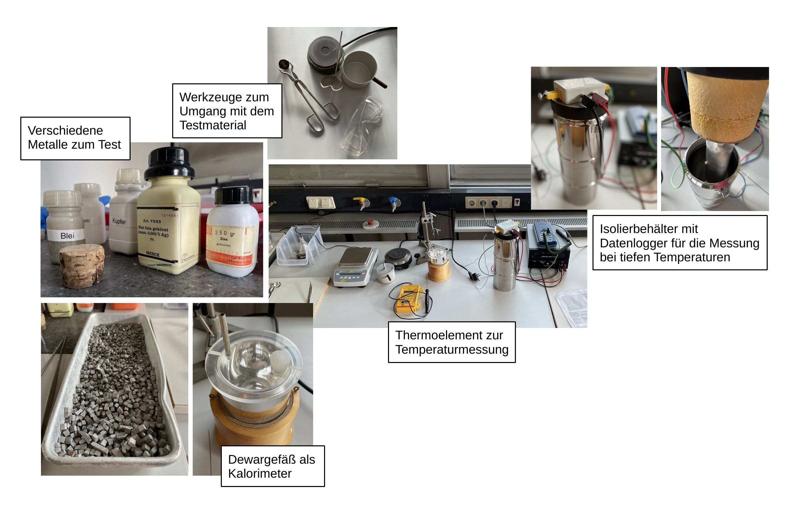

# Fakultät für Physik

## Physikalisches Praktikum P2 für Studierende der Physik

Versuch P2-33, 34, 35 (Stand: April 2024)

[Raum F1-10](https://labs.physik.kit.edu/img/Praktikum/Lageplan_P2.png)

# Spezifische Wärmekapazität

## Motivation

Im Jahr 1819 veröffentlichten [Pierre Dulong](https://de.wikipedia.org/wiki/Pierre_Louis_Dulong) und [Alexis Petit](https://de.wikipedia.org/wiki/Alexis_Th%C3%A9r%C3%A8se_Petit) nach eingehenden Untersuchungen die Vermutung, dass die [molare Wärmekapazität](https://de.wikipedia.org/wiki/Molare_W%C3%A4rmekapazit%C3%A4t) für alle aus einzelnen Atomen zusammengesetzten Festkörper den gleichen Wert 

$$
\begin{equation*}
C_{M} = 3\ R=24.9\ \mathrm{J\,mol^{-1}K^{-1}}
\end{equation*}
$$

haben könnte, wobei $R$ der idealen Gaskonstanten entspricht. Diese Vermutung konnte später durch eine entsprechende Vorhersage aus der [statistischen Thermodynamik](https://de.wikipedia.org/wiki/Statistische_Thermodynamik) erklärt werden. Eine Konsequenz dieser Vorhersage war, dass $C_{M}$ für einatomige Festkörper konstant sein sollte. Später stellte sich jedoch heraus, dass $C_{M}$ bei sehr tiefen Temperaturen ($T$) eine deutliche $T$-Abhängigkeit aufwies und und gegen Null strebte, ein Verhalten, dass im Rahmen der statistischen Thermodynamik nicht zu erklären war. Albert Einstein ([*Annalen der Physik*, 22 (1907)](http://echo.mpiwg-berlin.mpg.de/MPIWG:7BQGFZHC)) konnte dieses Phänomen als erster unter der Annahme erklären, dass Schwingungen im Festkörper, ganz so wie Strahlung in einem [Schwarzen Körper](https://de.wikipedia.org/wiki/Schwarzer_K%C3%B6rper) nur in Energiequanten aufgenommen und abgegeben werden können ([Einsteinmodell](https://de.wikipedia.org/wiki/Einsteinmodell)). Dieses Modell wurde 1912 von [Peter Debye](https://de.wikipedia.org/wiki/Debye-Modell) weiter verfeinert. Mit diesem Versuch haben Sie die Möglichkeit mit einfachsten Mitteln die Aussagen des Dulong-Petit Gesetzes für verschiedene Festkörper experimentell nachzuprüfen und mit Hilfe von [Flüssigstickstoff](https://de.wikipedia.org/wiki/Fl%C3%BCssigstickstoff) den Temperaturverlauf von $C_{M}$ an Aluminium zu untersuchen. Damit weisen Sie eine weitere Bruchstelle der klassischen Physik und einen der ersten Quanteneffekte des Festkörperphysik im Praktikum selbst nach. 

## Lehrziele

Wir listen im Folgenden die wichtigsten **Lehrziele** auf, die wir Ihnen mit dem Versuch **Spezifische Wärmekapazität** vermitteln möchten: 

- Sie üben sich in der sorgfältigen Planung, Dokumentation und Durchführung einfacher Experimente zur Bestimmung der [spezifischen Wärmekapazität](https://de.wikipedia.org/wiki/Spezifische_W%C3%A4rmekapazit%C3%A4t) verschiedener Metalle.
- Sie üben sich im gewissenhaften und exakten Experimentieren, sowie in der Abschätzung und Minimierung systematischer Effekte bei der Planung und Durchführung Ihrer Experimente.
- Sie untersuchen den Einfluss der Umgebung auf Experimente, die mit Wärme zu tun haben ([Wärmegang](https://de.wikipedia.org/wiki/W%C3%A4rme%C3%BCbergangskoeffizient)).
- Sie untersuchen die Abhängigkeit der spezifischen Wärmekapazität von der Temperatur, ein Phänomen, das im Rahmen der klassischen Thermodynamik nicht erklärt werden kann. 
- Sie üben sich im verantwortungsvollen Umgang mit [Flüssigstickstoff](https://de.wikipedia.org/wiki/Fl%C3%BCssigstickstoff) und führen ein Experiment bei tiefen Temperaturen durch. 
- Sie nutzen dabei den [thermoelektrischen (Peletier) Effekt](https://de.wikipedia.org/wiki/Thermoelektrizit%C3%A4t) zur Temperaturmessung.  

## Versuchsaufbau

Einen typischer Aufbau mit den Apparaturen für diesen Versuch ist in **Abbildung 1** gezeigt:

**Abbildung 1**: (Ein typischer Aufbau mit den Apparaturen für die Durchführung des Versuchs Spezifische Wärmekapazität)

---

Für die Durchführung des Versuchs stehen Ihnen mehrere Metalle in Form von Zylindern oder Granulaten zur Verfügung. Mit einer Heizplatte oder Eis können Sie die Metallgemenge oder Wasser erhitzen oder abkühlen. In einem Dewargefäß, dass Sie als thermisches Kalorimeter nutzen, bestimmen Sie mit Hilfe verschiedener Thermometer Mischtemperaturen von geeigneten Metall-Wasser-Gemischen. Die Planung, der grundsätzliche Aufbau und der konkrete Versuchsablauf bleibt Ihnen überlassen. 

In einem zweiten Teil des Versuchs kühlen Sie einen Aluminium-Hohlzylinder (AL) auf die Sidetemperatur von Flüssigstickstoff ab und erwärmen ihn im Anschluss wieder unter kontrollierten Bedingungen. Nach Anwendung verschiedener Korrektur- und Kalibrationsschritte bestimmen Sie den Temperaturverlauf der spezifischen Wärmekapazität von Aluminium und überprüfen u.a. die Konsistenz Ihrer  Messungen.  

## Wichtige Hinweise

- **Der Umgang mit Flüssigstickstoff erfordert besondere Vorsicht! Spritzer von flüssigem Stickstoff auf der Haut können bereits zu schweren Verbrennungen führen.** Tragen Sie daher immer Schutzhandschuhe und eine Schutzbrille im Umgang mit Flüssigstickstoff!
- Werfen Sie keine Gegenstände in die Dewargefäße und gehen Sie achtsam damit um. Da diese aus Glas bestehen können Sie leicht zerstört werden.
- Um die Daten von **Aufgabe 2** auf das Jupyter-notebook zu überspielen benötigen Sie einen USB-Stick. 

# Navigation

- [Hinweise-Waermekapazitaet.md](https://gitlab.kit.edu/kit/etp-lehre/p2-praktikum/students/-/blob/main/Spezifische_Waermekapazitaet/doc/Hinweise-Waermekapazitaet.md): **Grundlagen des Versuchs**.
- [Hinweise-Versuchsdurchfuehrung.md](https://gitlab.kit.edu/kit/etp-lehre/p2-praktikum/students/-/blob/main/Spezifische_Waermekapazitaet/doc/Hinweise-Versuchsdurchfuehrung.md): Wichtige Hinweise und **Tipps zur Versuchsdurchführung**.
- [Datenblatt.md](https://gitlab.kit.edu/kit/etp-lehre/p2-praktikum/students/-/blob/main/Spezifische_Waermekapazitaet/Datenblatt.md): **Wichtige technische Details** zu den Versuchsaufbauten.
