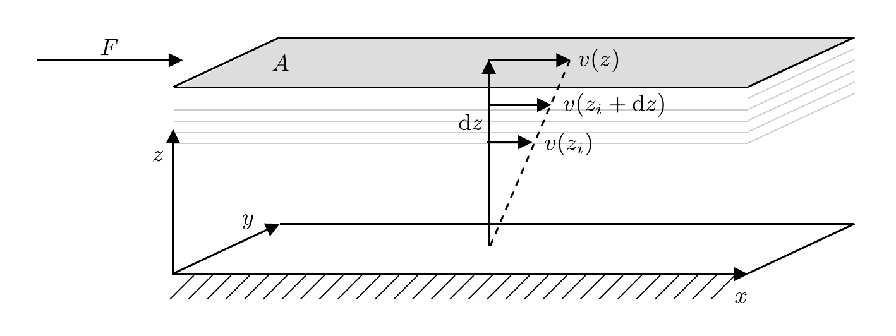
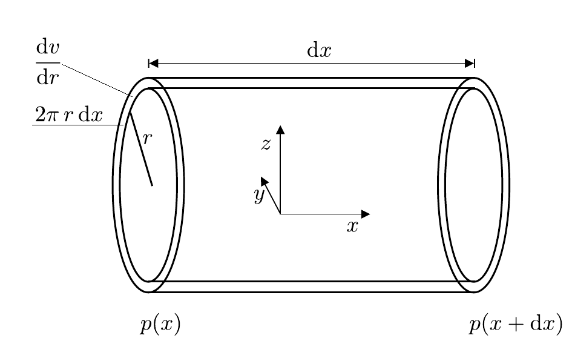

# Hinweise für den Versuch Vakuum

## Vakuumbereiche

Die Physik des Vakuums ist die [Strömungsmechanik](https://de.wikipedia.org/wiki/Str%C3%B6mungsmechanik). Grundsätzlich unterscheidet man drei Vakuumbereiche, in denen drei Strömungsarten dominant vorherrschen: 

### Grobvakuum ($\gt 1\ \mathrm{mbar}$)

Hier liegt viskose oder [Kontinuumsströmung](https://de.wikipedia.org/wiki/Kontinuumsstr%C3%B6mung) vor, d.h. es dominiert die Wechselwirkungen der Teilchen des Gases (Fluids) untereinander, die die innere Reibung ([Viskosität](https://de.wikipedia.org/wiki/Viskosit%C3%A4t)) des Fluids bestimmen. Treten Wirbel in der Strömung auf, spricht man von [turbulenter Strömung](https://de.wikipedia.org/wiki/Turbulente_Str%C3%B6mung), findet ein Gleiten verschiedener Schichten des Fluids gegeneinander statt, spricht man von [laminarer Strömung](https://de.wikipedia.org/wiki/Laminare_Str%C3%B6mung). 

Viskose Strömung liegt generell dann vor, wenn die [mittlere freie Weglänge](https://de.wikipedia.org/wiki/Mittlere_freie_Wegl%C3%A4nge) $\lambda$ der Teilchen sehr viel kleiner als der Durchmesser der Leitung ist. Die Bewegungsrichtung der Teilchen im Fluid entspricht in diesem Fall der makroskopischen Bewegungsrichtung des Fluids.

### Hoch- ($\lt 10^{-3}\ \mathrm{mbar}$) und Ultrahochvakuum ($\lt 10^{-8}\ \mathrm{mbar}$) 

Hier liegt [molekulare Strömung](https://de.wikipedia.org/wiki/Molekulare_Str%C3%B6mung) vor, in der sich die Teilchen des Fluids ohne gegenseitige Behinderung frei bewegen können. Die Wahrscheinlichkeit eines Teilchen mit den Begrenzungen der Leitung zu stoßen ist deutlich höher, als die Wahrscheinlichkeit der Teilchen untereinander zu stoßen. In diesem Fall ist $\lambda$ sehr viel größer als der Durchmesser der Leitung. Da sie so geringen Einfluss aufeinander haben kann man dem Strom der Teilchen des Fluids keine eindeutige Richtung mehr zuordnen. In diesem Druckbereich hängen viele charakteristische Eigenschaften von Leitungen nicht mehr vom Druck, sondern v.a. von der Oberfläche der Leitungen ab. Teilchen des Fluids können von den Begrenzungen der Leitung absorbiert und nach langen Zeiträumen erst wieder abgegeben werden.

### Feinvakuum ($10^{-3}$ bis $1\ \mathrm{mbar}$) 

Hier liegt der Übergang zwischen Kontinuumsströmung und molekularer Strömung, die sog. [Knudsenströmung](https://de.wikipedia.org/wiki/Knudsenstr%C3%B6mung) vor.

## Viskosität

Um die innere Reibung einer viskosen Strömung zu verstehen betrachten wir den Fall zweier übereinander liegender Flächen in einem Fluid, wie in **Abbildung 1** dargestellt: 

**Abbildung 1**: (Übereinandergleitende Schichten eines viskosen Fluids)

---

Wir stellen uns vor, dass sich die graue Fläche $A$ über dem Fluid mit der konstanten Geschwindigkeit $v(z)$ bewegt. Die weiße Grundfläche bei $z=0$ hat die Geschwindigkeit 0. Aufgrund der inneren Reibung der Flüssigkeit erfordert es die Kraft $F$, um die obere Fläche, die andernfalls zum Stillstand kommen würde, mit konstanter Geschwindigkeit fort zu bewegen. Im Kräftegleichgewicht wirkt $F$ die Kraft $F_{R}$ entgegen. In der Modellvorstellung führt die Bewegung mit $v(z)$ zu einer Scherung der übereinander gleitenden Fluidschichten. Die Kraft $F_{R}$ ist proportional zu $A$ und zum Differenzialquotienten $\mathrm{d}v/\mathrm{d}z$ 
$$
\begin{equation}
F_{R}=-\eta\,A\frac{\mathrm{d}v}{\mathrm{d}z}.
\end{equation}
$$
Den Proportionalitätsfaktor $\eta$ bezeichnet man als **Viskosität** des Fluids. Diese Beziehung gilt auch für turbulente Strömungen, die für infinitesimal kleine Volumenelemente immer noch nähergunsweise als laminar angenommen werden können.  

## Gesetz von Hagen-Poiseuille

Für ein zylindrisches Volumenelement mit Abmessungen, wie in **Abbildung 2** gezeigt

**Abbildung 2**: (Dimensionen eines zylindrischen Volumenelements zur Herleitung des Gesetzes von Hagen-Poiseuille)

---

nimmt Gleichung **(1)** die Form 
$$
\begin{equation*}
F_{R} = -\eta\,2\pi\,r\,\mathrm{dx}\frac{\mathrm{d}v}{\mathrm{d}r}
\end{equation*}
$$
an. Die Bewegung des Fluids durch ein solches Volumenelement kommt durch eine Druckdifferenz 
$$
\begin{equation*}
F=\pi\,r^{2}\bigl(p(x+\mathrm{d}x)-p(x)\bigr) = \pi\,r^{2}\,\mathrm{d}p
\end{equation*}
$$
zustande. Im stationären Fall gilt:
$$
\begin{equation*}
\begin{split}
&F+F_{R}=0;\\
&\\
&\frac{\mathrm{d}v}{\mathrm{d}r} = \frac{r}{2\,\eta}\frac{\mathrm{d}p}{\mathrm{d}x}.
\end{split}
\end{equation*}
$$
Für den Fluss eines Fluids durch ein zylindrisches Rohr mit Radius $R$ wählen wir die Randbedingung $v(R)=0$. Integriert man mit diesen Randbedingungen den obigen Ausdruck von $R$ bis $r$ erhält man das Geschwindigkeitsprofil des Fluids
$$
\begin{equation}
v(r) = \int\limits_{R}^{r}\frac{r}{2\,\eta}\,\frac{\mathrm{d}p}{\mathrm{d}x}\,\mathrm{d}r = \frac{r^{2}-R^{2}}{4\,\eta}\frac{\mathrm{d}p}{\mathrm{d}x},
\end{equation}
$$
das eine $r^{2}$-Abhängigkeit aufweist. Eine laminare Strömung in kreiszylindrischen Rohren mit einer solchen Geschwindigkeitsverteilung nennt man [Poiseuille’sche Strömung](https://de.wikipedia.org/wiki/Gesetz_von_Hagen-Poiseuille). Integriert man das Geschwindigkeitsprofil aus Gleichung **(2)** zusätzlich über die Querschnittsfläche des Rohrs (in der $yz$-Ebene in **Abbildung 2**) erhält man den **Volumendurchfluss** durch das Rohr:
$$
\begin{equation}
\dot{V} = \int\limits_{0}^{2\pi}\int\limits_{0}^{R}\frac{r^{2}-R^{2}}{4\,\eta}\frac{\mathrm{d}p}{\mathrm{d}x}\,r\,\mathrm{d}\varphi\,\mathrm{d}r = -\frac{\pi\,R^{4}}{8\,\eta}\,\frac{\mathrm{d}p}{\mathrm{d}x}.
\end{equation}
$$
Das Minuszeichen in Gleichung **(3)** zeigt, dass $\dot{V}$ der Druckdifferenz entgegen gerichtet ist, d.h. "das Fluid fließt in Richtung des geringeren Drucks". Gleichung **(3)** bezeichnet man als das **Gesetzt von Hagen-Poisseuille**. Demnach gilt entlang der Stömungsrichtung $x$: 
$$
\begin{equation*}
\dot{V}\propto R^{4};\qquad \dot{V}\propto \frac{\mathrm{d}p}{\mathrm{d}x}.
\end{equation*}
$$
Für strömdende Gase ist zwar der Massenfluss $\dot{m}$, nicht aber $\dot{V}$ konstant. Trotzdem ist Gleichung **(3)** differenziell anwendbar. Man verwendet es in diesem Fall oft in der Form
$$
\begin{equation}
\begin{split}
& p\dot{V}\,\mathrm{d}x = -\frac{\pi\,R^{4}}{8\,\eta}\,p\,\mathrm{d}p; \\
&\\
&\text{Nach Separation der Variablen:}\\
&\\
&\int\limits_{0}^{L}p\dot{V}\,\mathrm{d}x = -\int\limits_{p_{\mathrm{ein}}}^{p_{\mathrm{aus}}}\frac{\pi\,R^{4}}{8\,\eta}\,p\,\mathrm{d}p; \\
&\\
&p\,\dot{V} = -\frac{\pi\,R^{4}}{8\,\eta\,L}\left(\frac{p_{\mathrm{aus}}^{2}}{2}-\frac{p_{\mathrm{ein}}^{2}}{2}\right) = 
-\frac{\pi\,R^{4}}{8\,\eta\,L}\,\overline{p}\,\Delta p \\
&\\
&\text{mit:} \\
&\\
&\overline{p} = \frac{p_{\mathrm{aus}}+p_{\mathrm{ein}}}{2}; \qquad \Delta p = p_{\mathrm{aus}}-p_{\mathrm{ein}}.
\end{split}
\end{equation}
$$

## Grundbegriffe der Vakuumtechnik

In der Vakuuumtechnik bezeichnet man den Volumendurchfluss ([Volumenstrom](https://de.wikipedia.org/wiki/Volumenstrom#Normvolumenstrom), siehe Gleichung **(3)**, für viskose Fluide)

$$
\begin{equation*}
\dot{V}\equiv S
\end{equation*}
$$
durch die Ansaugöffnung einer Pumpe als **Saugvermögen**. Je nach Druck und Temperatur ($T$) verändert sich die Stoffmenge ($n$) des geförderten Gases bei gleichem Volumendurchfluss.

Die Menge eines Gases kann durch seine Masse $m$ abgeschätzt werden. Bei Gasen gebräuchlicher ist jedoch die Angabe durch das Produkt $pV$, das nach der idealen Gasgleichung 

$$
\begin{equation*}
\begin{split}
& pV = n\,R\,T = \frac{m}{M_{m}}R\,T; \\
&\\
&m = \frac{pV}{R\,T}M_{m},
\end{split}
\end{equation*}
$$
bei bekannter Temperatur zur Massenangabe äquivalent ist. Dabei entspricht $M_{m}$ der [molaren Masse](https://de.wikipedia.org/wiki/Molare_Masse) der Gasmoleküle. Für eine Pumpe ist neben dem Volumen- der **Massenfluss**

$$
\begin{equation*}
\dot{m}\equiv q_{m}
\end{equation*}
$$
von Relevanz, der entsprechend auch als **$pV$-Durchfluss** (oder Gasmenge)

$$
\begin{equation*}
q_{pV} = \frac{\mathrm{d}(pV)}{\mathrm{dt}}
\end{equation*}
$$
angegeben wird. Beachten Sie dass $q_{pV}$ zwar zu $q_{m}$ proportional, aber nicht damit identisch ist. Der $pV$-Durchfluss wird in Einheiten einer Leistung angegeben.   

Die **Saugleistung** einer Pumpe wird durch $q_{pV}$ an der Ansaugöffnung der Pumpe angegeben. Bei konstantem Druck gilt der einfache Zusammenhang 

$$
\begin{equation*}
q_{pV} = \left.\frac{\mathrm{d}(pV)}{\mathrm{d}t}\right|_{p=const.} = p\dot{V} = p\,S
\end{equation*}
$$
(siehe Gleichung **(4)** für viskose Fluide). 

Wenn wir beim Saugvorgang von einer adiabatischen Zustandsänderung des Gases ($\delta Q=0$) ausgehen erhalten wir: 

$$
\begin{equation*}
\begin{split}
\delta Q &= \mathrm{d}(pV) = 0;\\
&\\
&= p\,\mathrm{d}V  + V\,\mathrm{d}p \\
&\\
&= p\,S\,\mathrm{d}t  + V\,\mathrm{d}p;\\
&\\
\frac{\mathrm{d}p}{p} &= -\frac{S}{V}\mathrm{d}t,
\end{split}
\end{equation*}
$$
wobei $V$ dem Volumen der evakuierten Apparatur entspricht. Für eine Pumpe, die ein Gas aus einer Apparatur hinreichend großen Volumens $V$, ohne weiteren Wärmeaustausch absaugt, erwartet man also einen exponentiellen Verlauf des Drucks 

$$
\begin{equation}
\begin{split}
&\ln\left(\frac{p}{p_{0}}\right) = -\frac{S}{V}\left(t-t_{0}\right)\\
&\\
&p(t) = p_{0}\,\exp\left(-\frac{S}{V}\left(t-t_{0}\right)\right),
\end{split}
\end{equation}
$$
wobei $p_{0}$ dem Anfangs- (z.B. Umgebungs-)druck zum Zeitpunkt $t_{0}$ zu Beginn des Pumpvorgangs entspricht. 

## Strömungsleitwert und -widerstand

Den Proportionalitätsfaktor 
$$
\begin{equation}
L=\frac{\pi\,R^{4}\,\overline{p}}{8\,\eta\,L}
\end{equation}
$$
in Gleichung **(4)** bezeichnet man als **Strömungsleitwert**. Der Kehrwert von $L$ wird als **Strömungswiderstand** bezeichnet. Beide lassen sich über den Zusammenhang 
$$
\begin{equation*}
q_{pV}\propto\Delta p
\end{equation*}
$$
allgemein definieren. Gleichung **(6)** gilt nur für viskose Fluide, für molekulare Strömungen ergibt sich der Zusammenhang: 
$$
\begin{equation}
L = \sqrt{\frac{\pi\,k_{B}\,T}{18\,M_{m}}}\,\frac{R^{3}}{8\,L},
\end{equation}
$$
wobei $k_{B}$ der Boltzmann-Konstanten und $T$ der Temperatur (in $\mathrm{K}$) entsprechen. Der Leitwert wird also vom Druck unabhängig und $R$ geht nur noch in dritter Potenz ein.  

Bei Parallelschaltung von Rohren addieren sich die Saugleistungen, während der Druckunterschied gleich bleibt: 
$$
\begin{equation*}
\begin{split}
&q_{pV}^{\mathrm{(ges)}}= L_{\mathrm{ges}} \Delta p = q_{pV}^{(1)}+q_{pV}^{(2)}= L_{1}\Delta p + L_{2}\Delta p = \left(L_{1}+L_{2}\right)\Delta p;\\
&\\
&L_{\mathrm{ges}} = L_{1} + L_{2}.
\end{split}
\end{equation*}
$$
Bei Serienschaltung von Rohren addieren sich die Druckunterschiede während die Saugleistung gleich bleibt: 
$$
\begin{equation*}
\begin{split}
&\Delta p_{\mathrm{ges}}= \Delta p_{1} + \Delta p_{2}; \\
&\\
&\frac{q_{pV}}{L_{\mathrm{ges}}} = \frac{q_{pV}}{L_{1}} + \frac{q_{pV}}{L_{2}};\\
&\\
&\frac{1}{L_{\mathrm{ges}}} = \frac{1}{L_{1}} + \frac{1}{L_{2}}.\\
\end{split}
\end{equation*}
$$
Es handelt sich dabei um ein Analogon zu den [Kirchhoffschen Regeln](https://de.wikipedia.org/wiki/Kirchhoffsche_Regeln) der Elektrizitätslehre mit den folgenden Ersetzungen: 
$$
\begin{equation*}
\begin{split}
\vphantom{\frac{\mathrm{d}p}{\mathrm{d}x}}\dot{V}\qquad&\longleftrightarrow \qquad I\\
\frac{\mathrm{d}p}{\mathrm{d}x}\qquad&\longleftrightarrow\qquad U \\
\vphantom{\frac{\mathrm{d}p}{\mathrm{d}x}}L\qquad&\longleftrightarrow\qquad\sigma \\
\vphantom{\frac{\mathrm{d}p}{\mathrm{d}x}}L^{-1}\qquad&\longleftrightarrow\qquad R. \\
\end{split}
\end{equation*}
$$

### Effektive Saugleistung

Eine Pumpe schließt nur selten direkt an die zu evakuierende Apparatur an. Ist dies nicht der Fall, ist das Saugvermögen der Pumpe durch den Gesamtleitwert der verbindenden Leitungselemente reduziert. 

Nimmt man an, dass sich die Temperatur des Gases während des Durchflusses durch die Leitungselemente nicht wesentlich ändert, so dass also der $pV$-Durchfluss durch die Leitungselemente konstant ist, so erhält man für das effektive Saugvermögen $S_{\mathrm{eff}}$ hinter den Leitungselementen den Zusammenhang 

$$
\begin{equation*}
\begin{split}
&q_{pV} = p_{1}\,S = p_{2}\,S_{\mathrm{eff}};\\
&\\
&S_{\mathrm{eff}} = \frac{p_{1}}{p_{2}}\,S.
\end{split}
\end{equation*}
$$

Für $S_{\mathrm{eff}}$ folgt also:

$$
\begin{equation*}
\begin{split}
&L = \frac{q_{pV}}{p_{2}-p_{1}} = \frac{p_{1}}{p_{2}-p_{1}}S = \frac{p_{2}}{p_{2}-p_{1}}S_{\mathrm{eff}};\\
&\\
&\frac{p_{2}}{p_{1}} = \frac{S}{L}+1;\\
&\\
&\frac{S_{\mathrm{eff}}}{L} = \left(1-\frac{p_{1}}{p_{2}}\right) = \left(1-\frac{L}{S+L}\right) = \frac{S}{S+L}; \\
&\\
&\left(S+L\right)\,S_{\mathrm{eff}} = S\,L; \\
&\\
&\frac{S+L}{S\,L} = \frac{1}{S_{\mathrm{eff}}} \\
&\\
&\frac{1}{L} + \frac{1}{S} = \frac{1}{S_{\mathrm{eff}}} \\
&\\
&S_{\mathrm{eff}} = \left(\frac{1}{L} + \frac{1}{S}\right)^{-1}. \\
\end{split}
\end{equation*}
$$

Die effektive Saugleistung der Pumpe ergibt sich also durch "Serienschaltung" mit den entsprechenden Leitungselementen.

# Navigation

[Main](https://gitlab.kit.edu/kit/etp-lehre/p2-praktikum/students/-/tree/main/Vakuum)

